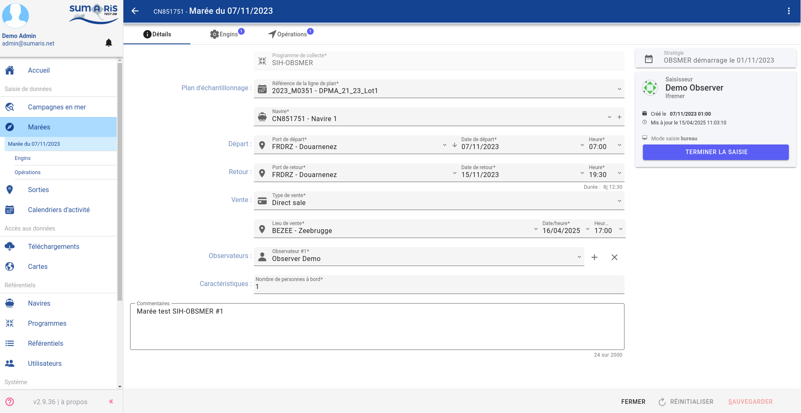

# Full Stack Developer Assessment

**Objective**: Quickly evaluate a developer's technical knowledge in 20 minutes.

## 1. Information System Architecture (2 minutes)

Fill in the blanks to describe the data flow in a classic layered architecture:

The client request first arrives in the __________________ (1) layer, which passes the request to the __________________ (2) layer via __________________ (3). The __________________ (4) layer contains the business logic and uses the __________________ (5) layer to interact with the database.

**Open question**: Briefly explain the benefit of separating an application into different layers:

-
-
-


## 2. Spring Boot (4 minutes)

### Dependency Injection

Complete the following code to inject a service into a controller:

```java
@__________________(1)
public class UserController {

    private final UserService userService;
    
    @__________________(2)
    public UserController(UserService userService) {
        this.userService = userService;
    }
}
```

### Services and Repositories

To create a Spring service, we use the __________________ (3) annotation. To create a Spring Data JPA repository, we extend the __________________ (4) interface.

### Transactions

To declare that a method must be executed within a transaction, we use the __________________ (5) annotation.

### Cache Management

Complete: To enable caching in Spring Boot, we add the __________________ (6) annotation in the configuration class.

### REST Controllers

Complete this REST controller:

```java
@__________________(7)
@RequestMapping("/api/users")
public class UserController {
    @__________________(8)("/")
    public List<User> getAllUsers() {
        return userService.findAll();
    }

    @__________________(9)("/{id}")
    public User getUserById(@__________________(10) @PathVariable Long id) {
        return userService.findById(id);
    }
}
```

**Open question**: Explain how you would handle exceptions in a Spring Boot REST API.

-
-
-


## 3. Oracle Database (4 minutes)

### Table Schema

Consider the following data model:

```plantuml
@startuml
    entity "employees" {
      * employee_id : number <<PK>>
      * name : varchar2
      * last_name : varchar2
      * salary : number
      * hire_date : date
      * active : char(1)
      * department_id : number <<FK>>
    }
    
    entity "departments" {
      * department_id : number <<PK>>
      --
      * department_name : varchar2
    }
    
    employees "*" -- "1"" departments : department_id

@enduml
```

### SQL - Join

Complete the following SQL query to get the list of employees with their department, even for employees without a department:

```sql
SELECT e.name, d.name as department_name
FROM employees e
__________________(1) JOIN departments d ON __________________(2)
WHERE e.salary > 5000
ORDER BY __________________(3)
```

### SQL - Conditions

Complete the following SQL query that uses conditions to categorize employees by salary and department:

```sql
SELECT
    employee_id,
    last_name,
    salary,
    __________________(1)
        WHEN salary < 5000 THEN 'Junior'
        WHEN salary BETWEEN 5000 AND 10000 THEN 'Confirmed'
        __________________(2) 'Senior'
    END AS level,
    __________________(3)(department_id,
        10, 'Finance',
        20, 'Marketing',
        30, 'IT',
        'Other') AS service_name
FROM employees
WHERE hire_date > TO_DATE('01-01-2020', __________________(4))
```

### SQL - Aggregations

Complete the following SQL query that uses aggregation functions to get statistics by department:

```sql
SELECT
    d.department_name,
    __________________(1)(e.employee_id) AS number_of_employees,
    __________________(2)(e.salary) AS minimum_salary,
    ROUND(AVG(e.salary), 2) AS average_salary
FROM
    employees e
JOIN
    departments d ON e.department_id = d.department_id
WHERE
    e.active = 'Y'
__________________(3) d.department_name
HAVING
    COUNT(e.employee_id) > 5
ORDER BY
    COUNT(e.employee_id) DESC
```

**Open question**: Explain the difference between a filter in the WHERE clause and a filter in the HAVING clause, and in which context to use one rather than the other.

-
-
-

**Open question**: How would you optimize a SQL query that takes too long to execute?

-
-
-


List two commands/tools to analyze the performance of an Oracle query:
- (1) ____________________________________________________
- (2) ____________________________________________________


## 4. Frontend - general (3 minutes)

### RxJS

Complete the following code to create an Observable, subscribe to it, and unsubscribe properly:

```typescript
import { __________________(1) } from 'rxjs';
import { map, filter } from 'rxjs/operators';
const observable = __________________(2).create(observer => {
  observer.next(1);
  observer.next(2);
  observer.complete();
});
const subscription = observable.pipe(
  __________________(3)(x => x > 1)
).subscribe(
  value => console.log(value),
  error => console.error(error),
  () => console.log('Completed')
);
// To unsubscribe
__________________(4);
```

### Component Breakdown
Break down the following screen into components (by circling them):


If needed, explain below:

-
-
-

**Open question**: What criteria do you use to decide whether to create a new reusable component in a frontend application?

-
-
-

## 5. Frontend - Angular 18+ (5 minutes)

### Part 1: Template with Form Fields
Complete the following template that uses new structural directives and Angular Material form controls:

```html
<div class="user-form-container">
  <form [__________________(1)]="userForm">
    <h2>User Profile</h2>

    @__________________(2) (userForm.get('firstName')?.hasError('required') && userForm.get('firstName')?.touched) {
      <div class="error-message">First name is required</div>
    }
    
    <mat-form-field appearance="outline">
      <mat-label>First Name</mat-label>
      <input matInput __________________(3)="firstName">
      <mat-error *ngIf="userForm.get('firstName')?.hasError('required')">
        This field is required
      </mat-error>
    </mat-form-field>
    
    <mat-form-field appearance="outline">
      <mat-label>Last Name</mat-label>
      <input matInput formControlName="lastName">
    </mat-form-field>
    
    <div formGroupName="address">
      <h3>Address</h3>
      @__________________(4) (addresses.length > 0; as hasAddresses) {
        <div class="addresses-container">
          @__________________(5) (address of addresses; track address.id) {
            <div class="address-card">
              <p>{{address.street}}, {{address.city}}</p>
              <button mat-icon-button (click)="removeAddress(address.id)">
                <mat-icon>delete</mat-icon>
              </button>
            </div>
          }
        </div>
      } @else {
        <p>No addresses recorded</p>
      }
      
      <button mat-raised-button color="primary" [__________________(6)]="!userForm.valid">
        Save
      </button>
    </div>
  </form>
</div>
```

### Part 2: Component with Form and Validators
Complete the associated component code:

```typescript
import { Component, OnInit, __________________(1) } from '@angular/core';
import { FormGroup, FormBuilder, __________________(2), Validators } from '@angular/forms';
import { UserService } from '../../services/user.service';
@Component({
  selector: 'app-user-profile',
  templateUrl: './user-profile.component.html',
  styleUrls: ['./user-profile.component.scss']
})
export class UserProfileComponent implements __________________(3), AfterViewInit {
  userForm: FormGroup;
  addresses: {id: number, street: string, city: string}[] = [];

  constructor(
    private __________________(4): FormBuilder,
    private userService: UserService
  ) { }

  __________________(5)() {
    this.userForm = this.fb.group({
      firstName: ['', [Validators.required, Validators.minLength(2)]],
      lastName: ['', [Validators.required]],
      email: ['', [Validators.required, __________________(6)]],
      address: this.fb.group({
        street: [''],
        city: [''],
        zipCode: ['', [Validators.pattern(/^\d{5}$/)]]
      })
    });

    this.loadAddresses();
  }

  ngAfterViewInit() {
    // Subscribe to form changes
    this.userForm.valueChanges.__________________(7)((value) => {
      console.log('Form value changed:', value);
    });
  }

  loadAddresses() {
    this.userService.getUserAddresses().subscribe({
      next: (addresses) => {
        this.addresses = addresses;
      },
      error: (err) => console.error('Error loading addresses', err)
    });
  }

  removeAddress(id: number) {
    this.userService.__________________(8)(id).subscribe({
      next: () => {
        this.addresses = this.addresses.filter(address => address.id !== id);
      },
      error: (err) => console.error('Error during deletion', err)
    });
  }

  onSubmit() {
    if (this.userForm.__________________(9)) {
      this.userService.saveUser(this.userForm.value).subscribe({
        next: (response) => {
          console.log('User saved', response);
        },
        error: (err) => console.error('Error during registration', err)
      });
    }
  }

  __________________(10)() {
    // Clean up subscriptions
    this.subscriptions.unsubscribe();
  }
}
```

### Part 3: Service and State Management
```typescript
import { Injectable } from '@angular/core';
import { HttpClient } from '@angular/common/http';
import { BehaviorSubject, Observable } from 'rxjs';
import { User } from '../models/user.model';
import { tap, catchError } from 'rxjs/operators';
@Injectable({
  providedIn: '__________________(1)'
})
export class UserService {
  private userSubject = new __________________(2)<User | null>(null);
  user$ = this.userSubject.asObservable();

  constructor(private http: HttpClient) { }

  getUserAddresses(): Observable<any[]> {
    return this.http.get<any[]>('/api/addresses');
  }

  deleteAddress(id: number): Observable<void> {
    return this.http.delete<void>(`/api/addresses/${id}`);
  }

  saveUser(userData: any): Observable<User> {
    return this.http.post<User>('/api/users', userData).pipe(
      __________________(3)((user) => {
        this.userSubject.next(user);
      }),
      catchError((error) => {
        console.error('Error saving user', error);
        throw error;
      })
    );
  }
}
```

### Part 4: Module and Routing

```typescript
import { NgModule } from '@angular/core';
import { CommonModule } from '@angular/common';
import { __________________(1) } from '@angular/forms';
import { MatInputModule } from '@angular/material/input';
import { MatFormFieldModule } from '@angular/material/form-field';
import { MatButtonModule } from '@angular/material/button';
import { MatIconModule } from '@angular/material/icon';
import { RouterModule } from '@angular/router';
import { UserProfileComponent } from './components/user-profile/user-profile.component';
import { UserService } from './services/user.service';

@NgModule({
  declarations: [
    UserProfileComponent
  ],
  imports: [
    CommonModule,
    __________________(2),
    MatInputModule,
    MatFormFieldModule,
    MatButtonModule,
    MatIconModule,
    RouterModule.forChild([
      {
        path: 'profile',
        component: __________________(3)
      }
    ])
  ],
  providers: [
    __________________(4)
  ]
})
export class UserModule { }
```

**Open question**: Explain the difference between Template-driven Forms and Reactive Forms in Angular. In which context would you prefer to use one over the other?

-
-
-

**Open question**: How do you handle asynchronous validations in an Angular form (for example, checking if a username is already taken)?

-
-
-


## 6. CI/CD - GitLab CI (2 minutes)

In a GitLab CI pipeline, the configuration file is called __________________ (1).

Complete the missing elements in this GitLab CI pipeline structure:
```yaml
stages:
  - ________________(1)
  - build
  - ________________(2)
  - deploy

________________(3) :
  stage: ________________(4)
  script:
    - ________________(5)

build:
  stage: ________________(6)
  script:
    - mvn ________________(7)

test:
  stage: ________________(8)
  script:
    - mvn test
deploy_staging:
  stage: deploy
  ________________(9): staging
  script:
    - deploy-production.sh
  ________________(10) :
    - master
    - develop
```