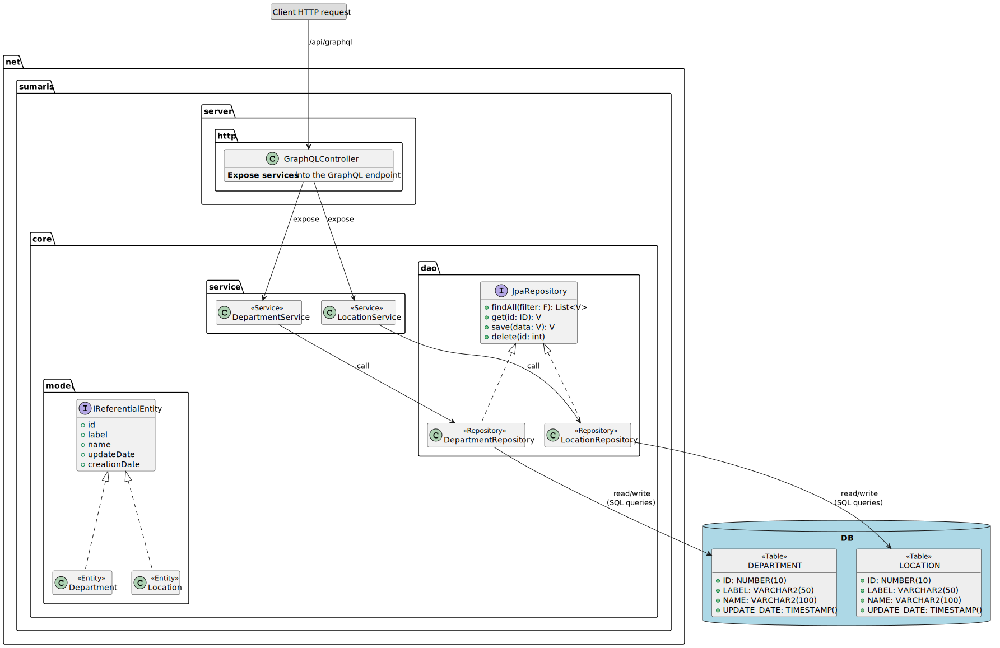

# Architecture > Software Core

## Table of Contents

* [Introduction](#introduction)
* [Features](#features)
  * [GraphQL API](#graphql-api)
* [Technical Implementation](#technical-implementation)
  * [Libraries and Frameworks](#libraries-and-frameworks)
  * [Software Components](#software-components)
    * [package `http`](#package-http)
    * [package `service`](#package-service)
    * [package `dao`](#package-dao)
    * [package `model`](#package-model)
    * [package `util`](#package-util)
  * [Security](#security)
  * [Configuration](#configuration)

## Introduction

The core's objective is to manage the SI's business entities, and their read/write operations to/from a database.

## Features

### GraphQL API

The core makes data accessible via a GraphQL endpoint.

This endpoint responds to HTTP requests (GET or POST) sent to the server at the path `<SERVER_URL>/api/graphql` (for example, `http://localhost:8080/api/graphql`). This endpoint can be used in any GraphQL editor or from any HTTP request.

The response format is JSON.

Authentication to the server requires a specific HTTP header.

> A GraphiQL editor is available at `SERVER_URL/api/graphiql` for testing the endpoint.

## Technical Implementation

### Libraries and Frameworks

Here are the libraries and frameworks used by the software core's implementation:

- Database: Oracle, PostgreSQL, or HsqlDB
- [Spring Boot](https://spring.io/projects/spring-boot):
  * To implement the HTTP REST endpoints (GET or POST) as JEE Servlets;
  * Deployable within an Apache Tomcat engine, and/or another web application using Spring Boot;
  * Security management uses Spring Security to control possible access rights through authentication.
- [JPA / Hibernate](https://hibernate.org): for mapping between entities (Java Object) and the database;
- [Apache Maven](https://maven.apache.org/):
  * For Java dependency management, compilation, and module delivery;

### Software Components

The module is divided into software components, illustrated below:



#### package `http`

The `http` package is responsible for responding to received HTTP requests (GET and/or POST).

The `GraphQLController` analyzes GraphQL requests and executes them by delegating to the requested business services. The result returned by a business service is directly converted into JSON.

#### package `service`

The `service` package focuses on business functions, responsible for processing read or written data. This layer also manages JDBC transactions and handles possible rollbacks in case of error.

This layer benefits from an application cache, implemented as needed to optimize data access performance.

#### package `dao`

The `Repository` components define the requests (Object or SQL) for accessing the database.

Each `Repository` is usually linked to a particular business entity.

#### package `model`

This package defines `Entity` which represents the underlying database model. Each `Entity` represents a business concept (e.g., `Department` represents an organism, `CoastalStructureType` a typology of structure).

The attributes of an `Entity` class allow configuring the columns of the associated table and its constraints (non-null, etc.)

```java
/**
* Example of a business entity  
**/
@Data
@Entity
@Table(name = "location")
public class Location implements IReferentialEntity<Integer> {

    @Id
    private Integer id;
 
    @Column(nullable = false, length = 50)
    @ToString.Include
    private String label;

    @Column(nullable = false, length = 100)
    private String name;
    
    // ...
}
```


#### package `util`

A `util` package (not shown on the software component illustration) contains utilities for manipulating various Java 
object types (`Stream`, `File`, `String`, `Date`, etc.)

### Security

Access rights can be managed at the level of the GraphQLController, thanks to Java annotations and Spring Security.
This way, access can be limited on a case-by-case basis, for example, to allow only certain user profiles.

### Configuration

Options available for configuring the core:

| Property                          | Description                                                  | Default Value                              |
|-----------------------------------|--------------------------------------------------------------|--------------------------------------------|
| `server.url`                      | Server access URL                                            | `http://localhost:8080`                    |
| `spring.datasource.url`           | Database URL (in JDBC format)                                | `jdbc:postgresql://localhost:5432/sar`     |
| `spring.liquibase.enabled`        | Activation of the database schema update by Liquibase        | `sar`                                      |
| `logging.level.org.hibernate.SQL` | SQL request logging level (set to `debug` to view)           | `warn`                                     |
