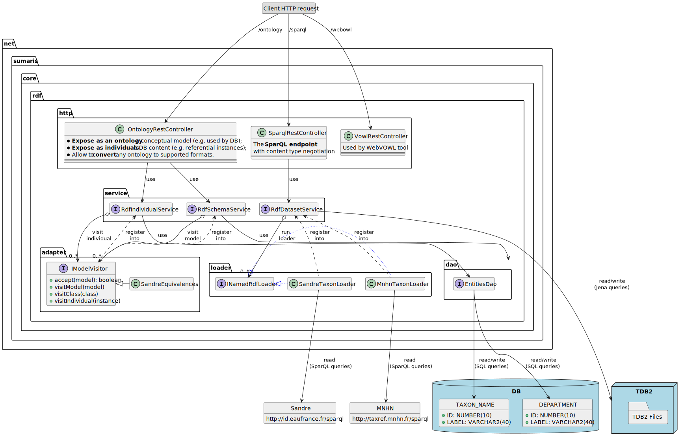

# Architecture > Module Web sémantique

## Introduction

Le module a pour objectif la diffusion de données dans un formalisme compatible avec les standards 
du web sémantique.

- Site de démo:  https://simm.e-is.pro/api

> Pour découvrir le web sémantique : 
> [voir ce cours en ligne](https://www.canal-u.tv/producteurs/inria/cours_en_ligne/web_semantique_et_web_de_donnees)
> proposé par l'INRIA (en accès libre).  


## Fonctionnalités

### Point d'accès SparQL

Le module rend accessible un "SparQL endpoint".
Celui-ci réponds aux rêquetes HTTP (GET ou POST) envoyés au serveur sur le chemin `<SERVER_URL>/sparql` (par exemple `http://localhost:8080/sparql`).
Ce endpoint est utilisable dans n'importe quel SparQL Editor, ou depuis une requete HTTP quelconque.

Le format de la réponse est détecté automatiquement, à partir de l'entête HTTP `Accept` de la requête, comme le prévoit l'usage de SparQL (content-type negociation).

Les formats de réponse suivants sont possibles : 
- Format spécifique SparQL (pour les requêtes de type `SELECT` et `ASK`) : 

    | Format                | Header `Accept` (Content-Type)                                |
    | --------------------- | ------------------------------------------------------------- |
    | SparQL-results XML    | `application/sparql-results+xml`, `application/xml`, `text/xml` | 
    | SparQL-results JSON   | `application/sparql-results+json`, `application/json`         | 
    | SparQL-results CSV    | `application/sparql-results+csv`, `text/csv`                  | 
    | SparQL-results TSV    | `application/sparql-results+tsv`, `text/tab-separated-values`, `text/html`, `text/plain` | 
    | SparQL-results SSE    | `application/sparql-results+sse`                              | 
    | SparQL-results Thrift | `application/sparql-results+thrift`                           | 

- Autres format RDF (pour les requêtes de type `CONSTRUCT` et `DESCRIBE`) :

    | Format     | Header `Accept` (Content-Type)                                              |
    | ---------- | --------------------------------------------------------------------------- |
    | RDF/XML    | `application/rdf+xml`, `application/xml`, `text/xml`                        | 
    | RDF/JSON   | `application/rdf+json`, `application/json`, `application/json;charset=UTF8` | 
    | JSON-LD    | `application/ld+json`            | 
    | N3         | `text/rdf+n3`                    | 
    | NTriple    | `application/n-triples`          | 
    | NQuads     | `application/n-quads`            | 
    | Trig       | `text/trig`, `application/trig`  | 
    | TriX       | `text/trix`, `application/trix`  | 
    | Turtle     | `text/turtle`, `application/ttl` | 
    | Text       | `text/plain`, `text/html`        | 

> Un éditeur SparQL est disponible à l'adresse `<SERVER_URL>/sparql/ui` pour tester le point d'accès SparQL.
> Des requêtes d'exemples y sont également accessibles.
  
  
#### Données accessibles

Le SparQL endpoint permet l'accès : 
- Aux données d'un TripleStore local, utilisant Apache Jena TDB2.

  Ce dataset peut-être, par exemple, chargée et mis à jour à partir :
  * D'une ou plusieurs bases de données (ex: table de référentiels);
  * De SparQL endpoints distants, via des requetes de type CONSTRUCT, stockés en fichiers;
  * De fichier RDF locaux;
  * etc.
  
  Chacune de ces sources de données est isolé dans un sous-ensemble, ce qui  
  permet de les requéter indépendamment, par sous-ensemble, à partir d'une requête du type :
  ```
  SELECT ... 
  FROM NAMED <URI>   <-- URI du sous-ensemble à requeter
  WHERE ...`
  ```
- Aux données d'autres endpoints (et leur jeux de données associés) via 
  une requête SparQL **fédérée** du type :
  ```
  SELECT * FROM
  WHERE {
   SERVICE <http://taxref.mnhn.fr/sparql> {
        
   }
  }  
  ``` 
  
#### Synchronisation d'un TripleStore local 
 
Le module permet de mettre à jour automatiquement le tripletsore local (TDB2) :
- A chaque re-démarrage du serveur
- Suivant une période données, par exemple toutes les nuits - TODO: NON implémenté

Suivant du module (via une fichier de configuration) l'importation des données pourrat avoir depuis une BDD,
des endpoints distants, des fichiers locaux, etc.     
  
### Ontologie d'un schéma BDD 

Le module permet de publier sous forme d'ontologie, une schéma issu d'un modèle de données
Pour cela, le module autorise l'accès (HTTP GET) aux adresses suivantes :
- `<SERVER_URL>/ontology/schema` : publication du schéma entier (Classes et attributs)
- `<SERVER_URL>/ontology/schema/<CLASSE>` : publication d'une classe, de ses attributs, et de ses classes directement connectées;

Le format de sortie dépend de la présence de l'entête HTTP `Accept`.
Il est également possible de définir explictement : soit en ajoutant ``?format=<FORMAT>` au chemin, soit en ajoutant une extension.

Exemples :
- http://localhost:8080/ontology/schema
- http://localhost:8080/ontology/schema.ttl
- http://localhost:8080/ontology/schema?format=ttl
- http://localhost:8080/ontology/schema/TaxonName
- http://localhost:8080/ontology/schema/TaxonName.ttl
- http://localhost:8080/ontology/schema/TaxonName?format=ttl

Les formats de réponse suivants sont possibles :

| Format     | extension ou format           | Header `Accept` (Content-Type)   |
| ---------- | ----------------------------- | -------------------------------- |
| RDF/XML    | `xml`, `rdf`                  | `application/rdf+xml`, `application/xml`, `text/xml`    | 
| RDF/JSON   | `json`                        | `application/rdf+json`, `application/json`, `application/json;charset=UTF8` | 
| JSON-LD    | `jsonld`, `json-ld`           | `application/ld+json`            | 
| N3         | `rdf/n3`, `n3`                | `text/rdf+n3`                    | 
| NTriple    | `nt`, `ntriples`, `n-triples` | `application/n-triples`          | 
| NQuads     | `nq`, `nquads`, `n-quads`     | `application/n-quads`            | 
| OWL        | `owl`                         | `application/xml+owl`            |
| Trig       | `trig`                        | `text/trig`, `application/trig`  | 
| TriX       | `trix`                        | `text/trix`, `application/trix`  | 
| Turtle     | `ttl`, `turtle`               | `text/turtle`, `application/ttl` | 
| Thrift     | `thrift`, `rt`, `trdf`        | `application/rdf+thrift`, `application/x-thrift`, `application/rdf+x-thrift`, `application/vnd.apache.thrift.binary` |
| VOWL       | `vowl`                        | `application/webvowl+json`       |

> Un outil graphique est disponible à l'adresse `<SERVER_URL>/ontology` pour construire et tester les
> différents chemins, options et format possibles.
> Une visualisation graphique d'ontologies y est également possible (en cliquant sur le bouton "View WebVowl") 
  
### Accès aux données d'une BDD

Le module permet d'accéder à des instances issues d'une base de données sous-jacente, pour des tables de référentiels.

Pour cela, le module autorise l'accès (HTTP GET) aux adresses suivantes :
- `<SERVER_URL>/ontology/data/<CLASSE>` : toutes les instances correspondante à la classe;
- `<SERVER_URL>/ontology/data/<CLASSE>/<ID>` : une seule instances de classe;

Il est possible de définir le format de sortie via une entête HTTP `Accept` dans la requete GET.
Il est également possible de le définir explictement : soit en ajoutant ``?format=<FORMAT>` au chemin, soit en ajoutant une extension.

Exemples :
- http://localhost:8080/ontology/data/TaxonName
- http://localhost:8080/ontology/data/TaxonName.ttl
- http://localhost:8080/ontology/data/TaxonName?format=ttl
- http://localhost:8080/ontology/data/TaxonName/15151
- http://localhost:8080/ontology/data/TaxonName/15151.ttl
- http://localhost:8080/ontology/data/TaxonName/15151?format=ttl

## Implémentation technique

### Libraries et frameworks

Voici les librairies et frameworks utilisés par l'implémentation du module :

- [Apache Jena](https://jena.apache.org/) :
  * Core API (v3.14 ou +): 
    * Pour lire/écrire et manipuler des modèles RDF;
    * Pour convertir les modèles RDF en différents format (RDF/XML, RDF/JSON, JSONLD, ...); 
  * TDB2 (v3.14 ou +): comme "triplestore" permettant la persistence des données sémantiques;
- [OWLAPI](https://github.com/owlcs/owlapi)
  * Pour les conversions au format OWL (tags xML OWL sans les balises RDF)
- [Owl2Vowl](https://github.com/VisualDataWeb/OWL2VOWL):
  * Pour les conversions au format VOWL, utilisé par [WebVOWL](http://vowl.visualdataweb.org/webvowl.html) (outil visualisation graphique d'ontologies) ; 
- [Spring Boot](https://spring.io/projects/spring-boot) :
  * Pour implémenter les points d'accès HTTP REST (GET ou POST), sous forme de Serlvet JEE;
  * Déployable au sein d'un moteur Apache Tomcat, et/ou d'une autre application web utilisant Spring Boot.
- [Apache Maven](https://maven.apache.org/) :
  * Pour la gestion des dépendances Java, la compilation et livraison du module;
  
### Composants logiciels

Le module est divisé en composants logiciels, illustrés ci-dessous :



#### package `http`

Le package `http` est responsable de répondre aux requetes HTTP (GET et/ou POST) recus par le serveur.
Il analyse également le format de sortie attendu par la requete, via les entêtes HTTP `Accept`, l'extension ou le paramètre `format`.
Chaque `RestController` délègue ensuite, suivant le type de demande, la création ou la récupration d'un modèle Jena à un service spécialisé.

Dans le cas du `SparQLRestController`, la requête SparQL est d'abord nettoyée, puis executé (via TDB2 ou une endpoint distant).
Le résultat est, si besoin, assemblé en un nouveau modèle Jena.

Quelque soit composant RestController, une fois le modèle Jena récupéré, une sérialisation du mdoèle vers le format de sortie attendu est appliquée.

#### package `service`

Le package `service` concentrent les fonction de chargement et de transformation de modèle. 
En particulier, les modèles résultant de la BDD locale proviennent de `RdfSchemaService` et `RdfIndividualService`,
respectivement pour la définition de l'ontologie du modèle de données, et des données en elle même. 
Les modèles Jena transitants par ces services sont extensibles, via le pattern __Visitor__. Par exemple, pour y associer
des correspondances avec d'autres ontologies (FOAF, RDFS, ORG, ...).

Les composants `Service` bénéficient également d'un cache applicatif, pour optimiser leur performance.
Chaque demande est ainsi converti en `hashCode` pour servir de clef d'accès à ce cache, qui dépendra donc de chaque
option utilisée pour la génération du modèle Jena. 

Le service `RdfDatasetService` est responsable de l'initailisation TripleStore local (TDB2). Il peut charger des données distantes,
en déléguant les requetes d'accès à des composants `NamedRdfLoader` (cf package `loader` ci-dessous). 
Il est également responsable  de l'execution des requetes SparQL non distantes, sur le TripleStore local.

#### package `loader`

Ce package permet d'ajouter simplement de nouveaux endpoints distants, pour importer leur données dans le TripleStore local.

Chaque composant implémentant l'interface `INamedRdfLoader` précise le endpoint à appeller, et la requête SaprQL CONSTRUCT 
(ou le fichier de requete) à executer sur celui-ci.

Pour éviter tout problème mémoire, l'importation des données est paginée. Chaque loader peut cependant préciser le nombre 
maximum d'éléments dans une page (10000 par défaut). 

```java
/**
* Exemple de INamedRdfLoader pour charger les taxons depuis le SparQL endpoint du Sandre  
**/
@Component("sandreTaxonLoader")
public class SandreTaxonRdfLoader extends AbstractNamedRdfLoader {

    private static final Logger log = LoggerFactory.getLogger(SandreTaxonRdfLoader.class);

    @Value("${rdf.sandre.sparql.endpoint:http://id.eaufrance.fr/sparql}")
    private String endpointUrl;

    @Value("${rdf.sandre.sparql.limit:10000}")
    private int fetchSize = 10000;

    @Value("${rdf.dataset.sandre.apt.name:http://id.eaufrance.fr/apt/}")
    private String name;

    @Value("${rdf.dataset.sandre.apt.query:classpath:sparql/taxon.sparql}")
    private String queryFile;
 
    // ...
}
```

#### package `adapter`

Le package `adapter` regroupe les composants qui viennent enrichir l'ontologie et les instances de données diffusées par le serveur, 
à partir du schéma et des donnée de la BDD sous-jacente.
Ils concernent exclusivement les classes d'entités (Entités JPA - cf package `dao`) du modèle de données de la BDD.

Chaque classe du modèle de données (par exemple `TaxonName`, `Department`) peut se voir ajouter des correspondances
avec des ontologies connus.

Les équivalences ajouté peuvent être de différentes nature. Le plus souvent, il s'agit :
- Pour une ontologie portant sur un schéma : 
  * `rdfs:subClassOf` ou `owl:equivalentClass`
  * `rdfs:subPropertyOf` ou `owl:equivalentProperty`
- Pour des instances (individuals) :
  * `skos:exactMatch` ou `owl:sameAs`

```java
/**
* Exemple d'ajout de correspondances FOAF (Friend Of A Friend) sur la classe Department. 
**/
@Component("foafSchemaEquivalences")
public class FoafSchemaEquivalences 
    implements IModelVisitor<Model, RdfSchemaFetchOptions> {
  // ...

  @Override
  public void visitClass(Model model, Resource ontClass, Class clazz) {

    // ...

    if (clazz == Department.class) {
        // FOAF.Organization = Department
        ontClass.addProperty(equivalentClass, FOAF.Organization);

        // FOAF.homepage = Department.site
        model.getResource(classUri + "#" + Department.Fields.SITE_URL)
                .addProperty(equivalentProperty, FOAF.homepage);
    }
  }
}
```

#### package `dao`

Le composant `EntitiesDao` offre une accès générique au modèle de données de la base de données.
Il permet également de requéter les données tables associées.  

Pour fonctionner, `EntitiesDao` a besoin d'entité du format JPA (Java Persistence API - utilisé par Hibernate), afin 
d'accéder à la BDD via des classes et objets Java. Les requêtes générées utilise egalement un formalisme objet (JPA-QL ou HQL)  

#### package `util`

Un package `util` (non représenté sur l'illustration des composants logiciels) contient des utilitaires qui permettent :
- La manipulation de modèle, vers tous les formats compatibles (y compris non standards, comme WebVOWL);
- La correspondance entre les entêtes HTTP `Accept` (Content-Type) et les format Jena;
- La conversion d'entité JPA (classes et instances de classes) en ontologie Jena ;
- etc.  

### Configuration

Le module est activable par l'option de configuration `rdf.enabled`.

Autres options disponibles :

| Propriété                   | Description                   | Valeur par défaut                |
| --------------------------- | ----------------------------- | -------------------------------- |
| `rdf.model.version`         | Version du modèle             | `2019-11-20`  | 
| `rdf.model.date`            | Date du modèle                | `2019-11-20`  | 
| `rdf.model.prefix`          | Namespace de l'ontologie générée    | `sar`  | 
| `rdf.model.baseUri`         | URI de l'ontologie générée          | `${server.url}/ontology/`  |
| `rdf.model.license`         | Licence de l'ontologie générée      | `http://www.gnu.org/licenses/gpl-3.0.html`  |
| `rdf.model.authors`         | Auteur de l'ontologie générée       | `${sumaris.organizationName}`  |
| `rdf.model.publisher`       | Editeur de l'ontologie générée      | `${sumaris.site.url}`  |
| `rdf.tdb2.enabled`          | Utiliser TDB2 ? Si désactivé, un TripleStore en mémoire sera utilisé.   | `true`  |
| `rdf.data.import.enabled`   | Importer les données de la BDD dans le TripleStore ?  | `true`  | 
| `rdf.data.import.entities`  | Classes d'entités de la BDD à importer, séparée par une virgule | `TaxonName,Department,Gear`  |
| `rdf.data.import.external.enabled`    | Importer les données distantes (cf package `loader`) | `true`  |
| `rdf.data.import.entities`  | Classes d'entités de la BDD à importer, séparée par une virgule | `TaxonName,Department,Gear`  |
| `rdf.data.import.entities`  | Classes d'entités de la BDD à importer, séparée par une virgule | `TaxonName,Department,Gear`  |
| `rdf.data.pageSize.default` | Nombre limite d'éléments renvoyé par une requête SparQL, si non spécifié dans celle-ci | `100`  |
| `rdf.data.pageSize.max `    | Nombre limite d'éléments renvoyé par une requête SparQL | `10000`  |
| `rdf.data.pageSize.max `    | Nombre limite d'éléments renvoyé par une requête SparQL | `10000`  |
| `rdf.directory `            | Répertoire de travail de TDB2 | `${sumaris.data.directory}/rdf`  |
| `rdf.tdb2.directory `       | Répertoire de travail de TDB2 | `${rdf.directory}/tdb2`  |

