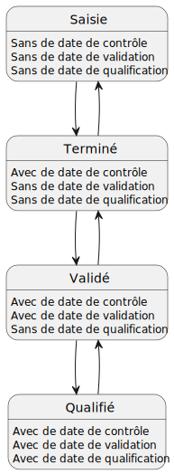

# Accès aux fonctions du système

## Définition

### Profiles utilisateur

Définissent des droits qui viennent s'appliquer de manière générale en fonction du profile que possède l'utilisateur.

Administrateur *(ADMIN)* :
: Administrateur de référentiel.

Utilisateur *(USER)* :
: TODO

Superviseur *(SUPERVISOR)* :
: Supervise des observateurs.

Invité *(GUEST)* :
: Compte invité (existant et actif, mais sans droit)

### Privilège d'un programme

Définissent des droits qui viennent s’appliquer sur un programme.

Manager *(MANAGER)* :
: Responsable de programme

Saisisseur *(RECORDER)* :
: Autorise la saisie de données sur le programme

Lecteur *(VIEWER)* :
: TODO

Validateur *(VALIDATOR)* :
: TODO

Qualifieur *(QUALIFIER)* :
: TODO

### États d'une donnée

## Table de droits sur une donnée en fonction de son état

### Création

| Profiles   | Privilèges   | Création |
|------------|--------------|:--------:|
| Admin      | Tous les cas |   OUI    |
| Supervisor | Tous les cas |   OUI    |
| User       | Manager      |   OUI    |
| User       | Recorder     |   OUI    |
| User       | Qualifier    |    ?     |
| User       | Validator    |    ?     |
| User       | Viewer       |   NON    |

### En cour de saisie

| Profiles   | Privilèges   | Visualisation | Modification | Changement d'état | Contexte  |
|------------|--------------|:-------------:|:------------:|:-----------------:|:---------:|
| Admin      | Tous les cas |      OUI      |     OUI      |    -> Terminé     |   [^0]    |
| Supervisor | Tous les cas |      OUI      |     OUI      |    -> Terminé     | [^3] [^4] |
| User       | -            |      NON      |     NON      |                   |           |
| User       | Recorder     |      OUI      |     OUI      |    -> Terminé     | [^1] [^2] |
| User       | Manager      |      OUI      |     OUI      |    -> Terminé     | [^3] [^4] |
| User       | Qualifier    |      OUI      |     OUI      |         ?         |     ?     |
| User       | Validator    |      OUI      |     OUI      |    -> Terminé     | [^3] [^4] |
| User       | Viewer       |      OUI      |     NON      |        NON        |     ?     |

### Terminé

| Profiles   | Privilèges   | Visualisation | Modification | Changement d'état  | Contexte  |
|------------|--------------|:-------------:|:------------:|:------------------:|:---------:|
| Admin      | Tous les cas |      OUI      |     OUI      | Terminé <-> Validé | [^3] [^4] |
| Supervisor | Tous les cas |      OUI      |     OUI      | Terminé <-> Validé | [^3] [^4] |
| Observer   |              |      OUI      |     OUI      |     Terminé <-     | [^1] [^2] |
| Observer   | Observer     |      OUI      |     OUI      |     Terminé <-     | [^1] [^2] |
| Observer   | Manager      |      OUI      |     OUI      | Terminé <-> Validé | [^3] [^4] |
| Observer   | Qualifier    |       ?       |      ?       |         ?          |     ?     |
| Observer   | Validator    |      OUI      |     OUI      | Terminé <-> Validé | [^3] [^4] |
| Observer   | Viewer       |      OUI      |     NON      |        NON         |     ?     |

## Notes de bas de page

[^0]: Dans tous les cas.

[^1]: Si est explicitement défini comme observateur sur les données et que l'option pour autoriser l’observateur à modifier la donnée est activé.

[^2]: Si est saisisseur de la donnée.

[^3]: Si membre du département saisisseur.

[^4]: Si membre des département qui peuvent tout voir.
