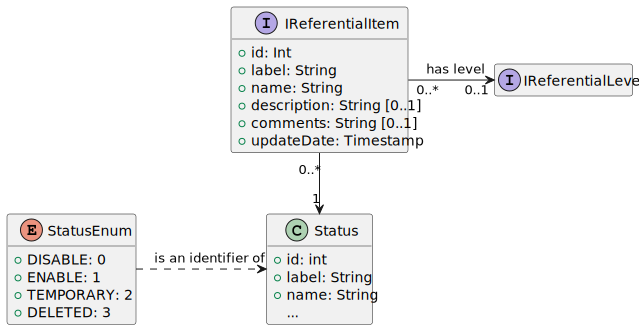
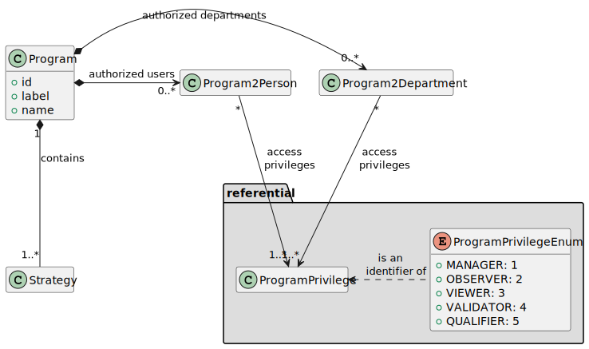
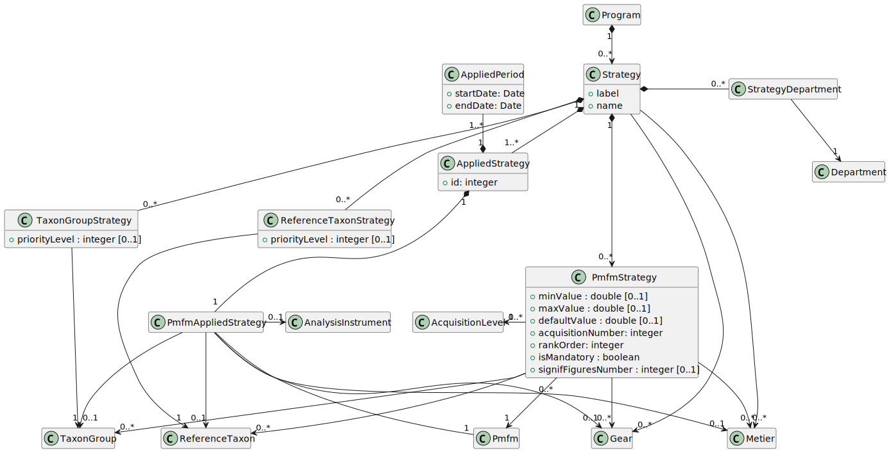

# SUMARiS Data Model

## Referential

### Base classes

Each referential entity item have a numerical id as identifier, a unique label (for code), a name and a full description. 

### Location

A location can be:
  - a territorial location (e.g. Country, harbour, auction...)
  - a fishing area, on any administrative spatial unit at sea (e.g. FAO area, ICES division or sub-division, CGPM..)

A location can have a spatial geometry (area, line, or point) that can be used by SUMARiS GIS capabilities.  

### Gear

A gear is fishing gear, used by vessels during a trip. 
Gear code comes from FAO gear code, but can be extended with other gear codification (like national gear codes).

### Commercial species

Commercial species are call "Taxon Group" in the data model.

FAO ASFIS code are used, but can be extends with national codes. 

### Scientific species

Scientific species are called "Taxon" in the data model.

 - For now, codes comes from French RefTax database, or any other national codes;
 - A working group (E-IS, Ifremer, MNHN, Sandre) will develop (2020) a Proof of Concept (PoC) to synchronize codes from [WoRMS](http://www.marinespecies.org/), using Ontologies Web Language (OWL) and the RDF format.    

### Collected parameters (PMFMU)

a PSFMU is an association of:
 
 - a Parameter: what is collected (e.g. a distance, a weight...);
    * A parameter has a unique type : numerical, alphanumerical, boolean, qualitative values;
    * A parameter can define min and max values;
 - a Matrix: what is measured;
 - a Fraction: a part of the matrix;
 - a Method: how to get the measure value;
 - a Unit (e.g meters, kilograms...)

This class allows to define any kind of measure type, with the precision expected by all scientific purposes.

### Program and strategies

Program is the entity that holds a data collection project (e.g. a scientific project, a UE project, ...).

 - A Program describe the project (label, name, description);  
   * Each program has one or more strategies; 
   
 - Forthcoming:
   * Each program can manage access rights by users or departments

 - A Strategy holds one data collection protocol. Typically, it define all parameters (PSFMU) that should be collected.
   * Each collected parameters is collected inside a acquisition level (e.g. on Trip, on Operation, on Landing, ...)

 - Forthcoming:
    * A strategy is applied on one or more period and on one or more locations.
   
This concept of program / strategies allow us to generate all the fields that user can fill in screens,
and also all applied controls (min/max, type).
This is part the generic aspect of SUMARiS tools.
 
## Collected data

Each collected data has a root entity, linked to a program.

- A root entity can be linked to one fishing vessel (see below: Trip, Landing, ...)
- A root entity has some data quality attributes : 
  * A update date, to identify the exact version;
  * A recorder department and person;
  * A quality flag (e.g. Good, Bad, Out of stats, ...) used to exclude bad data on exports or map products; 

### Trip

- Trip: a fishing trip, on a unique vessel.
  * A trip start from a departure location (and date/time) and ends with a return location; 
  * A trip can define one or more physical gears: a gear (e.g. OTB) and its physical features;
  * A trip can have many operations, as children;

- Operation: A unique fishing operation, using a physical gear.
  * A operation can define some features;

### Landing

- Observed Location: an observation applied on a landing site (harbour, auction) on a date/time (or period);
  * an observed location can have many landings (one or more by vessel), as children.

- Landing: an observation on a vessel, observed at landing time.
  * A landing can have a parent observed location, as parent;  
  * A landing can have many trips, as children;
