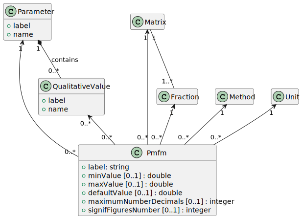
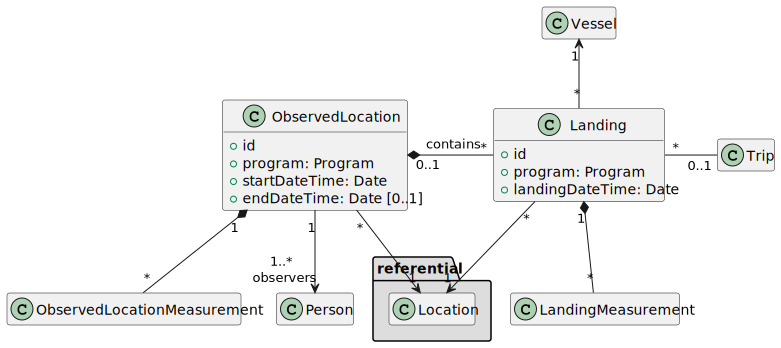

# SUMARiS Data Model

## Referential

### Base classes

### Location

### Paramètres collectés (PSFM)

## Data

### Landing

- ObservedLocation : Observation sur site (port, criée)

- Landing: Débarquement d'un navire, sur un site (port, criée)

