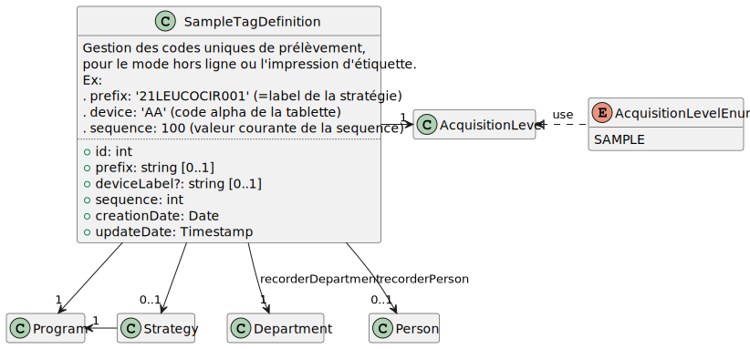

# Codes de prélèvement

## Réservation des codes de prélèvement

Pour fonctionner en mode hors-ligne, tout en restant uniques,
les codes de prélèvement doivent inclure :
- un préfixe, typiquement le code la ligne de plan (code de la stratégie)
- un id du matériel, optionnel dans le cas des impressions d'étiquettes
- un numéro d'incrément

Exemple :
 * prefix: '21LEUCOCIR001' (=label de la stratégie)
 * deviceId: 'AA' (code alpha de la tablette)
 * incrément: '100' (valeur courante de la sequence)

## Modèle de données

Exemple de valeur:

| Colonne | Type  	| Obligatoire ?  	| Exemple |
|---	  |---	|---	|---	|
| ID (PK) | NUMBER(10)  	| Y  	|   	|
| PREFIX  | VARCHAR(12)  	| Y  	| `  	|
|   	|   	|   	|   	|

