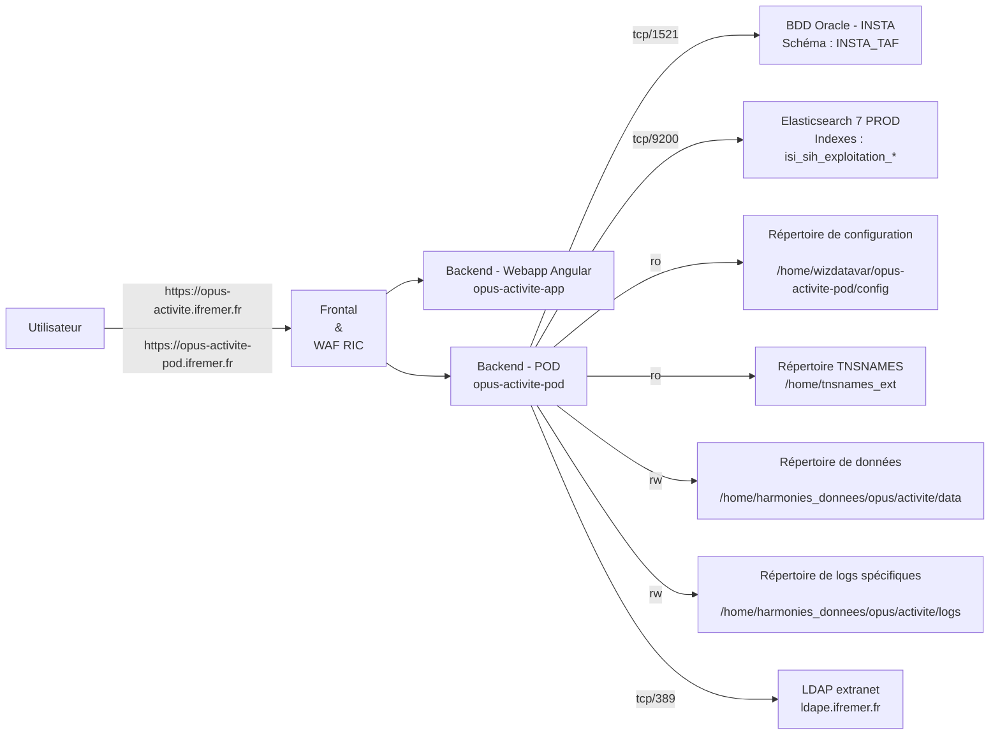

# Opus Activite - (opus-activite-app et opus-activite-pod)

Opus - Calendrier d'activité est la première application issue de la refonte Allegro.

Le calendrier annuel d'activité d'un navire consiste à indiquer pour chaque mois de l'année considérée si le navire a été actif ou non, et si oui, la liste des métiers pratiqués (par métier, on entend la mise en œuvre d'un engin pour capturer une ou plusieurs espèces cibles, dans une zone de pêche donnée).
Outre ces données, le calendrier recense chaque mois le port d'exploitation principal, l'effectif moyen embarqué et le nombre de jours de mer ou de pêche.

**Opus - Calendrier d'activité** a été développé sur le socle SUMARiS, comme IMAGiNE.

SUMARIS est un système d'information web destiné à la collecte, le traitement et l'extraction de données
ainsi qu'à la diffusion de résultats et d'agrégations.

L'application a une architecture "semi-connectée" qui permet de collecter et de stocker les données via
le navigateur lorsque l'application est hors-ligne.

**Opus App** : Une application web (ou App), hébergée sur un serveur web frontal (sous Docker), permettant l’accès aux interfaces de
saisie et l’administration des référentiels. Elle est développée sur le framework Angular.

**Opus pod** : Application serveur (ou Pod), qui fournit deux points d’accès d’API distincte : une API GraphQL pour l'accès aux données (en lecture/écriture, avec contrôle des droits d’accès)

## Etat du service

- Opérationnel depuis : 08/01/2025
- Date de décommissionnement : ? TODO

## Contacts

- Responsable fonctionnel : Vincent FACHERO <vincent.fachero@ifremer.fr>
- Responsable exploitation SISMER : Armelle ROUYER <armelle.rouyer@ifremer.fr>
- Guichet d'exploitation : <harmonie@ifremer.fr>
- Contact technique ISI :
    - Vincent FACHERO <vincent.fachero@ifremer.fr>
    - Glenn PRIGENT <glenn.prigent@ifremer.fr>
- Contact technique RIC : <assistance@ifremer.fr>

## Test du service

### Production

- Opus Activite App :
    - Racine : <https://opus-activite.ifremer.fr>

- Opus Activite Pod :
    - Racine : <https://opus-activite-pod.ifremer.fr>
    - Autre URL : <https://opus-activite-pod.ifremer.fr/api/node/info>
    - Lien avec BDD Oracle & Elasticsearch (endpoints Spring Boot Actuator)
        - <https://opus-activite-pod.ifremer.fr/actuator>
        - <https://opus-activite-pod.ifremer.fr/actuator/health>

### Pré-Production

- Opus Activite App :
    - Racine : <https://opus-activite.isival.ifremer.fr>

- Opus Activite Pod :
    - Racine : <https://opus-activite-pod.isival.ifremer.fr>
    - Lien avec BDD Oracle : <https://opus-activite-pod.isival.ifremer.fr/api/node/info>
    - Lien avec Elasticsearch : TODO

## Architecture RIC

### Opus Activite App

- **Visibilité** : `Internet`
- **Technos** : principales technos utilisées par l'application (serveur web, langage, framework, ...)
    - `Ionic`, `Angular`, `Angular Material`, `Nginx`, `ngx-components`,`Apollo (graphql)`
- **Backend** : `vdocker26-wiz`
- **Service** : `dockersvc@opus-activite-app`
- **Réseau Docker spécifique** : `N/A`
- **Runtime** :
    - **RAM** : `512 Mo`
    - **CPU** : `1 CPU`
    - **Utilisateur & groupe Unix principal** : `nginx` / `nginx` (`101` / `101`)
    - **Groupes Unix additionnels** :  `N/A`
- **MySQL** : `N/A`
- **Oracle** : `N/A`
- **PostgreSQL** : `N/A`
- **Cassandra** : `N/A`
- **Elasticsearch** : `N/A`
- **Flux HTTP/HTTPS internes à l'infrastructure Ifremer** : `N/A`
- **Flux HTTP/HTTPS externes à l'infrastructure Ifremer (passage par proxy sortant)** : `N/A`
- **CAS** : `N/A`
- **LDAP** : `N/A`
- **SMTP** : `N/A`
- **Variables d'environnement** :
    - `TZ` : Time zone
- **Grafana** : [Métriques du conteneur (CPU/RAM/...)](https://grafana.ifremer.fr/d/MUJ1h-2Vz/appli-web-dockerisees-wiz?orgId=1&refresh=1m&var-servers=vdocker26-wiz-admin_ifremer_fr&var-application=docker_opus-activite-app)
- **Logs** : `/home/logsdockersvc/wiz/opus-activite-app/`

### Opus Activite Pod

- **Visibilité** : `Internet`
- **Technos** : principales technos utilisées par l'application (serveur web, langage, framework, ...)
    - `Spring Boot`, `Hibernate/JPA`, `Java`, `GraphQL-java`
- **Backend** : `vdocker26-wiz`
- **Service** : `dockersvc@opus-activite-pod`
- **Réseau Docker spécifique** : `N/A`
- **Runtime** :
    - **RAM** : `4 Go`
    - **CPU** : `2 CPUs`
    - **Utilisateur & groupe Unix principal** : `admsih` / `ditiisi`
    - **Groupes Unix additionnels** :  `N/A`
- **Espaces disques**
    - Espace de données :
        - Dans le SI : `/home/harmonie_donnees/opus/activite/data`
        - Dans le conteneur : `/app/data`
        - Volumétrie : `500 Go`
        - Sauvegardé : `Oui`
        - Accès : `R/W`
        - Projet de rattachement : `Opus-Activite`
    - Fichiers de logs spécifiques :
          - Dans le SI : `/home/harmonie_donnees/opus/activite/logs`
          - Dans le conteneur : `/app/logs`
          - Accès : `R/W`
          - Volumétrie : `5 Go`
          - Sauvegardé : `Oui`
    - Configuration application :
        - Dans le SI : `/home/wizdatavar/opus-activite-pod/config`
        - Dans le conteneur : `/app/config`
        - Accès : `RO`
        - Volumétrie : `quelques ko`
        - Sauvegardé : `Oui`
    - TNSNAMES Oracle :
        - Dans le SI : `/home/tnsnames_ext`
        - Dans le conteneur : `/home/tnsnames`
        - Accès : `RO`
- **MySQL** : `N/A`
- **Oracle** :
    - Base de données Harmonie
        - Instance Oracle : `INSTA`
        - Utilisateur : `SIH2_ADAGIO_DBA_SUMARIS_MAP`
        - Service (BDD) : `INSTA_TAF`
        - Accès : `R/W`
- **PostgreSQL** : `N/A`
- **Elasticsearch** : `N/A` ou 1 entrée par accès
    - Indexes pour l'exploitation du SIH
        - Cluster : `https://elasticsearch7-prod.ifremer.fr` / port `9200`
        - Utilisateur : `isi_sih_exploitation_rw`
        - Indexes : `isi_sih_exploitation_`
        - Accès : `R/W`
- **Flux HTTP/HTTPS internes à l'infrastructure Ifremer** : `N/A`
- **Flux HTTP/HTTPS externes à l'infrastructure Ifremer (passage par proxy sortant)** : `N/A`
- **LDAP** : `Extranet`
    - Connexion des observateurs avec leur login extranet
    - Serveur : `ldape.ifremer.fr` / port `389`
- **Variables d'environnement** :
    - `APP_NAME` : Nom de l'application
    - `LOG_FILENAME` : Nom du fichier de configuration
    - `PORT` : Port de l'application Web
    - `PROFILES` : Nom du profil de configuration
    - `TZ` : Time zone
- **Grafana** : [Métriques du conteneur (CPU/RAM/...)](https://grafana.ifremer.fr/d/MUJ1h-2Vz/appli-web-dockerisees-wiz?orgId=1&refresh=1m&var-servers=vdocker26-wiz-admin_ifremer_fr&var-application=docker_opus-activite-pod)
- **Logs** :
    - Centralisation : `/home/logsdockersvc/wiz/opus-activite-pod/`
    - Logs spécifiques : `/home/harmonie_donnees/opus/activite/logs/`

### Schéma simplifié d'architecture

## Documentation et manuels

- Projet GitLab Opus - App : <https://gitlab.ifremer.fr/sih-public/sumaris/sumaris-app>
- Projet GitLab Opus - Pod : <https://gitlab.ifremer.fr/sih-public/sumaris/sumaris-pod>
- Documentation d'exploitation : <https://gitlab.ifremer.fr/sih-public/sumaris/sumaris-doc>
