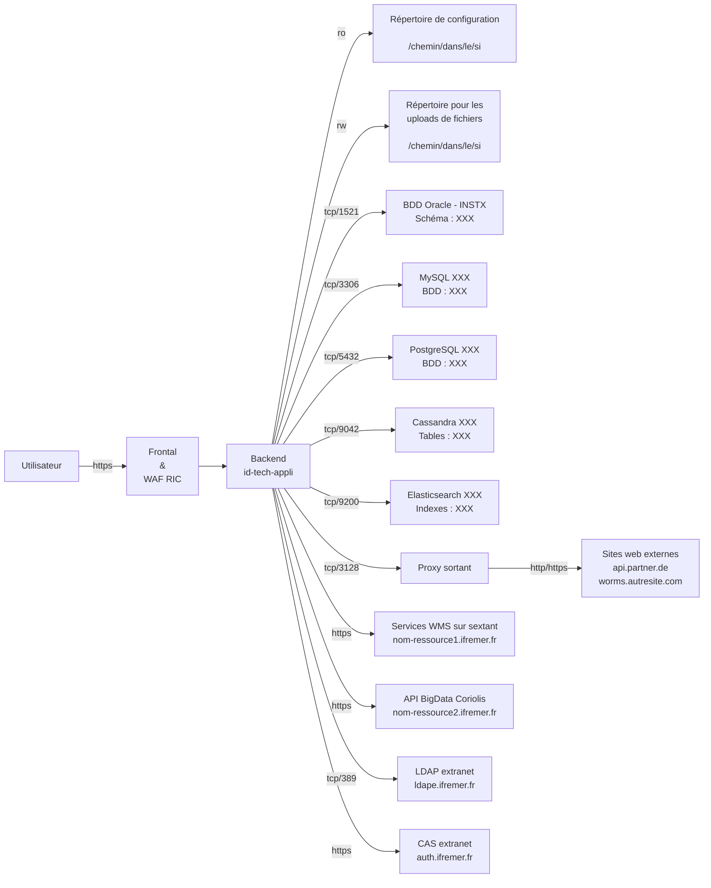

# Nom de l'application (id-tech-appli)

!!! Tips "Présentation fonctionnement fiche signalétique"
    Template de fiche signalétique.

    Commencez par dupliquer ce fichier `*.md`.

    Au fur et à mesure que vous remplissez la fiche, supprimez les blocs `Tips`.

    Pensez également à éditer localement sur votre PC la fiche signalétique et visualiser en direct le rendu de vos modifications via le conteneur Docker fourni ([voir le chapitre dédié](./contrib.md#astuce-visualiser-les-changements-localement-et-instantanement)) )

!!! Tips "ACTION REQUISE"
    Décrire succinctement le contexte dans laquelle s'inscrit l'application et ses objectifs principaux.

    Le nom entre parenthèse dans le titre correspond à l'identifiant de l'application qui sera utilisé à plusieurs endroits (nom du service dockerisé, nom du répertoire pour les logs, nom de l'application dans les métriques Grafana, etc...).

## Etat du service

!!! Tips "ACTION REQUISE"
    Renseigner la date de 1ère déploiement de l'application en production.

    Indiquer une date de décommissionnement estimée. Cette date sert uniquement à poser un jalon pour se reposer la question du maintien ou la suppression de l'application (pas de suppression avant l'accord du responsable).

- Opérationnel depuis : MOIS ANNEE
- Date de décommissionnement : ANNEE

## Contacts

!!! Tips "ACTION REQUISE"
    Renseigner les acteurs principaux en lien avec cette application pour pouvoir les contacter facilement.

    Si plusieurs personnes ont la même fonction, splitter l'entrée sur plusieurs lignes ; sinon la mettre sur une seule ligne.

- Responsable fonctionnel : Prenom NOM <prenom.nom@ifremer.fr>
- Responsable exploitation SISMER : Prenom NOM <prenom.nom@ifremer.fr>
- Guichet d'exploitation : <mail-guichet@ifremer.fr>
- Contact technique ISI :
    - Prenom1 NOM1 <prenom1.nom1@ifremer.fr>
    - Prenom2 NOM2 <prenom2.nom2@ifremer.fr>
    - Prenom3 NOM3 <prenom3.nom3@ifremer.fr>
- Contact technique RIC : <assistance@ifremer.fr> ou Prenom NOM <prenom.nom@ifremer.fr>

## Test du service

!!! Tips "ACTION REQUISE"
    Lister les URLs et/ou actions permettant de valider le bon fonctionnement du service en production.

    Certaines URLs seront utilisées par RIC pour monitorer le service périodiquement via la sonde-sites-web (toutes les 5 à 10 minutes, requête GET en anonyme es'attendant à recevoir un statut HTTP `200`).

    Il est également recommandé de vérifier directement ou indirectement le bon fonctionnement entre l'application et ses dépendances. Par exemple, si votre application s'appuie sur une BDD, et que l'affichage d'une page web particulière dépend du bon fonctionnement de la BDD, il est pertinent de référencer cette page dans les URLs à tester (l'URL sera en erreur si le lien entre l'application web et la BDD est HS).

    Par ailleurs, vous pouvez également implémenter un endpoint (ex : `/healthz`) qui vérifiera que toutes les dépendances fonctionnent et retournera alors un statut HTTP `200` (= `OK`). Si un problème est détecté, ce endpoint devra retourné un statut différent comme `500` (= `Server Internal Error`).

    Supprimer les éléments ci-dessous qui ne servent pas (ex : tout le script de test quand vous avez des dizaines d'URL à tester).

- Racine : <https://mon-appli.ifremer.fr>
- Accès espace disque Datawork : <https://mon-appli.ifremer.fr/graph/stations-123456.png>
- Lien avec BDD PostgreSQL : <https://mon-appli.ifremer.fr/stations/123456>
- Lien avec cluster Elasticsearch : <https://mon-appli.ifremer.fr/stations?name=abc>
- Recherche avancée :

    ```bash
    curl -XPOST -d '{ "filter1": "value1", "filter2": "value2" }' -s https://mon-appli.ifremer.fr/api/mon-endpoint
    ```

<details>
<summary>Script pour tester rapidement un ensemble d'URLs</summary>

(à copier/coller dans un shell bash) :

```bash
#####################################################################
# Configuration
#####################################################################

URLS=(
 https://mon-appli.ifremer.fr/endpoint1
 https://mon-appli.ifremer.fr/endpoint2
 https://mon-appli.ifremer.fr/endpoint3
 https://mon-appli.ifremer.fr/endpoint4
)

EXPECTED_RESPONSE_CONTENT_TYPE="text/html"
EXPECTED_RESPONSE_HTTP_STATUS=200

# Durée maximale pour obtenir la réponse en secondes
EXPECTED_MAX_TIME=10

#####################################################################
# VARIABLES INTERNES AU SCRIPT
#####################################################################
TEST_OK=true
ERROR_URLS=()

#####################################################################
# FONCTIONS
#####################################################################

###
 # Function that tests an URL against its HTTP status code and content type.
 # $1 - URL to test
 # $2 - Expected HTTP status code
 # $3 - Expected content type
 ##
function test_url {
    printf "[INFO]  GET ${1} ..."

    http_status=$(curl -s -o /dev/null -w "%{http_code}" "${1}")
    printf "\b\b\b${http_status} ..."
    if [[ "${http_status}" != "${2}" ]]; then
        printf "\n"
        echo "[ERROR] Returned ${http_status} HTTP status (expected: ${2})"
        TEST_OK=false
        ERROR_URLS+=("${1}")
    else
        content_type=$(curl -s -o /dev/null -m ${EXPECTED_MAX_TIME} -w "%{content_type}" "${1}")
        printf "\b\b\b${content_type}\n"
        if [[ ! "${content_type}" =~ ${3} ]]; then
            echo "[ERROR] Returned '${content_type}' content-type (expected: containing '${3}')"
            TEST_OK=false;
            ERROR_URLS+=("${1}")
        fi
    fi
}


#####################################################################
# LANCEMENT DU TEST EN BOUCLANT SUR LES URLs
#####################################################################

for url in "${URLS[@]}"; do
 test_url "${url}" ${EXPECTED_RESPONSE_HTTP_STATUS} "${EXPECTED_RESPONSE_CONTENT_TYPE}"
done


if ${TEST_OK}; then
    echo "[INFO]  Tests succeeded"
else
    echo "[ERROR] Tests failed: check log above"
    echo "[ERROR] Failed URLs:"
    for url in "${ERROR_URLS[@]}"; do
        echo " - ${url}"
    done
fi
```

</details>

## Architecture RIC

!!! Tips "ACTION REQUISE"
    Référencer les élements techniques concernant votre application.

    N'y faites pas apparaître de secrets (mot de passe, token, etc...).

    Si votre application n'est pas concernée par un élément, gardez-le en précisant `N/A` (ceci permet de s'assurer que vous l'avez bien pris en compte).

    Réaliser également un schéma d'architecture simplifié grâce à la librairie MermaidJS. Le schéma doit permettre d'avoir une vue d'ensemble sur la manière dont l'application s'intègre dans le SI.

    Si votre applicatif est divisée en plusieurs conteneurs, vous pouvez :

    - soit créer un sous-paragraphe (via `### Nom sous-composant`) pour chaque conteneur et dupliquer la section courante
    - soit référencer des fiches signalétiques filles (une par sous-composant)

    Certains éléments ne pourront pas être renseignés par le porteur applicatif et le seront par l'équipe RIC lors de la MEX.

    Si certains éléments sont manquants dans le template, n'hésitez pas à les rajouter et à notifier <webric@ifremer.fr> pour que nous rajoutions la section concernée au template.

- **Visibilité** : `Internet` ou `intranet` ou `Non exposé - Sidecar de l'application id-autre-application`
- **Technos** : principales technos utilisées par l'application (serveur web, langage, framework, ...)
    - `Apache`, `Nginx`, `uswgi`, `unicorn`, `NodeJS`, ...
    - `PHP 8`, `Java 21`, `Python 3.11`, `JavaScript`, `TypeScript`, ...
    - `Symphony`, `SpringBoot 3`, `Django`, `NextJS`, `AngularJS`, `React`, ...
- **Backend** : `nom-machine`
- **Service** : `dockersvc@id-tech-appli`
- **Réseau Docker spécifique** : `N/A` ou `nom-reseau-docker-specifique` (utile quand plusieurs conteneurs communiquent directement ensemble sur la même VM)
- **Runtime** :
    - **RAM** : `X Go`
    - **CPU** : `X CPUs`
    - **Utilisateur & groupe Unix principal** : `user` / `groupA`
    - **Groupes Unix additionnels** :  `groupB`,  `groupC`,  `groupD`
- **Espaces disques** : `N/A` ou 1 entrée par espace disque
    - Description espace disque n°1
        - Dans le SI : `/chemin/commun/dans/systeme/dinformation`
        - Dans le conteneur : `/point/montage/dans/conteneur`
        - Accès : `RO` ou `R/W`
        - Volumétrie : `x Go`
        - Sauvegardé : `Oui` / `Non`
    - Description espace disque n°2
        - Dans le SI : `/chemin/commun/dans/systeme/dinformation`
        - Dans le conteneur : `/point/montage/dans/conteneur`
        - Accès : `RO` ou `R/W`
        - Volumétrie : `x Go`
        - Sauvegardé : `Oui` / `Non`
- **MySQL** : `N/A` ou 1 entrée par BDD
    - Description succincte de la BDD MySQL n°1
        - Serveur : `nom-serveur-mysql.ifremer.fr` / port `3306`
        - Utilisateur : `nom-utilisateur-bdd`
        - BDD : `nom-base-de-donnees`
        - Accès : `RO` ou `R/W`
- **Oracle** : `N/A` ou 1 entrée par BDD
    - Description succincte de la BDD Oracle n°1
        - Instance Oracle : `INSTX`
        - Utilisateur : `nom-utilisateur-bdd`
        - Service (BDD) : `nom-du-service-de-base-de-donnees`
        - Accès : `RO` ou `R/W`
- **PostgreSQL** : `N/A` ou 1 entrée par BDD
    - Description succincte de la BDD PostgreSQL n°1
        - Serveur : `nom-serveur-postgres.ifremer.fr` / port `numero-port`
        - Utilisateur : `nom-utilisateur-bdd`
        - BDD : `nom-base-de-donnees`
        - Accès : `RO` ou `R/W`
- **Cassandra** : `N/A` ou 1 entrée par accès
    - Description succincte des indexes n°1
        - Cluster : `nom-cluster-cassandra.ifremer.fr` / port `numero-port`  + noeuds de connexions
        - Utilisateur : `nom-utilisateur-cassandra`
        - Tables : `nom-tables`
        - Accès : `RO` ou `R/W`
- **Elasticsearch** : `N/A` ou 1 entrée par accès
    - Description succincte des indexes n°1
        - Cluster : `nom-cluster-elasticsearch.ifremer.fr` / port `9200`
        - Utilisateur : `nom-utilisateur-elasticsearch`
        - Indexes : `nom-index`
        - Accès : `RO` ou `R/W`
- **Flux HTTP/HTTPS internes à l'infrastructure Ifremer** : `N/A` ou 1 entrée par flux interne
    - Description du flux n°1 (ex : Services WMS sur sextant)
        - `https://nom-ressource1.ifremer.fr`
    - Description du flux n°2 (ex : [API BigData Coriolis](scientific/oceanography/coriolis/dataAccessAPI.md))
        - `https://nom-ressource2.ifremer.fr`
- **Flux HTTP/HTTPS externes à l'infrastructure Ifremer (passage par proxy sortant)** : `N/A` ou 1 entrée par flux externe
    - Description du flux n°1 (ex : Localisation des navires de la flotte allemande)
        - `https://api.partner.de`
    - Description du flux n°2 (ex : Référentiels WoRMS)
        - `https://worms.autresite.com`
- **CAS** : `N/A` ou `Extranet` ou `Intranet` ou `Fédération Renater` ...
    - Décrire la raison pourquoi une connexion avec LDAP est nécessaire (ex : synchonisation données utilisateurs)
    - Serveur : `nom-serveur.ifremer.fr`
- **LDAP** : `N/A` ou `Extranet` ou `Intranet` ou ...
    - Décrire la raison pourquoi une connexion avec LDAP est nécessaire (ex : synchonisation données utilisateurs)
    - Serveur : `nom-serveur-ldap.ifremer.fr` / port `389`
- **SMTP** : `N/A` ou remplir les éléments suivants
    - Décrire la raison pourquoi des e-mails doivent être envoyés (ex : notification nouveau dataset)
    - Serveur : `smtp.ifremer.fr` / port `25`
    - Adresse expéditeur : `noreply+id-tech-appli@ifremer.fr`
- **Variables d'environnement** : `N/A` ou lister les variables d'environnement qui présentent un intérêt d'être présentées ici
    - `NOM_ENVVAR` : description de la variable
    - `SIDECAR_URL` : URL pour joindre le sidecar
- **Grafana** : [Métriques du conteneur (CPU/RAM/...)](https://grafana.ifremer.fr/d/MUJ1h-2Vz/appli-web-dockerisees-wiz?orgId=1&refresh=1m&var-servers=nom-machine-admin_ifremer_fr&var-application=docker_container-id-tech-appli)
- **Logs** : `/home/logsdockersvc/zone/id-tech-appli/`

### Schéma simplifié d'architecture

!!! Tips "ACTION REQUISE"
    Créer un schema simplifié avec MermaidJS ([syntaxe disponible en ligne](http://mermaid.js.org/syntax/flowchart.html).

    Ce schéma permet d'avoir une vue d'ensemble et les interactions entre les composants.

    Schéma au format texte donc facilement éditable et modification tracée dans Git.

    Si vous voulez plutôt un schéma dans le sens "Top-Down" plutôt que `Left-Right`, remplacez `graph LR` par `graph TD`.

    Une astuce consiste également à créer les éléments avec les libellés en début de bloc. Le reste du bloc ne référençant que les liens entre composants.

    Pensez également à éditer localement sur votre PC la fiche signalétique et visualiser en direct le rendu de vos modifications via le conteneur Docker fourni ([voir le chapitre dédié](./contrib.md#astuce-visualiser-les-changements-localement-et-instantanement)) )

    N'ayez pas peur du schéma d'exemple car quasiment tous les flux possibles y ont été représentés. Supprimer ceux dont vous n'avez pas besoin.



## Documentation et manuels

- Projet GitLab : <https://gitlab.ifremer.fr/chemin/vers/code/source>
- Documentation d'exploitation : `N/A` ou <https://chemin/vers/documentation> ou `/home/mon-projet/chemin/vers/documentation`
