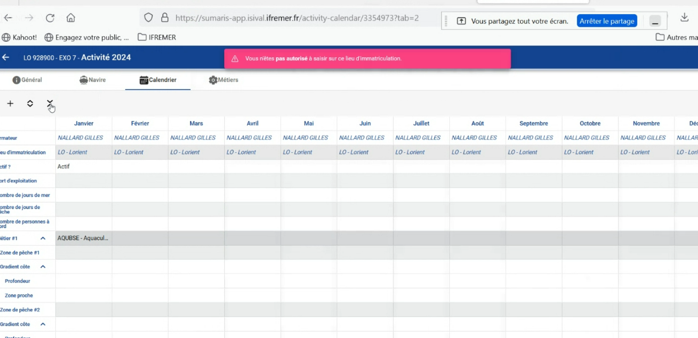

# Activity Calendar - Demo 3 MOA

## Application

- URL : https://sumaris-app.isival.ifremer.fr
- Node choice : https://sumaris-pod.isival.ifremer.fr
- Login : Intranet user account

---

## 27/08/2024 - Demo 3

### Activity Calendar - Sprint 4 - Issues Board

- **Sprint** : 4
- **Start date** : 24/06/2024
- **End date** : 19/07/2024
- **Milestone** : **2.9.20.1**
- **Status** : Closed
- [gitlab Issues board](https://gitlab.ifremer.fr/sih-public/sumaris/sumaris-app/-/boards/873?label_name[]=ACTIFLOT&milestone_title=2.9.20)
- [gitlab Issues board](https://gitlab.ifremer.fr/sih-public/sumaris/sumaris-app/-/boards/873?label_name[]=ACTIFLOT&milestone_title=2.9.20.1)

---

### Fonctionnalités / Limitations

Fonctionnalités du sprint 4
- Filtres
  - Suppression des filtres "Programme" et "Année"
  - Ajout des filtres "Objectif d'enquête directe ?" et "Enquête éco ?"
- Onglet "Général"
  - Suppression du code dans les listes déroulantes
- Onglet "Navire"
  - Affichage des données dans la colonne "FPC"
  - Fusion des lignes ayant des carac identiques
  - Implémentation du tableau des armateurs

---

- Onglet "Calendrier"
  - Affichage de l'armateur
  - Utilisation du double-clic pour l'édition
  - Restriction des valeurs de la colonne "Actif ?"
  - Affichage de la liste des métiers
  - Améliorations des fonctionnalités "Etendre" et "Copier/coller"
  - Gestion de plusieurs sources de prédoc
  - Implémentation du copier/coller de la prédoc
  - Implémentation du vidage du calendrier
  - Corrections lors de l'enregistrement

---

- Implémentation du formulaire terrain vierge
- Formulaire terrain avec données :
  - Affichage de plusieurs lieux d'immatriculation
  - Affichage des cases à cocher pour la qualification de l'enquête et la vente
  - Suppression du tableau des carac engin si vide

---

Limitations du sprint 3 
- [Retours de recette ActiFlot v2.9.20.1](https://gitlab.ifremer.fr/sih-public/sumaris/sumaris-doc/-/blob/master/projects/activity-calendar/rec/rec-24-002-activity-calendar-refonte-recette-2.9.20.md?ref_type=heads)

---

### Recette MOE/MOA du sprint 4

Navigateur préconisé pour la recette : **Chrome**

- Sumaris-Calendrier d'activité ([SquashTM](http://visi-common-squash.ifremer.fr:8080/squash/login))
  - 3 - Collecte de données
    * 01.01 - Consultation des calendriers
    * 01.02 - Saisie d'un calendrier
  - 4 - Formulaires & rapports
    * 02 - Formulaire terrain vierge
    * 03 - Formulaire terrain avec données

Début recette MOA le ?

---

### Sprint 5 terminé (2.9.21)

- [gitlab Issues board](https://gitlab.ifremer.fr/sih-public/sumaris/sumaris-app/-/boards/873?label_name[]=ACTIFLOT&milestone_title=2.9.21)
- Version en cours de génération
- Démonstration à planifier pour Septembre

---

### Sprint 6 en cours (2.9.22)

- [gitlab Issues board](https://gitlab.ifremer.fr/sih-public/sumaris/sumaris-app/-/boards/873?label_name[]=ACTIFLOT&milestone_title=2.9.22)

---

### Notes Réunion

- Présents :
  - Emilie Le Roy (MOA/HISSEO)
  - Vincent Badts (MOA/HISSEO)
  - Johann Le Traon (MOA/HISSEO)
  - Vincent Fachéro (MOE/ISI)
  - Caroline Destreez (MOE/CODRA)
  - Morgan Facorat (CODRA)
  - Benoit Lavenier (EIS)
  - Maxime Demarest (EIS)

---

Présentation 
- Filtres : 
  - Colonne année absente du tableau (sera remise)
  - Rajouter le type des navires avant le filtre sur navire
  - Objectif d'enquête directe : Liste déroulante avec valeurs "Oui / Non / Opportuniste"

- Calendrier : 
  - Utiliser les calendriers vierges (simulation d'importation)
    - Une seule colonne "Observateur(s)" à la place d'Enquêteurs et "Saisisseurs"
  - Inactivité annulle : utiliser le radio button avec l'option de vidage de la valeur
  - Saisie :
    - Métier : Métier sans engin affiché
    - Améliorations significatifs de options de saisie : Scroll, Copier/Coller
      - Bug sur Etendre vers la gauche
    - Prédocumentation 
      - Les mois sont issues du calendrier courant
      - Si 2 sources : Les mois affichés sont Enquête N-1 et Sacrois
      - Copie vers le calendrier courant : demander une confirmation
        - Le mettre sur la totalité de la copie et pas sur la copie d'une ou plusieurs cellules
      - Il faut activer le bouton "Réinitialiser"
      - Pouvoir sélectionner tout un mois en cliquant sur l'entête du mois. Idem pour les lignes
      - Erreur sur un compactage de ligne :
        - 
          - Problème de droit ?
      - Pas de nombre maximum de métier. Faire un erecherche en base pour avoir un ordre de grandeur 
du nombre de calendriers avec plus de 10 métiers et récupérer les métiers pour analyse - Action CDE-VFA
    - Type de rapport
      - Mettre un message si erreur de saisie et si le rapport ne s'affiche pas
      - Formulaire vierge : 
        - Ne pas afficher les qualifications de l'enquête "Recopie xxxx", mais les afficher sur le rapport avec données
        - Avec des informations sur le navire (depuis le tableau de consultation si un calendrier est sélectionné)
        - Sans information (depuis le tableau de consultation si rien n'est sélectionné)
        - Afficher uniquement les caractéristiques engins suivantes :
          - "Plus petit maillage étiré en mm"
          - "Dimension"
        - Rajouter les carac liées aux engins. Voir ce que ça pourrait donner. Actuellement ces infos sont sur le site web du SIH
      - Avoir un formulaire navire avec des infos sur le navire (Option à mettre dans ...)

- Navires
  - RAS

