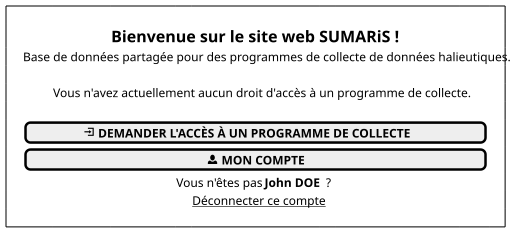
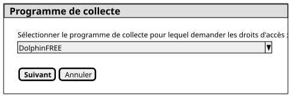
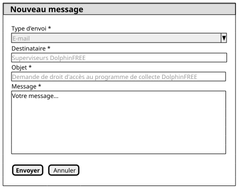
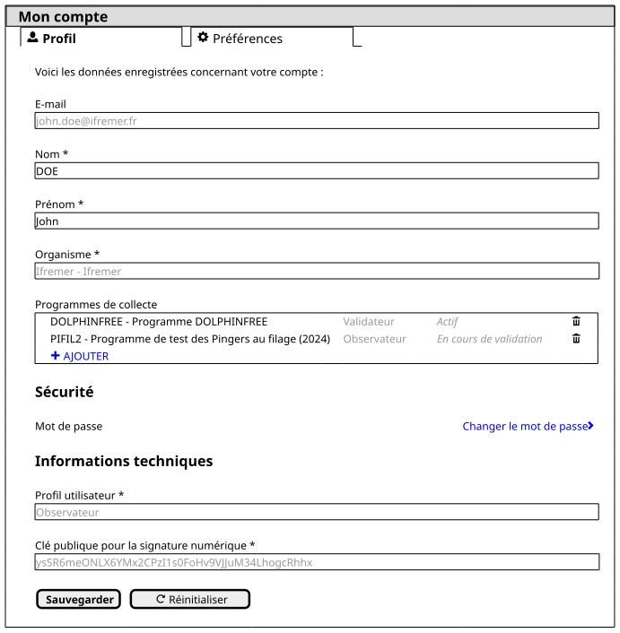

# Spécifications des règles de gestion des droits d'accès des utilisateurs aux programmes de collecte

Table des matières

<!-- TOC -->
* [Rappel](#rappel)
  * [Profils d'utilisateurs](#profils-dutilisateurs)
  * [Privilèges d'utilisateurs](#privilèges-dutilisateurs)
* [Demandeur](#demandeur)
  * [Rôles éligibles](#rôles-éligibles)
  * [Écran d'accueil](#écran-daccueil)
  * [Fenêtre de sélection du programme de collecte](#fenêtre-de-sélection-du-programme-de-collecte)
  * [Fenêtre d'envoi d'un message de demande de droits](#fenêtre-denvoi-dun-message-de-demande-de-droits)
  * [Écran Mon compte](#écran-mon-compte)
* [Valideur](#valideur)
  * [Rôles éligibles](#rôles-éligibles-1)
  * [Interface de validation](#interface-de-validation)
<!-- TOC -->

# Rappel

## Profils d'utilisateurs

Il y a, dans l'application SUMARiS, quatre types de profils :

| Profil         | Code          |
|:---------------|---------------|
| Administrateur | Administrator |
| Superviseur    | Supervisor    |
| Observateur    | Observer      |
| Invité         | Guest         |

Le type de profil est attribué par un _**Administrateur**_.

## Privilèges d'utilisateurs

Il y a, dans l'application SUMARiS, cing types de privilèges :

| Profil                   | Code      |
|:-------------------------|-----------|
| Responsable de programme | Manager   |
| Validateur               | Validator |
| Qualificateur            | Qualifier |
| Observateur              | Observer  |
| Lecture seule            | Viewer    |

Le type de privilège (droit d'accès) est attribué par un _**Responsable de programme**_.

# Demandeur

## Rôles éligibles

Le demandeur de droits d'accès à un programme de collecte peut avoir n'importe quel rôle, y compris _**Invité**_.

## Écran d'accueil

À la connexion, si l'utilisateur n'a de droit d'accès sur aucun programme, les éléments conditionnels suivants s'affichent :

 * Message d'information
   * "Vous n'avez actuellement aucun droit d'accès à un programme de collecte."
 * Bouton _**Demander l'accès à un programme de collecte**_
   * Affichage vers la [Fenêtre de sélection du programme de collecte](#fenêtre-de-sélection-du-programme-de-collecte)

## Fenêtre de sélection du programme de collecte

La fenêtre est modale.

Elle comprend les composants suivants :

 * Liste déroulante _**Programmes de collecte**_
   * Sélection multiple
   * Affiche tous les programmes de collecte actifs de la base de données
* Liste déroulante _**Type de droits**_
    * Affiche tous les privilèges disponibles
      * Responsable de programme
      * Validateur
      * Qualificateur
      * Observateur
      * Lecture seule
    * "Observateur" par défaut
 * Bouton _**Suivant**_
   * Affichage de la [Fenêtre d'envoi d'un message de demande de droits](#fenêtre-denvoi-dun-message-de-demande-de-droits)
 * Bouton _**Annuler**_
   * Retour à l'[Écran d'accueil](#écran-daccueil)

## Fenêtre d'envoi d'un message de demande de droits

La fenêtre est modale.

Elle comprend les composants suivants :

 * Liste déroulante _**Type d'envoi**_
   * Valeur sélectionnée
     * "E-mail"
   * Désactivée
   * Masquée (si possible)
 * Champ de saisie _**Destinataire**_
   * Valeur renseignée
     * Groupe de superviseurs du programme de collecte demandé
       * Tous les utilisateurs ayant le rôle _**Superviseur**_ et l'accès au programme de collecte demandé
  * Désactivé
  * Masqué (si possible)
 * Champ de saisie _**Objet**_
   * Valeur renseignée
     * "Demande de droit d'accès au programme de collecte _**Programme demandé**_"
   * Désactivé
 * Champ de saisie _**Message**_
   * Activé 
 * Bouton _**Envoyer**_
   * Envoi du message
   * Cas de sélection d'un seul programme de collecte
     * Affichage de l'[Écran d'accueil](#écran-daccueil)
   * Cas de sélection de plusieurs programmes de collecte
     * Si pas dernière occurrence
       * Affichage de la [Fenêtre d'envoi d'un message de demande de droits](#fenêtre-denvoi-dun-message-de-demande-de-droits) pour l'occurrence suivante
     * Si dernière occurrence
       * Affichage de l'[Écran d'accueil](#écran-daccueil)
 * Bouton _**Annuler**_
   * Cas de sélection d'un seul programme de collecte
     * Affichage de l'[Écran d'accueil](#écran-daccueil) 
   * Cas de sélection de plusieurs programmes de collecte
     * Si pas dernière occurrence
       * Affichage de la [Fenêtre d'envoi d'un message de demande de droits](#fenêtre-denvoi-dun-message-de-demande-de-droits) pour l'occurrence suivante
     * Si dernière occurrence
       * Affichage de l'[Écran d'accueil](#écran-daccueil)

## Écran Mon compte

L'utilisateur a accès, dans les données de son compte, à la liste des programmes de collecte auxquels il a souscrit.

Chaque ligne de la liste comprend les éléments suivants :
 * Nom du programme de collecte
 * Type de droits d'accès
 * Statut des droits d'accès
   * "Actif"
   * "En cours de validation"
 * Bouton _**Suppression**_
   * Affichable au survol
   * Affichage d'un message de confirmation de suppression
   * Suppression des droits
     * Hard delete ou soft delete ?

La dernière ligne de la liste comprend un lien cliquable "+ Ajouter" :
 * Affichage de la [Fenêtre de sélection du programme de collecte](#fenêtre-de-sélection-du-programme-de-collecte)

# Valideur

## Rôles éligibles

Le valideur quelque soit son rôle, doit être _**Responsable de programme**_ pour le programme concerné.

## Interface de validation