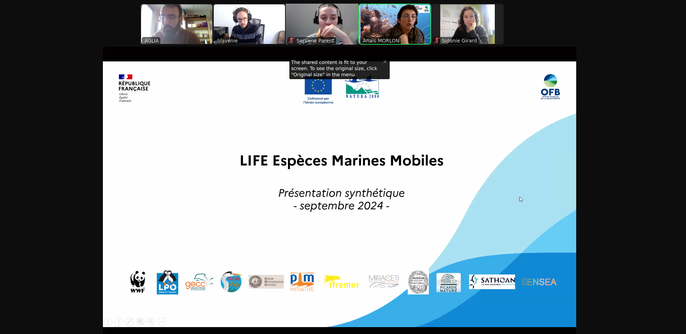
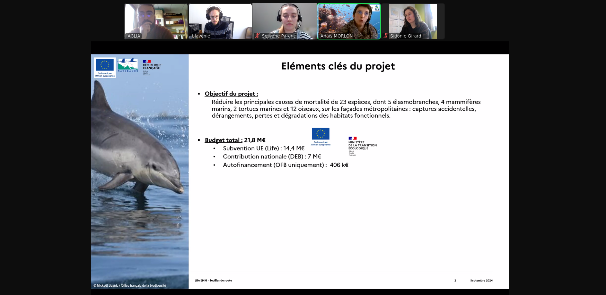
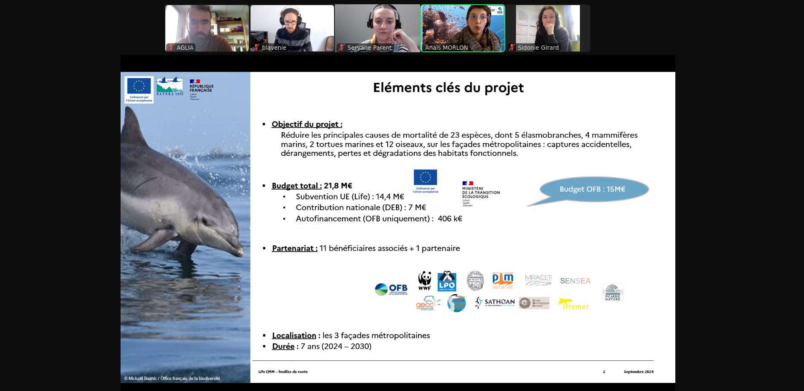
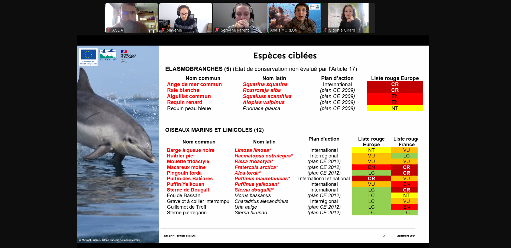
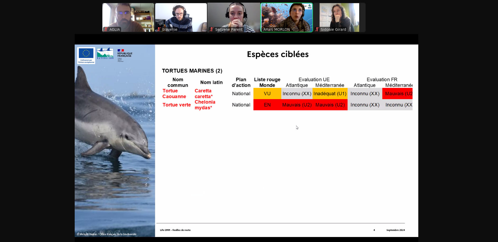
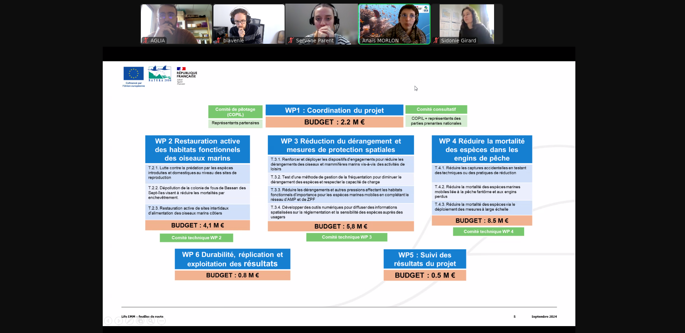

# Projet Life EMM

OFB

> Participants:
> - Anaïs MORLON
> - Sidonie GIRARD
> - Servane PARENT

OP / association : 
- WWF et LPO

Outils existants connus : 
- Obs En Mer
- Echo Si

Mise en production :
- Avril/Mai 2024

