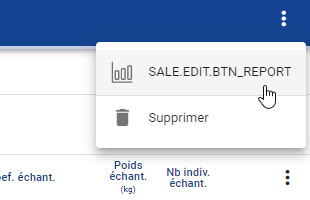
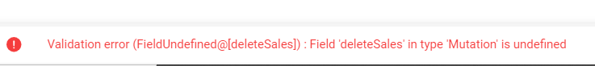

# ObsVentes - Recette MOA sur la démo 3

## Présentation démo 3 MOA 

- [Présentation]()
- [Retours de recette]()

---

## Retours de recette MOA (Marion Scavinner, Elise Bultel)

A plannifier

## Retours de recette MOE 

### Sortie > Echantillonnages en métropole
- [Spécifications](/projects/obsvente/spe/collecte_de_donnees.md#sortie--echantillonnages-en-métropole)

- Anomalies :
  - [ ] A l'ajout d'un PETS, il est possible de décocher la colonne "Observé ?". On ne devrait pas pouvoir.
  - [ ] Le fonctionnement de la colonne "Observé ?" n'est pas correcte.
    - Si on la coche, on doit renseigner obligatoirement une raison de non observation
    - Il est possible de la cocher et de saisir une raison de non observation
 
### Vente > Détails
- [Spécifications](/projects/obsvente/spe/collecte_de_donnees.md#vente--détails)

- Anomalies :
  - [ ] Problème de saleType.id négatif (issue [#637](https://gitlab.ifremer.fr/sih-public/sumaris/sumaris-app/-/issues/637))

### Vente > Lots

- Anomalies :
  - [ ] La liste des lots à échantillonnés contient les PETS et les espèces tirées au sort (remonté lors de la recette 2.9.19)
    - Il faudrait une seule espèce
  - [ ] Si on sélectionne l'espèce commerciale et l'espèce scientifique puis que l'on change l'espèce scientifique, l'espèce commerciale n'est pas modifiée.
  On peut alors saisir une espèce commerciale et scientifique qui ne corresponde pas.
  - [ ] L'ajout de lot n'est pas sauvegardé
    - Quand on ajoute un lot, on sauvegarde (pas d'erreur). Quand on revient sur la vente ou que l'on rafraichit, le lot précédemment saisi n'apparait pas.

log côté pod : 
Aucune erreur


  - [ ] Problème de label pour éditer le rapport de la vente 
  


  - [ ] La validation du bouton ramène à la page d'accueil

  - [ ] Erreur lors de la suppression d'une vente 



log côté pod : 

```
2024-08-09 11:02:59,663 WARN  [http-nio-8080-exec-9] notprivacysafe.graphql.GraphQL             : Query did not validate : 'mutation DeleteSales($ids: [Int]) {
Aug 09 11:02:59 visi-docker-val4 dockersvc_sumaris-pod[2738570]:   deleteSales(ids: $ids)
Aug 09 11:02:59 visi-docker-val4 dockersvc_sumaris-pod[2738570]: }'
```