# 
Manuel du superviseur

 
 

 
 
 

Programmes PIFIL 2 et DolphinFREE

 
 
 
 

Version 2.9.34.1

Dernière mise à jour : 14/03/2025

 
 

Auteur : E-IS

 
 

**Licence: [Creative Commons Attribution-ShareAlike 4.0 (CC-by-SA)](https://creativecommons.org/licenses/by-sa/4.0/)**

Table des matières

 
 
 

<!-- TOC -->
* [Préambule](#préambule)
  * [Objectif de l'application](#objectif-de-lapplication)
  * [Pré-requis](#pré-requis)
* [Assistance technique](#assistance-technique)
* [Accéder à l'application SUMARiS](#accéder-à-lapplication-sumaris)
  * [Écran d'accueil (mode non-identifié)](#écran-daccueil-mode-non-identifié)
  * [Fenêtre Inscription](#fenêtre-inscription)
  * [Fenêtre Authentification](#fenêtre-authentification)
  * [Fenêtre Réinitialisation du mot de passe](#fenêtre-réinitialisation-du-mot-de-passe)
* [Utiliser l'application SUMARiS](#utiliser-lapplication-sumaris)
  * [Écran d'accueil (mode identifié)](#écran-daccueil-mode-identifié)
  * [Gérer les droits d'accès des utilisateurs à un programme de collecte](#gérer-les-droits-daccès-des-utilisateurs-à-un-programme-de-collecte)
    * [Écran Programmes](#écran-programmes)
    * [Écran de paramétrage d'un programme](#écran-de-paramétrage-dun-programme)
      * [Onglet Détails](#onglet-détails)
      * [Onglet Droits d'accès](#onglet-droits-daccès)
        * [Privilèges des utilisateurs](#privilèges-des-utilisateurs)
        * [Ajout d'un utilisateur au programme de collecte](#ajout-dun-utilisateur-au-programme-de-collecte)
        * [Modification des droits d'accès d'un utilisateur au programme de collecte](#modification-des-droits-daccès-dun-utilisateur-au-programme-de-collecte)
        * [Retrait d'un utilisateur du programme de collecte](#retrait-dun-utilisateur-du-programme-de-collecte)
  * [Gérer les navires](#gérer-les-navires)
    * [Écran Navires](#écran-navires)
    * [Fenêtre Nouveau navire](#fenêtre-nouveau-navire)
    * [Écran Détails d'un navire](#écran-détails-dun-navire)
<!-- TOC -->

# Préambule

_**SUMARiS**_ est un outil de saisie en ligne de données halieutiques, développé par _**E-IS**_.

Ce document a pour objet d'aider efficacement le superviseur à affecter des droits d'accès, dans le cadre des programmes _**PIFIL 2**_ et _**DolphinFREE**_, à des utilisateurs ayant un compte dans l'application _**SUMARiS**_. Il s'adresse exclusivement aux utilisateurs ayant un compte de type _**Responsable de programme**_ (_**Manager privilege**_). 

## Objectif de l'application

_**SUMARiS**_ est un système d'information en ligne destiné à la collecte, au traitement et à l'extraction de données
ainsi qu'à la diffusion de résultats et d'agrégations.

## Pré-requis

Afin de pouvoir accéder à l'application en tant que superviseur, l'utilisateur doit :
- avoir créé un compte utilisateur,
- avoir validé son compte utilisateur via le lien reçu par e-mail,
- avoir reçu les privilèges de _**Responsable de programme**_ (_**Manager privilege**_) d'un superviseur de son programme de collecte ou d'un administrateur.

Pour pouvoir effectuer les actions décrites dans ce document, l'utilisateur doit se connecter avec son compte à l'application [SUMARiS](https://open.sumaris.net), à l'adresse https://open.sumaris.net. 

# Assistance technique

Pour remonter les questions ou problèmes :

* Contacter en priorité le superviseur de votre organisation (ou _**CNPMEM**_), qui est chargé de vous assister,
* À défaut, contacter l'assistance technique :
    * Par e-mail :
        * Moyen de communication à privilégier
        * [support@sumaris.net](mailto:support@sumaris.net)
    * Par téléphone :
        * Du lundi au vendredi, de 9h à 18h30
        * [+33 (0)9 53 24 41 20](tel:+33953244120)

# Accéder à l'application SUMARiS

L'application est disponible, depuis un navigateur Internet, à l'adresse suivante : https://open.sumaris.net/. 

## Écran d'accueil (mode non-identifié)

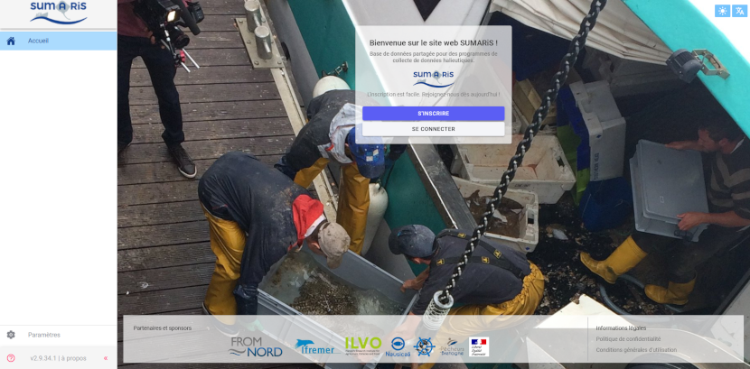

Deux boutons sont disponibles :

* _**S'inscrire**_
  * Lien vers la [Fenêtre Inscription](#fenêtre-inscription)
* _**Se connecter**_
  * Lien vers la [Fenêtre Authentification](#fenêtre-authentification)

## Fenêtre Inscription

Lors de la première utilisation de l'application, il est nécessaire de créer un compte utilisateur pour s'authentifier.

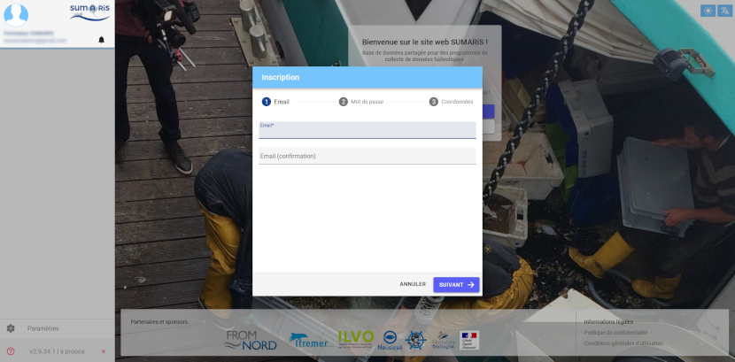

Renseigner deux fois l'adresse e-mail. Elle doit obligatoirement être valide.

Appuyer sur le bouton _**Suivant**_.

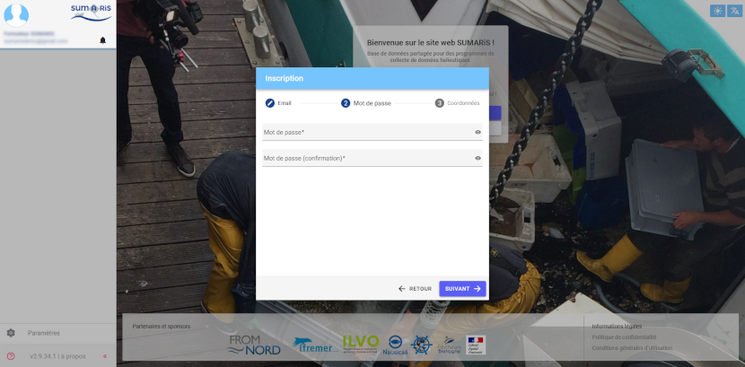

Renseigner deux fois le mot de passe. Il doit être sécurisé, à savoir, comprendre différents types de caractères (majuscules,
minuscules, nombres, caractères spéciaux...).

Appuyer sur le bouton _**Suivant**_.

Renseigner les nom, prénom et organisme de du compte utilisateur à créer.

**NB :**

> Le champ _**Organisme**_ correspond à l'_**OP**_ du nouvel utilisateur ou, à défaut, à son _**CRPMEM**_.

À l'issue de l'inscription, l'utilisateur est automatiquement redirigé vers l'[Écran d'accueil (mode identifié)](#écran-daccueil-mode-identifié).

**⚠ AVERTISSEMENT !**

> L'utilisateur doit impérativement demander à son _**OP**_ (ou _**CRPMEM**_) de lui donner les droits de saisie sur le programme _**PIFIL 2**_ ou _**DolphinFREE**_.  
> Sous quelques jours, il sera notifié par e-mail de l'attribution des droits d'accès.  
> Avant cela, la saisie de marées ne sera pas possible.

À la création du compte, un e-mail automatique est envoyé au nouvel utilisateur afin de valider l'adresse.

**⚠ AVERTISSEMENT !**

> Si le nouvel utilisateur ne reçoit pas immédiatement d'e-mail de confirmation d'inscription, il doit impérativement aller vérifier ses messages indésirables.

Chaque utilisateur authentifié a, au départ, un statut d'invité qui lui permet de visualiser mais pas de saisir de données.

Une fois que le nouvel utilisateur a validé son compte en cliquant sur lien de l'e-mail de confirmation d'inscription, il est redirigé vers l'application.

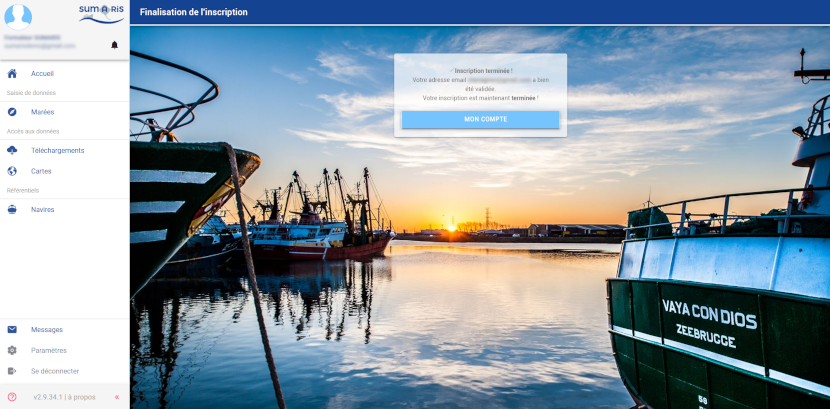

Il obtient alors le statut d'observateur, à moins que son superviseur ne lui octroie les privilèges de superviseur.

## Fenêtre Authentification

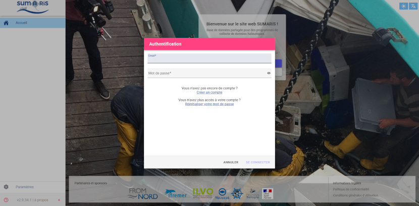

Renseigner l'adresse e-mail et le mot de passe puis valider la saisie en appuyant sur le bouton _**Se connecter**_.

Une fois connecté, l'utilisateur est redirigé vers l'[Écran d'accueil (mode identifié)](#écran-daccueil-mode-identifié).

Le lien _**Créer un compte**_ permet d'afficher la [Fenêtre Inscription](#fenêtre-inscription).

Le lien _**Réinitialiser votre mot de passe**_ permet d'afficher la [Fenêtre Réinitialisation du mot de passe](#fenêtre-réinitialisation-du-mot-de-passe).

## Fenêtre Réinitialisation du mot de passe

Renseigner l'adresse e-mail puis valider la saisie en appuyant sur le bouton _**Envoyer la demande**_.

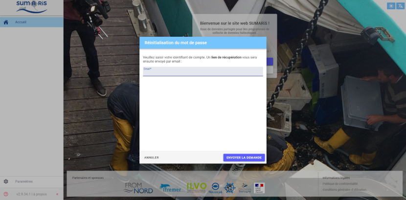

Un message de confirmation d'envoi d'e-mail s'affiche en haut de l'écran.

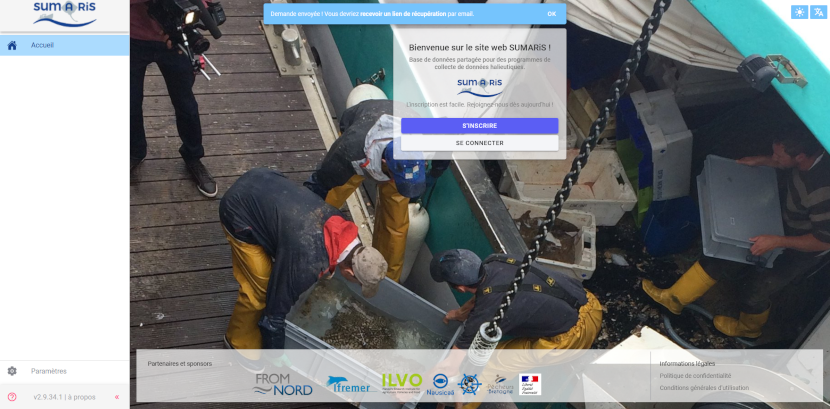

Aller consulter les e-mails et cliquer sur le lien de récupération.

**⚠ AVERTISSEMENT !**

> Si l'utilisateur ne reçoit pas immédiatement d'e-mail de réinitialisation de mot de passe, il doit impérativement aller vérifier ses messages indésirables.

Le lien présent dans le message envoyé redirige vers la fenêtre de saisie du nouveau mot de passe.

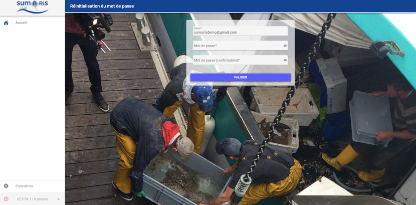

Saisir le nouveau mot de passe deux fois et appuyer sur le bouton _**Valider**_ de la fenêtre.

# Utiliser l'application SUMARiS

## Écran d'accueil (mode identifié)

Si l'utilisateur n'a pas validé son compte, il n'aura aucun droit d'accès. Il accèdera à l'écran ci-dessous, qui ne permet aucune action.

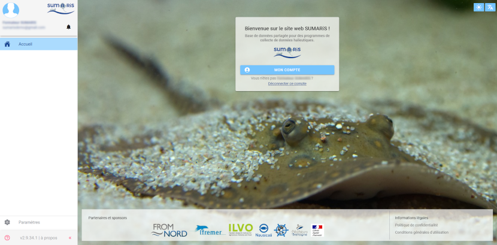

Une fois son compte validé, il pourra accéder à toutes les fonctionnalités permises par ses privilèges utilisateur.

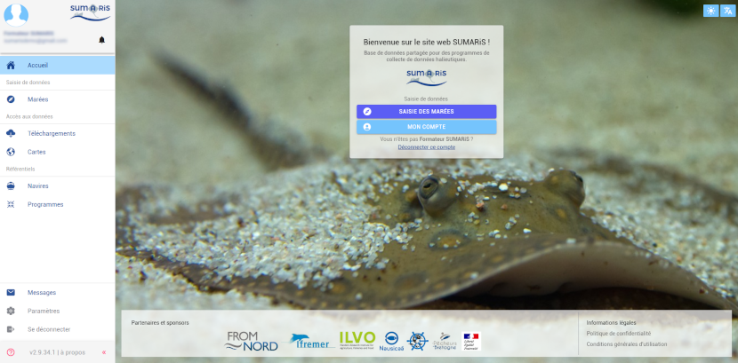

**NB :**

> Tant que les droits d'accès n'ont pas été attribués au compte par l'_**OP**_ (ou _**CRPMEM**_), l'utilisateur ne pourra ni saisir, ni visualiser de marée, ni intervenir en quoi que ce soit sur un programme de collecte.

Le menu latéral est visible sur la partie gauche de l'écran.

Le superviseur peut effectuer les actions suivantes :
- [Gérer les droits d'accès des utilisateurs à un programme de collecte](#gérer-les-droits-daccès-des-utilisateurs-à-un-programme-de-collecte)
  - Accès à l'[Écran Programmes](#écran-programmes) via l'entrée _**Programmes**_ du menu latéral 
    - Si celle-ci n'est pas visible, contacter un autre superviseur du programme ou l'[Assistance technique](#assistance-technique) pour obtenir droits nécessaires.
- [Gérer les navires](#gérer-les-navires)
  - Accès à l'[Écran Navires](#écran-navires) via l'entrée _**Navires**_ du menu latéral
- Se déconnecter
  - Depuis l'entrée _**Se déconnecter**_ du menu latéral
  - Déconnexion du compte utilisateur
  - Redirection vers l'[Écran d'accueil (mode non-identifié)](#écran-daccueil-mode-non-identifié)

## Gérer les droits d'accès des utilisateurs à un programme de collecte

### Écran Programmes

L'écran _**Programmes**_ permet d'afficher la liste des programmes de collecte pour lesquels l'utilisateur connecté a les droits d'accès.

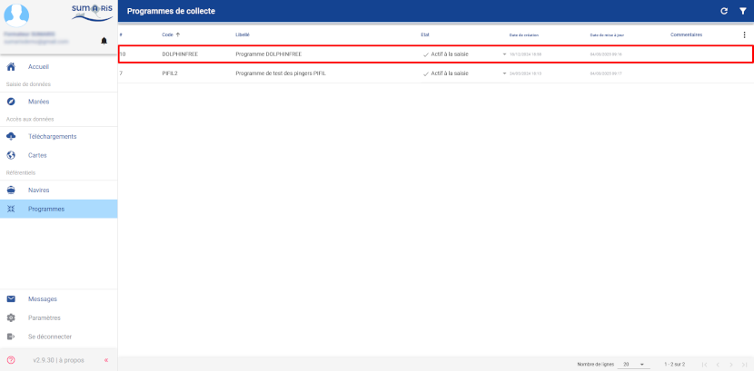

Cliquer sur la ligne du programme désiré (_**PIFIL 2**_ ou _**DolphinFREE**_) pour accéder à l'[Écran de paramétrage d'un programme](#écran-de-paramétrage-dun-programme). 

### Écran de paramétrage d'un programme

L'écran est composé des onglets suivants :

- [_**Détails**_](#onglet-détails)
- Lieux
- Stratégies
- Options
- [_**Droits d'accès**_](#onglet-droits-daccès)

Il s'ouvre par défaut sur l'onglet [_**Détails**_](#onglet-détails).

**⚠ AVERTISSEMENT !**

> Les privilèges affectés au superviseur donnent, pour l'instant accès à tous les onglets.  
> Ne modifier des données que dans l'onglet _**Droits d'accès**_.  
> Modifier les autres données pourrait rendre le programme de collecte inopérant.

#### Onglet Détails

Cet onglet affiche les généralités du programme.

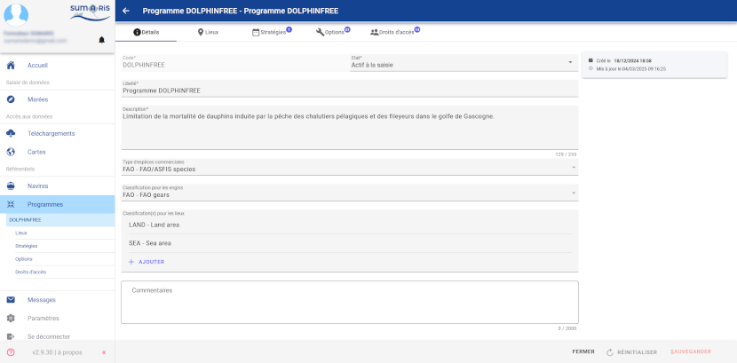

Aucune action n'est requise sur cet onglet. Cliquer sur l'[Onglet Droits d'accès](#onglet-droits-daccès) pour l'afficher.

#### Onglet Droits d'accès

L'onglet affiche la liste de tous les utilisateurs ayant les droits d'accès à ce programme de collecte.

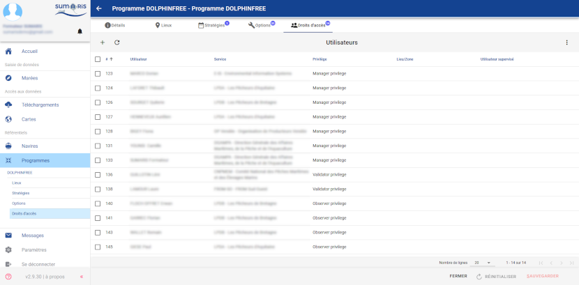

##### Privilèges des utilisateurs

Un utilisateur peut disposer, pour un programme de collecte, des privilèges suivants :
- _**Responsable de programme**_ (_**Manager privilege**_)
- _**Observateur**_ (_**Observer privilege**_)
- _**Qualificateur**_ (_**Qualifier privilege**_)
- _**Validateur**_ (_**Validator privilege**_)
- _**Invité**_ (_**Viewer privilege**_)

Ces privilèges ne sont valables, pour l'utilisateur, que sur le programme de collecte concerné.

Les privilèges à affecter aux utilisateurs sont les suivants :
- _**Observateur**_ (_**Observer privilege**_)
  - Pour les pêcheurs et toute autre personne devant effectuer des observations en mer.
- _**Validateur**_ (_**Validator privilege**_)
    - Pour les responsables devant effectuer des validations de données.
- _**Responsable de programme**_ (_**Manager privilege**_)
    - Pour les responsables de structure devant gérer les droits d'accès des utilisateurs.

##### Ajout d'un utilisateur au programme de collecte

L'appui sur l'icône  ajoute une nouvelle ligne, en orange, en bas du tableau.

À tout moment, l'appui sur l'icône  permet de supprimer la ligne en cours de saisie.

Sélectionner l'utilisateur souhaité dans la liste déroulante qui s'affiche.

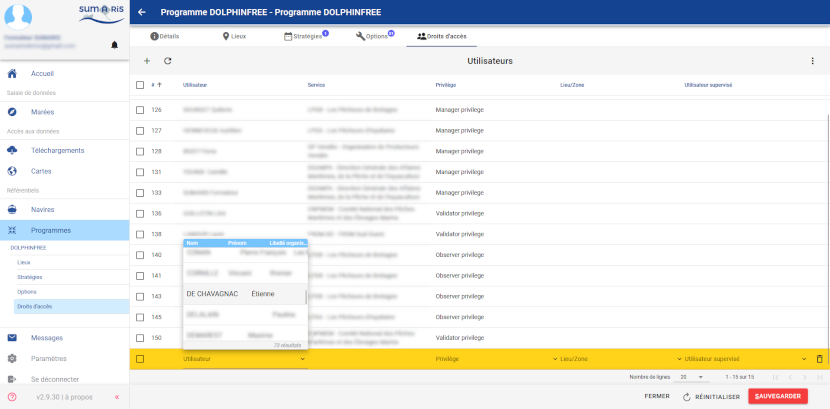

Sélectionner ensuite le champ _**Privilège**_ puis, dans la liste déroulante qui s'affiche, les privilèges souahités.

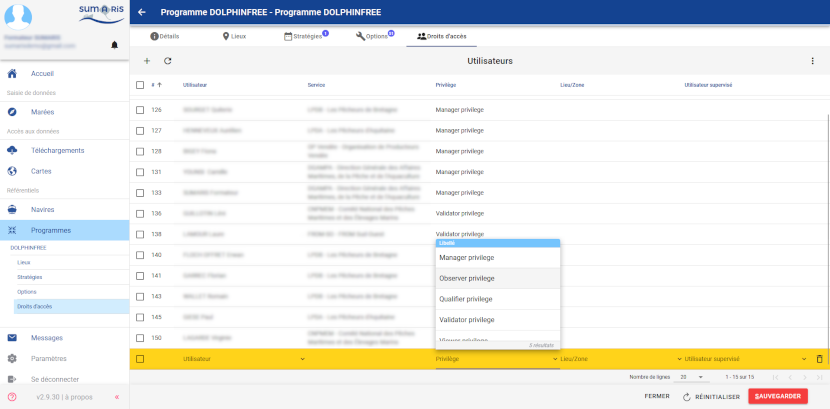

Une fois la saisie terminée, la ligne passe en bleu.

**⚠ AVERTISSEMENT !**

> À ce stade, l'ajout de l'utilisateur n'est pas encore enregistré en base de données.  
> L'ajout de l'utilisateur ne sera effectif qu'après l'appui sur le bouton _**Sauvegarder**_.

Il est alors possible d'ajouter un ou plusieurs autre(s) utilisateur(s), en recommençant l'opération autant de fois que souhaité, en appuyant à chaque fois sur l'icône .

Chaque ligne précédemment créée affichera une icône ★ en son extrémité droite, pour indiquer qu'elle n'est pas encore enregistrée en base de données.

Une fois la saisie terminée, appuyer sur le bouton _**Sauvegarder**_ afin d'enregistrer les modifications dans la base de données.

Le ou les utilisateur(s) nouvellement ajouté(s) apparaissent alors sur fond blanc et sans ★, comme ceux précédemment présents dans le programme de collecte.

##### Modification des droits d'accès d'un utilisateur au programme de collecte

Sélectionner la ligne à modifier. Elle s'affiche alors en bleu.

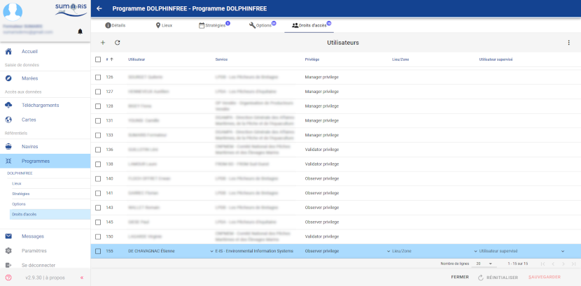

Sélectionner ensuite la totalité du contenu du champ _**Privilège**_. La liste déroulante s'affiche avec uniquement la valeur affectée.

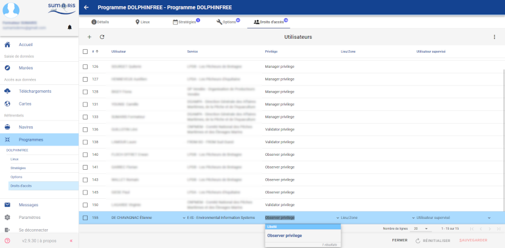

Effacer le contenu du champ _**Privilège**_ puis sélectionner la nouvelle valeur souhaitée, dans la liste déroulante.

**⚠ AVERTISSEMENT !**

> À ce stade, la modification effectuée n'est pas encore enregistrée en base de données.  
> La modification ne sera effective qu'après l'appui sur le bouton _**Sauvegarder**_.

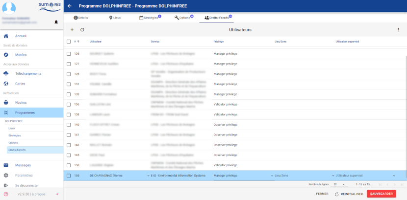

Comme lors de l'ajout de nouveaux utilisateurs, il est alors possible de modifier les droits d'un ou de plusieurs autre(s) utilisateur(s), en recommençant l'opération autant de fois que souhaité, en sélectionnant à chaque fois la ligne à modifier.

Chaque ligne précédemment modifiée affichera une icône ★ en son extrémité droite, pour indiquer qu'elle n'est pas encore enregistrée en base de données.

Une fois la modification terminée, appuyer sur le bouton _**Sauvegarder**_ afin d'enregistrer les modifications dans la base de données.

Le ou les utilisateur(s) modifié(s) apparaissent alors sur fond blanc et sans ★, comme les autres utilisateurs du programme de collecte.

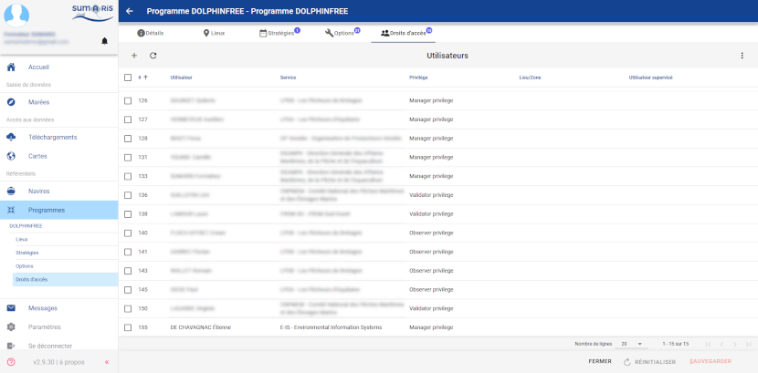

##### Retrait d'un utilisateur du programme de collecte

Sélectionner la ou les ligne(s) à supprimer, à l'aide des cases à cocher en début de chaque ligne.

L'appui sur l'icône  permet de supprimer la ou les ligne(s) sélectionnée(s) et, ainsi, de retirer les droits d'accès au programme de collecte aux utilisateurs concernés.

La ou les lignes à supprimer disparaissent alors de l'affichage de la liste.

**⚠ AVERTISSEMENT !**

> À ce stade, la suppression n'est pas encore enregistrée en base de données.  
> La suppression ne sera effective qu'après l'appui sur le bouton _**Sauvegarder**_.

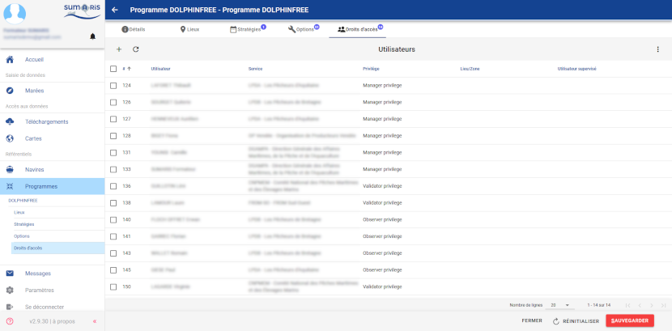

Comme lors de l'ajout ou de la modification d'utilisateurs, il est alors possible de supprimer les droits d'un ou de plusieurs autre(s) utilisateur(s), en recommençant l'opération autant de fois que souhaité.

La ou les lignes à supprimer disparaissent alors de l'affichage de la liste.

Une fois la suppression terminée, appuyer sur le bouton _**Sauvegarder**_ afin d'enregistrer les modifications dans la base de données.

Le ou les utilisateur(s) concerné(s) sont alors définitivement supprimés du programme de collecte.

## Gérer les navires

### Écran Navires

L'écran _**Navires**_ permet d'afficher la liste de tous les navires disponibles dans la base de données.

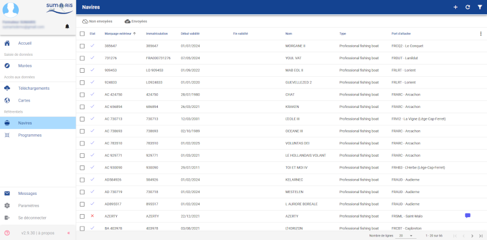

L'appui sur une ligne affiche l'[Écran Détails d'un navire](#écran-détails-dun-navire).

L'appui sur l'icône  affiche la [Fenêtre Nouveau navire](#fenêtre-nouveau-navire).

L'appui sur l'icône  rafraîchit la liste des navires.

L'appui sur l'icône  affiche le volet des filtres.

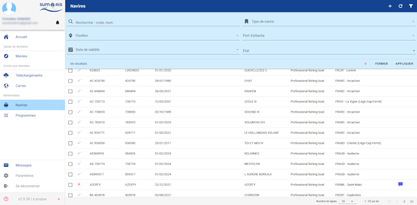

Le volet des filtres peut être masqué par l'appui sur l'icône  ou sur le bouton _**Fermer**_.

Renseigner un ou plusieurs champ(s) de filtrage et appuyer sur le bouton _**Appliquer**_.

Le volet des filtres se masque et la liste apparaît filtrée. 

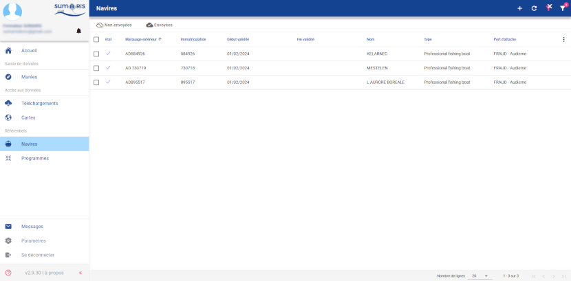

L'icône  affiche une pastille indiquant le nombre de filtre(s) appliqués : .

L'appui sur l'icône  supprime les filtres appliqués.

### Fenêtre Nouveau navire

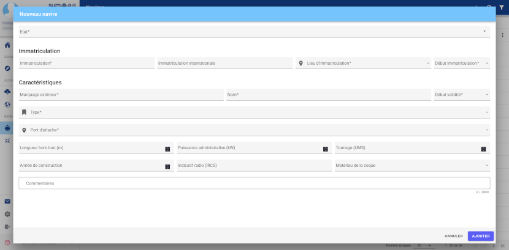

Les champs marqués <strong>*</strong> sont obligatoires.

Renseigner le champ _**État**_ avec la valeur "Actif à la saisie" afin que le navire soit visible par tous les utilisateurs.

**Rappel:**
- Le champ _**Immatriculation**_ doit impérativement comporter six chiffres.
- Le champ _**Marquage extérieur**_ doit comporter les deux lettres du quartier d'immatriculation ainsi que les six chiffres de l'immatriculation.
  - Afin de faciliter la recherche dans les écrans de l'application, ne pas saisir d'espace entre les lettres du quartier d'immatriculation et les chiffres de l'immatriculation. 

Renseigner les caractéristiques du navire et appuyer sur le bouton _**Ajouter**_ pour terminer la création du navire.

### Écran Détails d'un navire

L'écran affiche, en lecture seule les caractéristiques du navire.

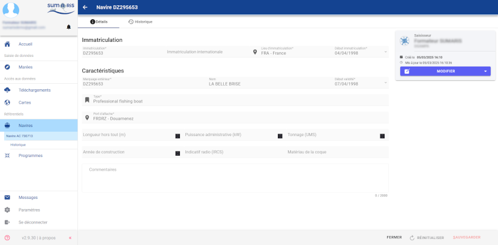

Si l'utilisateur n'a accès au navire qu'en lecture seule, le bouton _**Modifier**_ est désactivé.

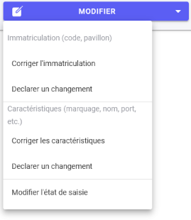

Si l'utilisateur a accès au navire en écriture, le bouton _**Modifier**_ est activé.

L'appui sur le bouton affiche un menu déroulant permettant de réaliser des modifications.

Les champs de l'écran passent alors en mode édition.

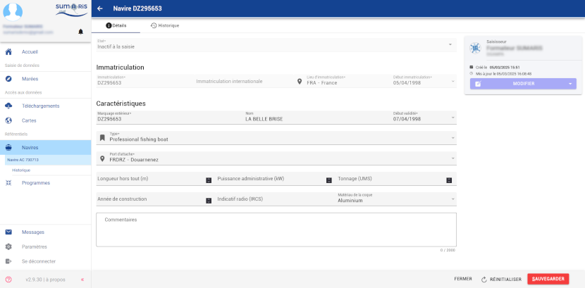

L'appui sur le bouton _**Sauvegarder**_ enregistre les modifications dans la base de données. 