# 
Guide de démarrage rapide

Programme PIFIL 2

 
 

Version 2.9.29.3

Dernière mise à jour : 20/01/2025

 
 

 
 
 

Auteur : E-IS

 
 
 
 

**Licence: [Creative Commons Attribution-ShareAlike 4.0 (CC-by-SA)](https://creativecommons.org/licenses/by-sa/4.0/)**

Table des matières

 
 
 

<!-- TOC -->
* [
Guide de démarrage rapide
](#div-styletext-align-centerguide-de-démarrage-rapidediv)
* [Préambule](#préambule)
  * [Objectif de l'application](#objectif-de-lapplication)
  * [Configuration minimum](#configuration-minimum)
* [Installer l'application SUMARiS](#installer-lapplication-sumaris)
* [Premiers pas dans l'application SUMARiS](#premiers-pas-dans-lapplication-sumaris)
  * [Première utilisation](#première-utilisation)
  * [Écran d'accueil (mode non identifié)](#écran-daccueil-mode-non-identifié)
    * [Choix de la langue](#choix-de-la-langue)
  * [Écran Inscription](#écran-inscription)
  * [Écran Authentification](#écran-authentification)
  * [Écran Réinitialisation du mot de passe](#écran-réinitialisation-du-mot-de-passe)
  * [Écran d'accueil (mode identifié)](#écran-daccueil-mode-identifié)
    * [Choix de la langue](#choix-de-la-langue-1)
  * [Menu latéral](#menu-latéral)
  * [Écran Marées](#écran-marées)
    * [Affichage en mode bureau (mode connecté)](#affichage-en-mode-bureau-mode-connecté)
    * [Affichage en mode terrain (hors-ligne)](#affichage-en-mode-terrain-hors-ligne)
    * [Ajout d'une nouvelle marée](#ajout-dune-nouvelle-marée)
    * [Menu Marées](#menu-marées)
  * [Écran Configuration du mode hors-ligne](#écran-configuration-du-mode-hors-ligne)
  * [Écran Nouvelle marée](#écran-nouvelle-marée)
    * [Onglet Détails](#onglet-détails)
    * [Onglet Engins](#onglet-engins)
    * [Onglet Opérations](#onglet-opérations)
  * [Écran de saisie d'un filage](#écran-de-saisie-dun-filage)
  * [Écran de saisie d'un virage](#écran-de-saisie-dun-virage)
  * [Écran de saisie d'une capture accidentelle](#écran-de-saisie-dune-capture-accidentelle)
  * [Écran d'édition d'une marée](#écran-dédition-dune-marée)
  * [Écran Mon compte](#écran-mon-compte)
  * [Écran Paramètres](#écran-paramètres)
* [Assistance technique](#assistance-technique)
<!-- TOC -->

# Préambule

_**SUMARiS**_ est un outil de saisie en ligne de données halieutiques, développé par _**E-IS**_.

Ce document a pour objet d'aider efficacement le nouvel utilisateur à découvrir l'application _**SUMARiS**_, dans le cadre du programme _**PIFIL**_. Il s'adresse exclusivement aux utilisateurs ayant un compte de type _**Observateur**_. 

Ce guide ne présente que les éléments permettant une première utilisation rapide de l'application _**SUMARiS**_ et ne doit pas être considéré comme un manuel complet.

## Objectif de l'application

_**SUMARiS**_ est un système d'information en ligne destiné à la collecte, au traitement et à l'extraction de données
ainsi qu'à la diffusion de résultats et d'agrégations.

## Configuration minimum

L'application fonctionne sur des terminaux mobiles (tablette ou téléphone), sur Android ou iOS, ou dans un navigateur Internet (Google Chrome ou Safari).

**L'application peut fonctionner hors connexion, notamment lors de son utilisation en mer.**

En revanche, comme des données doivent être synchronisées à un serveur, une connexion Internet est nécessaire dans les cas suivants :

 * Installation de l'application,
 * Première connexion à l'application,
 * Configuration du mode hors-connexion,
 * Synchronisation des données lors du retour à terre.

# Installer l'application SUMARiS

L'application est disponible dans les stores Android et iOS, ainsi que depuis un navigateur Internet :

|   |  | https://play.google.com/store/apps/details?id=net.sumaris.app |
|:--------------------------------------------------------:|:--------------------------------------------------------------------------------------------------------------------------------:|:--------------------------------------------------------------|
|   |                 | **https://apps.apple.com/fr/app/sumaris/id6736747523**        |
|  |                                                     | **https://open.sumaris.net**                                  |

 

Dans le cas de l'ouverture de l'application via le navigateur Internet, attendre l'affichage du bandeau de téléchargement, en haut de l'écran, et cliquer sur le bouton pour être redirigé vers le store correspondant au terminal mobile.

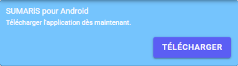
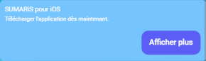

La page de l'application s'ouvre dans le store concerné, pour pouvoir procéder à l'installation.

**⚠ AVERTISSEMENT !**

_Pour l'utilisation en mer, a priori sans connexion Internet, il est **grandement recommandé** de ne pas utiliser la version Internet et **d'installer l'application** sur le terminal mobile._

# Premiers pas dans l'application SUMARiS

## Première utilisation

Lors de la première utilisation, l'application s'ouvrira sur l'écran de sélection de données.

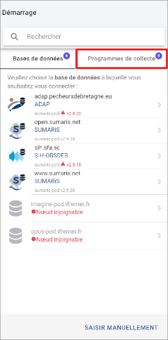
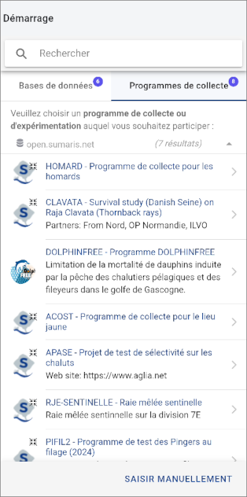
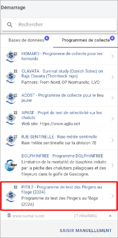

Aller dans l'onglet _**Programmes de collecte**_ et sélectionner le programme _**PIFIL 2**_.

**⚠ AVERTISSEMENT !**

_Faire attention de bien sélectionner le programme **PIFIL 2**._

_La bonne utilisation de l'application et l'exploitabilité des données saisies en découlent !_

 

L'[Écran d'accueil (mode non identifié)](#écran-daccueil-mode-non-identifié) s'affiche ensuite.

## Écran d'accueil (mode non identifié)

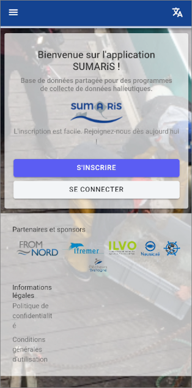

Deux boutons sont disponibles :

* _**S'inscrire**_
    * Lien vers l'[Écran Inscription](#écran-inscription)
* _**Se connecter**_
    * Lien vers l'[Écran Authentification](#écran-authentification)

### Choix de la langue

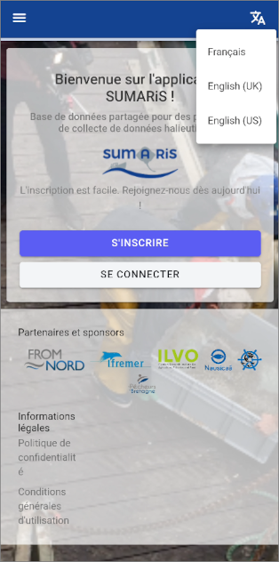

L'icône en haut à droite permet de choisir la langue de l'application.

## Écran Inscription

Lors du premier lancement de l'application, il est nécessaire de créer un compte utilisateur pour s'authentifier.

Il est obligatoire de saisir une adresse e-mail valide et un mot de passe sécurisé comprenant différents types de caractères (majuscules,
minuscules, nombres, caractères spéciaux...) puis de valider.

**NB :**

_Le champ _**Organisme**_ correspond à l'**OP** de l'observateur ou, à défaut, à son **CRPMEM**._

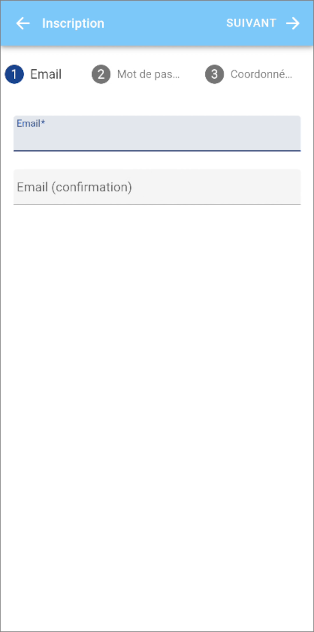
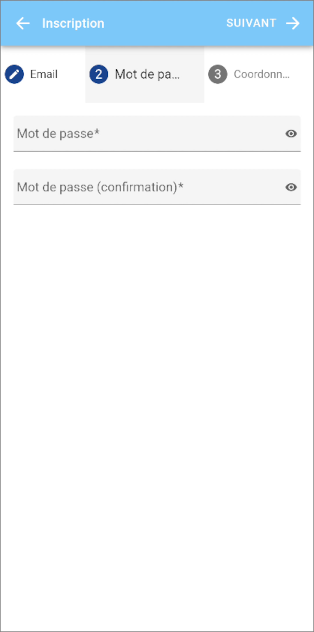
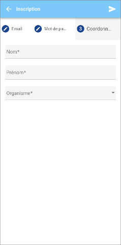

À la création du compte, un e-mail automatique est envoyé au nouvel utilisateur afin de valider l'adresse.

Chaque utilisateur authentifié a, au départ, un statut d'invité qui lui permet de visualiser mais pas de saisir de données.

**⚠ AVERTISSEMENT !**

_L'utilisateur doit impérativement demander à son **OP** (ou **CRPMEM**) de lui donner les droits de saisie sur le programme **PIFIL 2**._

_Sous quelques jours, il sera notifié par e-mail de l'attribution des droits d'accès._

_Avant cela, le bouton de **Saisie des marées** ne sera pas affiché, et la saisie de marées ne sera pas possible._

À l'issue de l'inscription, l'utilisateur est automatiquement redirigé vers l'[Écran Authentification](#écran-authentification).

## Écran Authentification

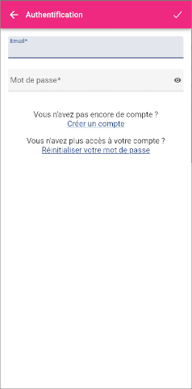

Renseigner l'adresse e-mail et le mot de passe puis valider la saisie avec l'icône **✔** de la barre de titre.

Le lien _**Créer un compte**_ permet d'afficher l'[Écran Inscription](#écran-inscription).

Le lien _**Réinitialiser votre mot de passe**_ permet d'afficher l'[Écran Réinitialisation du mot de passe](#écran-réinitialisation-du-mot-de-passe).

## Écran Réinitialisation du mot de passe

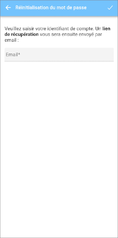
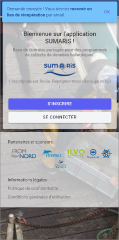

Renseigner l'adresse e-mail puis valider la saisie avec l'icône **✔** de la barre de titre.

Un message de confirmation d'envoi d'e-mail s'affiche en haut de l'écran.

Aller consulter les e-mails et cliquer sur le lien de récupération.

## Écran d'accueil (mode identifié)

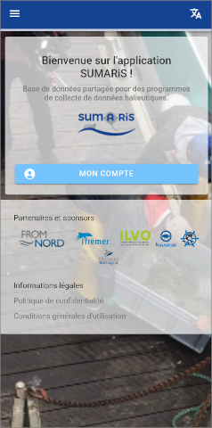
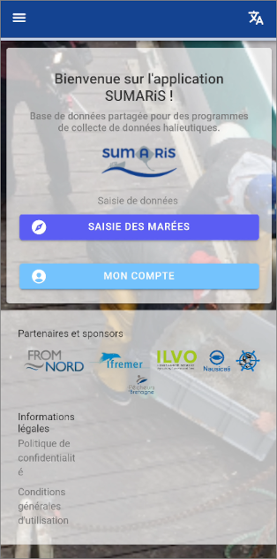

Deux boutons sont disponibles :

* _**Saisie des marées**_ : Lien vers l'[Écran Marées](#écran-marées)
* _**Mon compte**_ : Lien vers l'[Écran Mon compte](#écran-mon-compte)

**NB :**

_Tant que les droits d'accès n'ont pas été attribués au compte par l'**OP** (ou **CRPMEM**), l'utilisateur ne pourra ni saisir, ni visualiser de marée._

_Le bouton **Saisie des marées** ne sera donc pas affiché._

### Choix de la langue

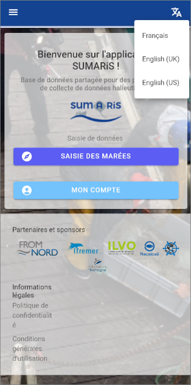

L'icône en haut à droite permet de choisir la langue de l'application.

## Menu latéral

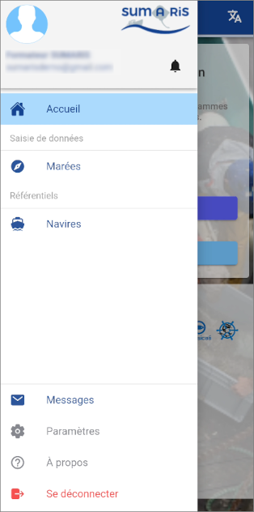

Le menu latéral comporte les éléments suivants :

 * Identité de l'utilisateur
   * Lien vers l'[Écran Mon compte](#écran-mon-compte)
 * Icône de notification 
   * Affichage de la pop-up de notifications
 * Marées
   * Lien vers l'[Écran Marées](#écran-marées)
 * Navires
 * Messages
 * Paramètres
   * Lien vers l'[Écran Paramètres](#écran-paramètres)
 * À propos
 * Se déconnecter

**NB :**

_Tant que les droits d'accès n'ont pas été attribués au compte par l'**OP** (ou **CRPMEM**), l'utilisateur ne pourra ni saisir, ni visualiser de marée._

_L'entrée **Marées** ne sera donc pas affichée._

## Écran Marées

L'écran _**Marées**_ permet d'afficher la liste des marées saisies par l'utilisateur ou dans le cadre du programme.

L'icône **⁝** de la barre de titre permet d'afficher le [Menu Marées](#menu-marées).

### Affichage en mode bureau (mode connecté)

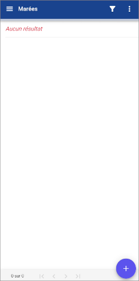

### Affichage en mode terrain (hors-ligne)

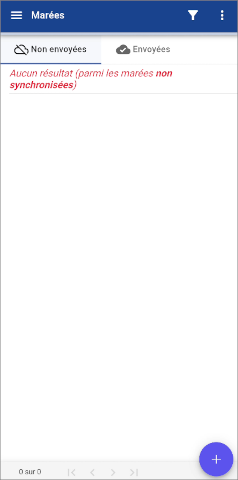
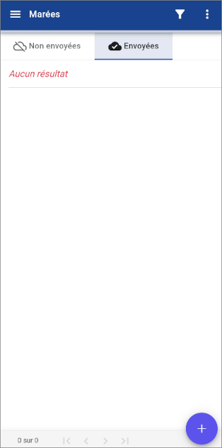

L'écran possède deux onglets :
 * _**Non envoyées**_
 * _**Envoyées**_

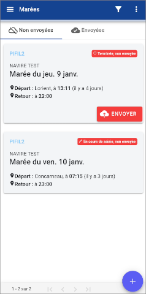
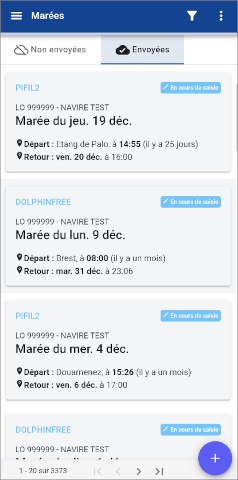

Le statut des marées apparaît en haut à droite du statut des marées.

Une marée en cours de saisie ne peut pas être envoyée au serveur. Il faut avoir appuyé au préalable sur le bouton _**Terminer la saisie**_ de l'[Onglet Détails](#onglet-détails)  de l'[Écran Nouvelle marée](#écran-nouvelle-marée) ou de l'[Écran d'édition d'une marée](#écran-dédition-dune-marée).

Les marées non envoyées (au serveur de la base de données) sont consultables uniquement par l'utilisateur, sur son terminal mobile.

Les marées envoyées (au serveur de la base de données) sont consultables par tous les ayants droit connectés.

Pour envoyer une marée au serveur, appuyer sur le bouton _**Envoyer**_ de la marée correspondante.

Une marée ne peut être prise en compte par les structures professionnelles et les scientifiques que lorsqu’elle a été envoyée.

### Ajout d'une nouvelle marée

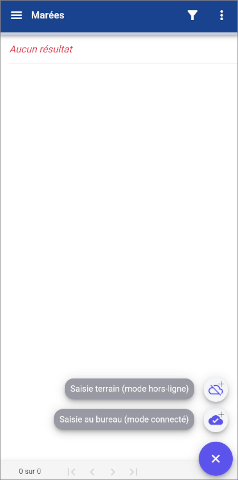
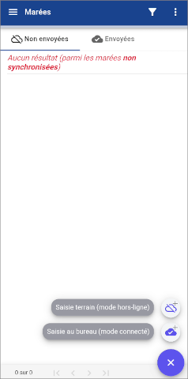

L'appui sur l'icône d'ajout d'une marée  de l'[Écran Marées](#écran-marées) permet d'afficher les entrées suivantes :

* Saisie terrain (mode hors-ligne) 
    * Si le mode hors-ligne n'a pas été configuré :
        * Lien vers l'[Écran Configuration du mode hors-ligne](#écran-configuration-du-mode-hors-ligne)
    * Si le mode hors-ligne a été configuré :
        * Lien vers l'[Écran Nouvelle marée](#écran-nouvelle-marée)
* Saisie bureau (mode connecté) 
    * Lien vers l'[Écran Nouvelle marée](#écran-nouvelle-marée)

### Menu Marées

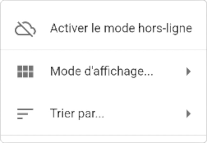
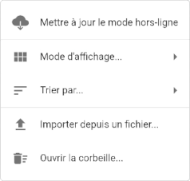

Le menu s'affiche différemment en mode terrain (hors-ligne) ou en mode bureau (connecté).

L'entrée _**Activer le mode hors-ligne**_ ou _**Mettre à jour le mode hors-ligne**_, selon le mode en cours, permet d'afficher l'[Écran Configuration du mode hors-ligne](#écran-configuration-du-mode-hors-ligne).

## Écran Configuration du mode hors-ligne

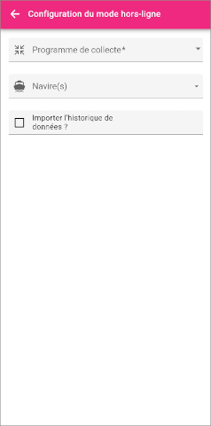
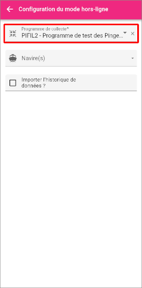

Cet écran permet de préparer la saisie terrain (mode hors-ligne).

Sélectionner le programme _**PIFIL 2**_ puis le(s) navire(s) souhaités.

**⚠ AVERTISSEMENT !**

_Faire attention de bien sélectionner le programme **PIFIL 2**._

_La bonne utilisation de l'application et l'exploitabilité des données saisies en découlent !_

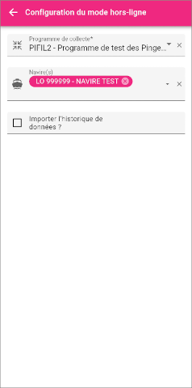
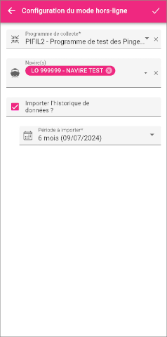

Il est possible d'importer l'historique des données déjà saisies, dans le cadre du programme et du ou des navire(s) sélectionnés, sur une période donnée, de sept jours à deux ans en arrière.

**⚠ AVERTISSEMENT !**

_Les données importées peuvent représenter un volume conséquent qui risque d'augmenter le temps de téléchargement au moment de la création, ainsi que de prendre de la place dans l'espace de stockage du terminal mobile._

Valider la saisie avec l'icône **✔** de la barre de titre.

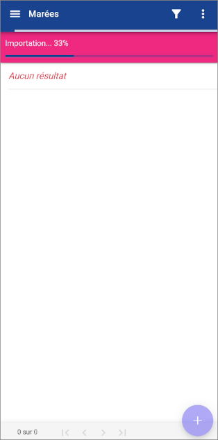

L'[Écran Marées](#écran-marées) apparaît, avec une barre de progression de l'importation.

À la fin de l'importation des données, l'affichage bascule vers l'[Écran Nouvelle marée](#écran-nouvelle-marée).

## Écran Nouvelle marée

**⚠ AVERTISSEMENT !**

_Si le terminal mobile est connecté, les menus déroulants du formulaire de saisie contiendront toutes les entrées disponibles dans la base de données._

_Si le terminal mobile n'est pas connecté, seules les données préalablement téléchargées seront disponibles._

### Onglet Détails

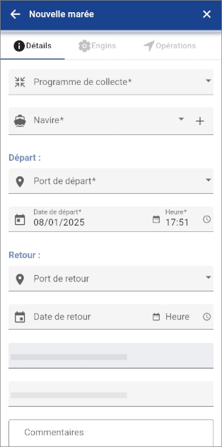

### Onglet Engins

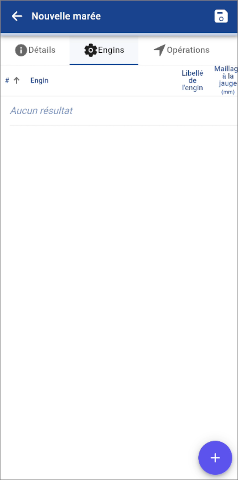
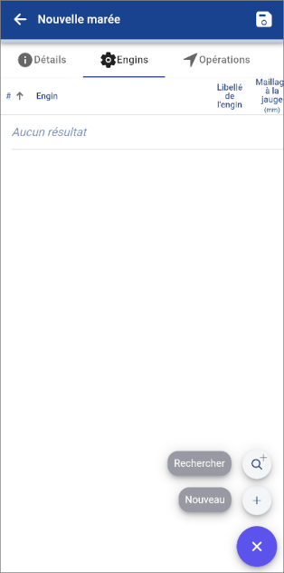

### Onglet Opérations

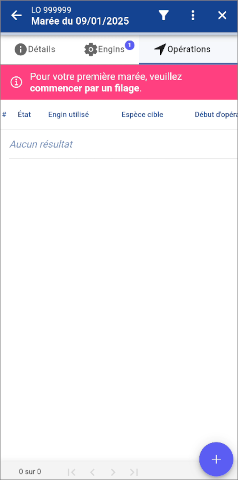
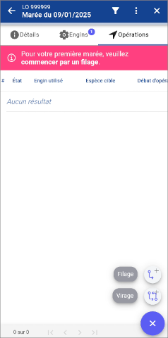

L'appui sur l'icône d'ajout d'une opération  permet d'afficher les entrées suivantes :

* Filage 
   * Lien vers l'[Écran de saisie d'un filage](#écran-de-saisie-dun-filage)
* Virage 
   * Lien vers l'[Écran de saisie d'un virage](#écran-de-saisie-dun-virage)

**⚠ AVERTISSEMENT !**

_Les marées étant liées entre elles (filage / virage), elles doivent être terminées / envoyées dans le bon ordre, sans quoi la base de données les refusera._

_L'application affichera un avertissement, le cas échéant. Ce point sera amélioré dans une version future._

## Écran de saisie d'un filage

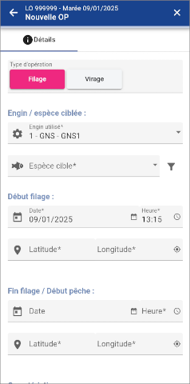

## Écran de saisie d'un virage

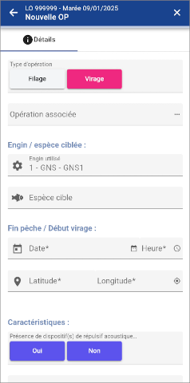
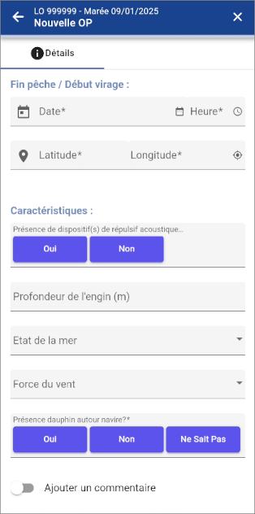

**⚠ AVERTISSEMENT !**

_Un virage est obligatoirement lié à un filage. Celui-ci doit impérativement avoir été saisi au préalable._

Si le champ _**Présence de capture accidentelle**_ a la valeur _**Oui**_, l'onglet _**Captures accidentelles**_ s'affiche.

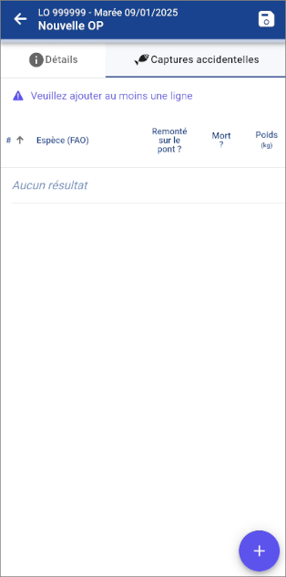

L'appui sur l'icône d'ajout d'une capture accidentelle  permet d'afficher l'[Écran de saisie d'une capture accidentelle](#écran-de-saisie-dune-capture-accidentelle).

## Écran de saisie d'une capture accidentelle

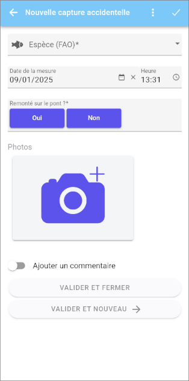

## Écran d'édition d'une marée

Cet écran est le même que l'[Écran Nouvelle marée](#écran-nouvelle-marée).

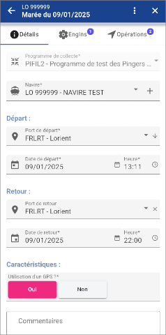
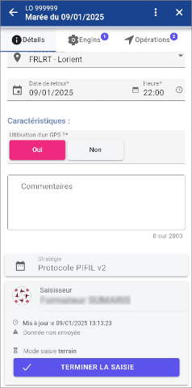

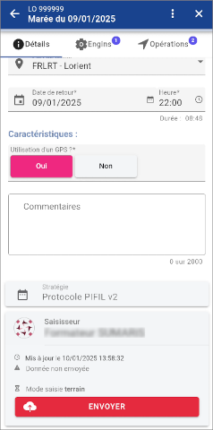
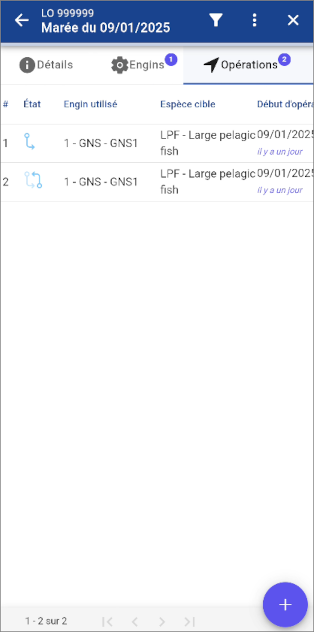

## Écran Mon compte

L'écran _**Mon compte**_ permet principalement de pouvoir réinitialiser le mot de passe du compte utilisateur.

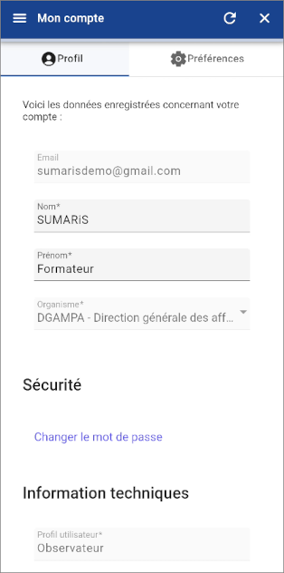
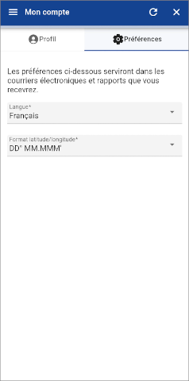

**⚠ AVERTISSEMENT !**

_Les autres paramètres ne sont à utiliser qu'en connaissance de cause, au risque de détériorer les fonctionnalités de
l'application._

## Écran Paramètres

L'écran _**Paramètres**_ permet principalement de gérer le mode sombre de l'affichage.

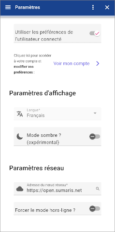
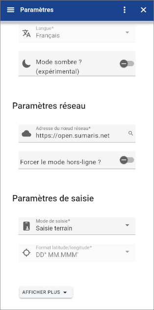

**⚠ AVERTISSEMENT !**

_Les autres paramètres ne sont à utiliser qu'en connaissance de cause, au risque de détériorer les fonctionnalités de
l'application._

# Assistance technique

Pour remonter les questions ou problèmes :

 * Contacter en priorité l'_**OP**_ (ou _**CRPMEM**_), qui est chargé de centraliser les demandes et de les remonter,
 * À défaut, contacter l'assistance technique _**E-IS**_ :
   * Par e-mail (de préférence) : [support@sumaris.net](mailto:support@sumaris.net)
   * Par téléphone : [+33 (0)9 53 24 41 20](tel:+33953244120)
