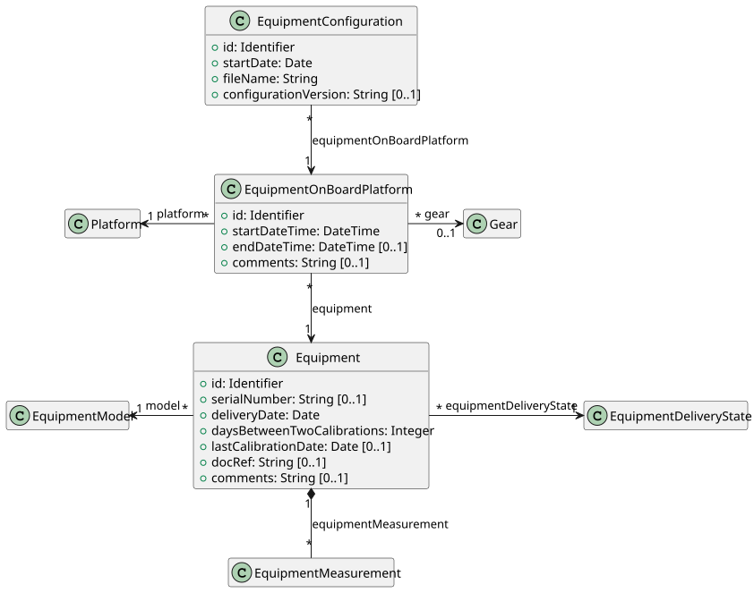
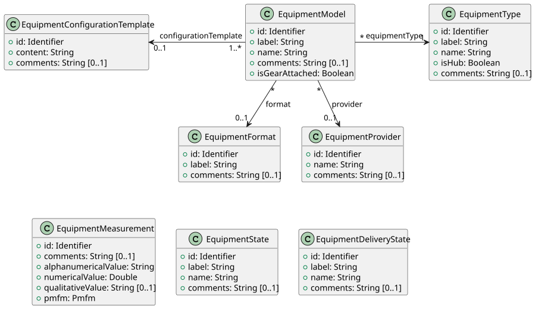
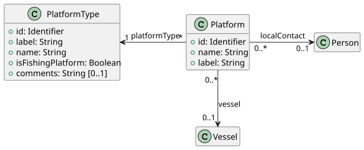
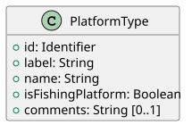
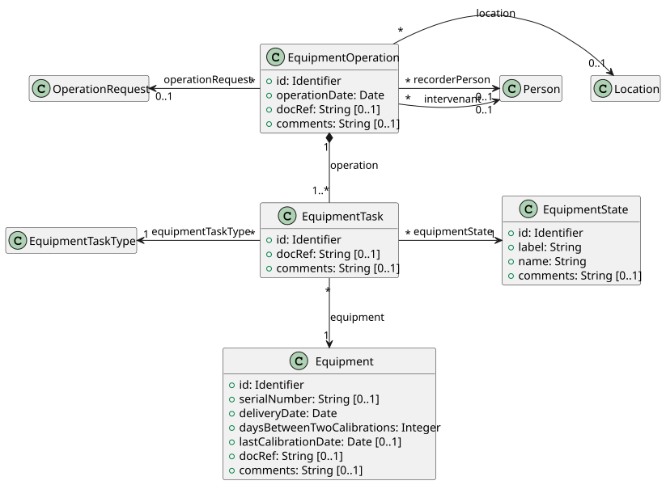
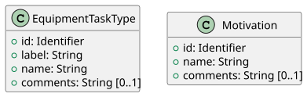
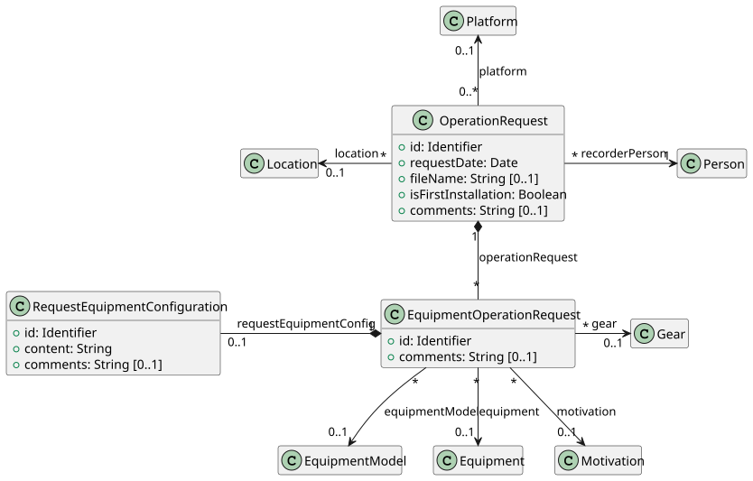
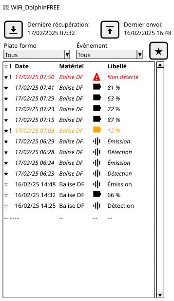
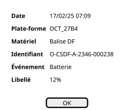

# Cas d'utilisation fonctionnels

 

Table des matières

 

<!-- TOC -->
* [Cas d'utilisation fonctionnels](#cas-dutilisation-fonctionnels)
  * [Modèle de données](#modèle-de-données)
    * [Classe **Equipment**](#classe-equipment)
    * [Classe **Platform**](#classe-platform)
    * [Classe **EquipmentOperation**](#classe-equipmentoperation)
    * [Classe **OperationRequest**](#classe-operationrequest)
  * [Définitions](#définitions)
    * [Observateur](#observateur)
    * [Superviseur](#superviseur)
  * [Ergonomie](#ergonomie)
    * [Principes généraux et connexion](#principes-généraux-et-connexion)
    * [Interface](#interface)
      * [Écran de données des équipements](#écran-de-données-des-équipements)
      * [Fenêtre de détails d'un événement](#fenêtre-de-détails-dun-événement)
  * [Collecte des données d'un équipement](#collecte-des-données-dun-équipement)
    * [CU Visualiser les données des équipements (**Observateur**)](#cu-visualiser-les-données-des-équipements-observateur)
      * [Scénario principal](#scénario-principal)
    * [CU Récupérer les données du concentrateur (_**Observateur**_)](#cu-récupérer-les-données-du-concentrateur-_observateur_)
      * [Scénario principal](#scénario-principal-1)
    * [CU Visualiser les notifications disponibles (**Observateur**)](#cu-visualiser-les-notifications-disponibles-observateur)
      * [Scénario principal](#scénario-principal-2)
    * [CU Envoyer les données au serveur de base de données (**Observateur**)](#cu-envoyer-les-données-au-serveur-de-base-de-données-observateur)
      * [Scénario principal](#scénario-principal-3)
    * [CU Consulter les données des équipements (**Superviseur**)](#cu-consulter-les-données-des-équipements-superviseur)
      * [Scénario principal](#scénario-principal-4)
    * [CU Visualiser les notifications disponibles (**Superviseur**)](#cu-visualiser-les-notifications-disponibles-superviseur)
      * [Scénario principal](#scénario-principal-5)
<!-- TOC -->

 

## Modèle de données

### Classe **Equipment**

### Classe **Platform**

### Classe **EquipmentOperation**

### Classe **OperationRequest**

## Définitions

### Observateur

Dans le présent document, le terme _**observateur**_ définira un utilisateur qui :

* est identifié dans l'application SUMARiS, avec son compte utilisateur,
* dispose des privilèges _**Observateur**_ sur le programme concerné,
* accède à l'application, le plus souvent, depuis un terminal mobile (téléphone ou tablette),
* accède à l'application, le plus souvent, en mer, sans connexion Internet.

De façon générale, c'est un pêcheur qui participe à un programme de collecte.

### Superviseur

Dans le présent document, le terme _**superviseur**_ définira un utilisateur qui :

* est identifié dans l'application SUMARiS, avec son compte utilisateur,
* a, a minima, le profil _**Superviseur**_, sur son compte utilisateur,
* dispose, a minima, des privilèges _**Validateur**_ sur le programme concerné,
* accède à l'application, le plus souvent, depuis un ordinateur (portable ou de bureau),
* accède à l'application, le plus souvent, à terre, avec une connexion Internet.

De façon générale, c'est un gestionnaire de parc de matériel ou un responsable de flotte de navires, au sein d'un programme de collecte.

## Ergonomie

### Principes généraux et connexion

[Principes généraux communs](../../../common/spe/regles_communes.md#commun--ergonomie--principes-généraux)

### Interface

#### Écran de données des équipements

|  |
|---------------------------------------------------------|

#### Fenêtre de détails d'un événement

|  |
|------------------------------------------------------------------------------|

## Collecte des données d'un équipement

### CU Visualiser les données des équipements (**Observateur**)

#### Scénario principal

1. L'observateur est identifié avec les privilèges _**Observateur**_ sur le programme concerné.
2. L'observateur accède à l'application, le plus souvent, depuis un terminal mobile, en mer, sans connexion Internet.
3. L'observateur accède à l'écran de visualisation des données des équipements depuis l'écran d'accueil ou le menu latéral.
4. L'écran affiche les éléments suivants :
    1. Zone de notification
    2. Bouton _**Récupérer les données**_
    3. Date de dernière récupération des données
    4. Bouton _**Envoyer les données**_
    5. Date de dernier envoi des données
    6. Filtre _**Plate-forme**_
    7. Filtre _**Événement**_
    8. Bouton _**Marquer comme consultés**_
    9. Tableau des événements
        * Surbrillance (booléen)
        * Critique (booléen)
        * Date et heure
        * Matériel
        * Type d'événement
        * Libellé
5. L'observateur peut rafraîchir la liste en récupérant les données du concentrateur.
    * Cf. [CU Récupérer les données du concentrateur (_**Observateur**_)](#cu-récupérer-les-données-du-concentrateur-_observateur_).
6. L'observateur peut accéder à la fenêtre des détails d'un événement en interagissant avec la ligne de l'événement.
7. L'observateur peut fermer la fenêtre des détails d'un événement : bouton _**OK**_.
    * L'événement apparaît comme consulté (plus en surbrillance).
8. L'observateur peut marquer, en une fois, tous les événements comme consultés : bouton _**Marquer comme consultés**_.
9. L'observateur peut envoyer les données au serveur de base de données.
    * Cf. [CU Envoyer les données au serveur de base de données](#cu-envoyer-les-données-au-serveur-de-base-de-données-observateur).

### CU Récupérer les données du concentrateur (_**Observateur**_)

#### Scénario principal

1. L'observateur est identifié avec les privilèges _**Observateur**_ sur le programme concerné.
2. L'observateur accède à l'application, le plus souvent, depuis un terminal mobile, en mer, sans connexion Internet.
3. L'observateur accède à l'écran de visualisation des données des équipements.
4. Le système vérifie que la connectivité Wi-Fi est activée sur le terminal mobile.
5. Le système vérifie que le terminal mobile est connecté à un réseau Wi-Fi.
6. Le système met à jour la zone de notification
    * Si réseau Wi-Fi connecté
        * Icône 🛜 et SSID du réseau
    * Si réseau pas de réseau Wi-Fi connecté
        * "Pas de réseau Wi-Fi"
    * Si connectivité Wi-Fi désactivée
        * "Connectivité Wi-Fi non activée"
7. Le système affiche, si elle existe, la date de dernière récupération des données effectuée.
8. L'observateur initie la récupération des données du concentrateur : bouton _**Récupérer les données**_.
9. Le système récupère les données du concentrateur et les stocke, en local, dans l'application.
10. Le système remet à jour le tableau des événements, avec les nouveaux événements en surbrillance.
11. Le système affiche, dans la zone de notification, un message "Opération terminée".

### CU Visualiser les notifications disponibles (**Observateur**)

#### Scénario principal

1. X

### CU Envoyer les données au serveur de base de données (**Observateur**)

#### Scénario principal

1. X

### CU Consulter les données des équipements (**Superviseur**)

#### Scénario principal

1. X

### CU Visualiser les notifications disponibles (**Superviseur**)

#### Scénario principal

1. X