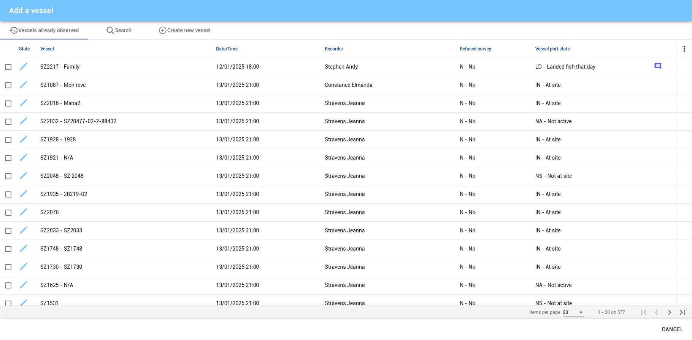
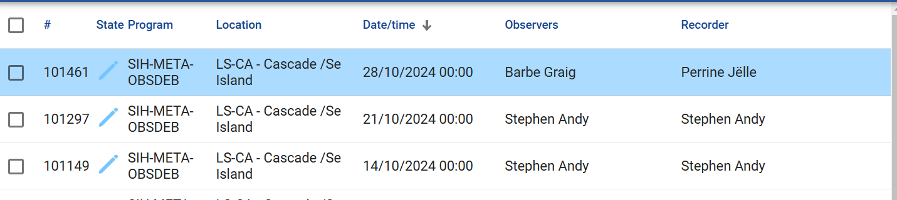

# Videoconference meeting minutes
## 29/01/2025

---

> Attending :
>
> - Emilie AUGUSTIN (SFA)
> - Juliette LUCAS (SFA)
> - Ludovic PECQUOT (EIS)
> - Dorian MARCO (EIS)
> - Étienne de CHAVAGNAC (EIS)

<!--

---

> Excused :
>
> - Benoît LAVENIER (EIS)
> - Cindy ASSAN (SFA)
> - Annisha LESPERANCE (SFA)
> - Claire PIERRE-LOUIS (SFA)
-->

---
## Extraction queries creation

Queries done : 
- Fichier flotte
- P03_OBSDEB_CALENDRIER_MAREE
- P03_OBSDEB_CALENDRIER
- P03_OBSDEB_CAPTURE
- P03_OBSDEB_CAPTURE_LOT
- P03_OBSDEB_CAPTURE_INDIVIDU
- P03_OBSDEB_COUT_VARIABLE
- P03_OBSDEB_MAREE
- P03_OBSDEB_OBSERVATEUR
- P03_OBSDEB_OBSERVATION
- P03_OBSDEB_OBSERVATION_OBS
- P03_OBSDEB_OBSERVATION_NAVIRE
- P03_OBSDEB_OPERATION
- P03_OBSDEB_VENTES

Query to be done :
- Deducted_Artisanal_Finss

> Questions :
> - ?

> Actions : 
> - ?

---
## New feature : Adding vessel search option on _**Occasions**_ page

- Purpose
  - Facilitate staff to search for a vessel at any landing site
    - Some vessels can often move location
  - Easily locate a vessel whatever its actual location is
- Feasibility
  - TDB
- Cost
  - TDB
- Schedule
  - TBD

> Questions :
> - ?

> Actions :
> - ?

---
## New feature : Adding biological sampling checkbox on packet page

- Purpose
  - Marking packets for biological sampling
- Feasibility
  - TDB
- Cost
  - TDB
- Schedule
  - TBD

> Questions :
> - ?

> Actions :
> - ?

---
## Troubleshooting : Vessels already observed list malfunction

- Issue
  - List is far too long to display on some locations
    - Victoria
    - Providence
  - 
- Requested fix
  - Limiting list to a certain length
    - TBD

> Questions :
> - ?

> Actions :
> - ?

---
## Troubleshooting : Former enumerator name remaining on tablet as Recorder

- Issue
  - 
  - Jëlle Perrine
    - Former user of the tablet
    - No longer with SFA
    - Should no longer appear on new entries
  - Graig Barbe
    - Current user of the tablet
    - Should appear both as Observer and Recorder on new entries

> Questions :
> - How to set Craig Barbe as default Recorder on this tablet?
> - How to avoid the issue to appear on any oncoming user tablet change? 

> Actions :
> - ?

---
## SIH upgrade

SIH upgrade from 2.8.12 to 2.9.29

- Pending issues
  - ?
- Schedule
  - ?

> Questions :
> - ?

> Actions :
> - ?