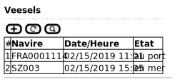
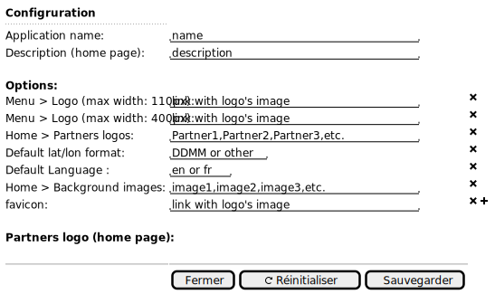

# Cas d'utilisation fonctionnels

 - [Administration des référentiels](#Administration_des_référentiels)
 - [Collecte des données](../collect/collect.md)

## Administration des référentiels

 - [Liste des référentiels](#Liste_des_référentiels)
 - [Liste des utilisateurs](#Liste_des_utilisateurs)
 - [Liste des navires](#Liste_des_navires)
 - [Configuration du serveur](#Configuration_du_serveur)

### Identification

### Liste des référentiels

### Liste des utilisateurs

### Liste des navires

### Configuration du serveur

