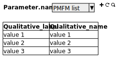

# Cas d'utilisation fonctionnels

 - [Administration des référentiels](administration/administration.md)
 - [Collecte des données](collect/collect.md)
    * [CU Saisir une observation au débarquement]()
    * [CU Saisir un débarquement observé]()
    * [CU Saisir des captures débarquées]()
    * [CU Saisir des ventes]()
    * [CU Saisir des dépenses]()
    
## Administration des référentiels

### Identification

### Liste des référenciels

### Liste des utilisateurs

### Liste des navires

### Configuration du serveur

