# Functional use cases

## Data collection

 * Observations on landing (ObdDeb) :
    * [UC Input an observation on landing](#CU_Saisir_une_observation_au_débarquement)
    * [UC Input of observed trip on landing](#CU_Saisir_marée_observée_au_débarquement)
    * [UC Enter the landing catches](#CU_Saisir_des_captures_débarquées)
    * [UC Enter sales](#CU_Saisir_des_ventes)
    * [UC Enter the expenditures](#CU_Saisir_des_dépenses)
    * [UC Enter a weekly report](#CU_Saisir_un_calendrier_hebdomadaire)

### UC Input an observation on landing

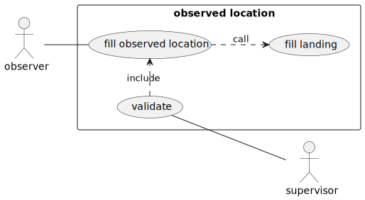

Differentiation of main data = root data (observations, fishing trip, weekly report ...)
of those that are not (effort, capture ...):
* 1 observation = global term to indicate which is observation, without details. 
* 1 program = term to specify what is the reason for the observation. Different screens are available depending on the 
programs.

In the Home page, a Menu is present on the left hand side with the different root data. 
Each type of data gives access to:
* a list of data already entered and
* a "+" button for entering new data

    
#### Main scenario

1. The observer requests the creation of a new observation on landing: button “+”

2. He enters:

    * Data collection program
    * Observation site = Landing sites (Optional navigation calculated by the software: island and district are 2 levels of places which are used above all to search for the place of observation in SFA ObsDeb program)
    * Date/time of the start of the observation of a specific vessel
    * Date/time of the end of the observation (optional / invisible - depending on the program configuration)
    * One or more observers (at least one mandatory)
    * The other characteristics / parameters, collected for the program
    * Comment (optional)

    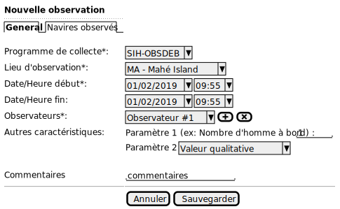

   NB: Technical information :
   * Date / time of entry (automatic)
   * Geographic position (X, Y) where the observer is located at the time of entry 
   (This information will be stored, but will not be displayed systematically, except for the administrator status)
   
    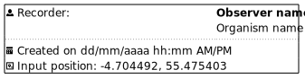
    
3. He can then add / delete observed vessels:

     List all the vessels to be re-called thereafter for each trip. 
     Pre-documentation of vessels based on previous observations on the same site.

    
 
    The observer can:
    * enter a new vessel: "+" button
        
    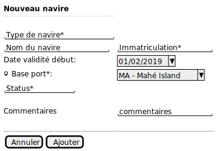
    
    * delete an identified vessel: "trash" button
    * Search in the register: "magnifying glass" button. Search by the vessel's registration number. The researched vessel is added to the list
    * All the vessels, in the list of vessels observed in the last 12 months, are shown and deselected by default. 
    They can all be selected if necessary and the vessels not present will be deselected one by one.

    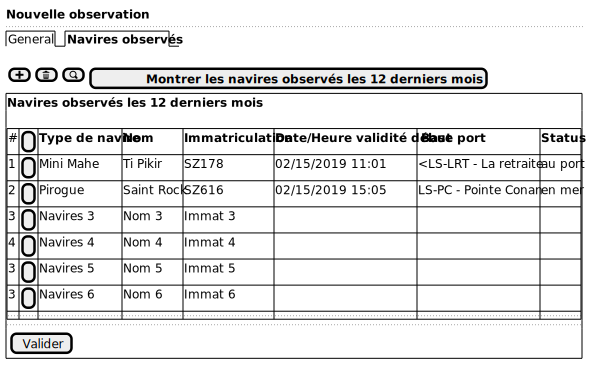
 
### UC Input of observed trip on landing

objective:

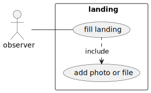

#### Main scenario

1. The observer requests the creation of a new trip, attached to an observation on site.

2. He chooses for this trip:
    * The data collection program: mandatory information is already pre-filled according to the choice made previously
    * The vessel observed (from the list of vessels identified previously)
    * The landing site: mandatory information is already pre-filled according to the choice made previously
   
3. He enters:
    * Date/time of the start of the trip (mandatory; if not entered, saving not possible) 
    (ultimately, if not entered, possibility to automatically indicate observation date and time “00:00”)
    * Date/time of the end of the trip (mandatory; if not entered, saving not possible) 
    (ultimately, if not entered, possibility to automatically indicate the start date of the trip and 11.59pm)
    * The other characteristics / parameters collected for the program
    * A comment (optional)

    

4. He can then enter the fishing effort for the identified vessel:
        
    * Metier code
    * Number of gear
    * The other effort characteristics specific to each metier/gear
    * Parameter specific to the gear: 
        * Number of hooks 
        * length of net 
        * Number of lockers
    * Time spent fishing (days spent at sea)
    * Minimum depth of the gear (m)
    * Maximum depth of the gear (m)
    * Comments (optional)
    * He can then enters the catch landed by metier for each metier (cf point 5)

<ins>Desktop mode: </ins>
    
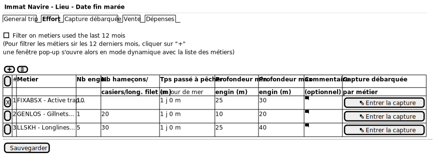
    
<ins>Tablet mode: </ins>
    
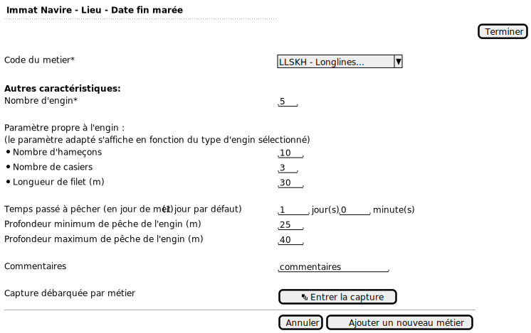

#### Variants

##### Variant 1.a - Trip without parent observation (quite rare for SFA) -> Other program different from ObsDeb
TO REVIEW

The observer requests the creation of a new trip, without attachment to an on-site observation 
(e.g. opportunistic collection, without observation related to artisanal fishing)
   -> If it happens, it will be done in a different program with a different parameter list (surely simplified)
   -> Remove all filters from the ObsDeb landing section, meaning opening the choice to all types of gears, metiers, etc.

1. He enters :

    * The data collection program
    * The observed vessel
    * The landing site
    * Date/hour of the start of the trip (optional ; if not entered, will show automatically  00:00) TO BE CONFIRMED
    * Date/hour of the end of the trip (optional; if not entered, will show automatically  23:59) TO BE CONFIRMED
    * The observers (at least one, compulsory)
    * Comments (optional)

    

2. The observer:
    * Chooses the vessel observed (among the list of vessels precedently identified)
    * Requests the creation of a new trip

\[Return to point 3]

##### Variant 3.a – Caracteristics/parameters of collection for SFA ObsDeb

* Other caracteristics/parameters
    * Observed metiers (the first in the list is the most important, the following ones are secondary) / possibility to add more. To seek a metier: a pop-up window opens in a dynamic mode with a presence of a search zone
    * Number of men on board
    * Principal fishing zone (optional as the data is rarely used because fishermen don’t like disclosing their fishing sites)
    * Gradient of distances to the coast (optional as the data is rarely used because fishermen don’t like disclosing their fishing sites)  
    * Force of the wind
    * Force of the current

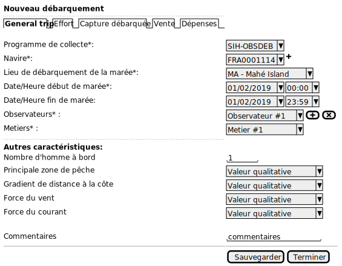

Opening of the combo list of metiers: 
(An identical combo may be created for an observer list)

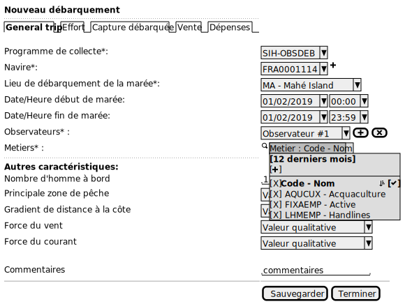

\[Return to point 4]

### UC Enter the landing catches

Objective:

#### Main scenario

1. He can then add/delete catches:
    * For individual catches:
        * Species (referential of commercial species with a few variations for the SFA but no hierarchy tree as in the SIH)
        * Weigth (kg)
        * Number of individuals
        * Packaging type
        * Preservation type (space compulsory)
        
    * For the catches in packets: 
        * Differentiate the homogeneous packets (a single species) from the heterogeneous packets (composed of multiple species) (1 line for each distinct packet)
        * Sample from 1 to 6 packets per type of packets, then complete with the composition of the packet (grouping table): (No rule for entering data)

            * Total number of counted packets for each type of composition.
            * Add the species which composed the packet ( l line = 1 species);
            * Add the weigth of the sample packets ( 1 column = 1 sample packet);
            * Add the percentage (%) of presence for each species (line) per packet (column)
            
                * The sum of  % = 100 % : OK
                * If the sum of  % < 100 % : error message
                * If the sum  % > 100 % : error message
                
            * The total weigth (kg) for each species is calculated per the composition of the packet

    <ins>Desktop mode: </ins>
    
    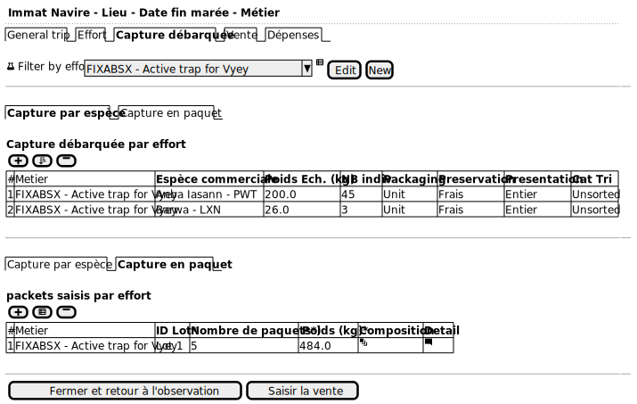
    
    <ins>Tablet mode: </ins>
    
    

    The user enters the composition by packet

    <ins>Desktop mode: </ins>
    
    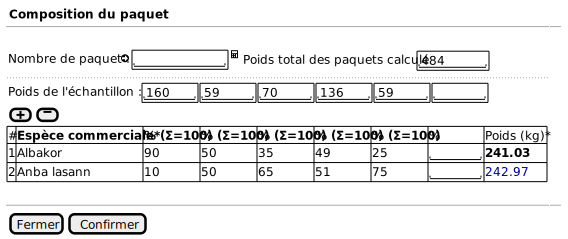

    <ins>Tablet mode: </ins>
    
    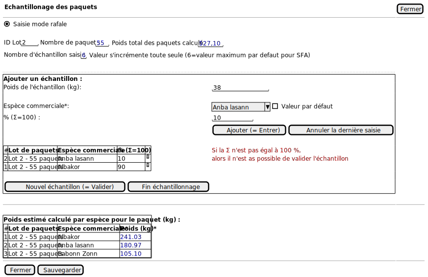
   
2. The user saves his modification then can enter the sales

### UC Enter sales

Note: Optional screen

Objective

#### Main scenario

The sales are automatically created for each individual catch and by packets.

1. It can then associate one type of sale to an individual catch or packet 
   And also categorise different type of sales for a same  catch (by adding or deleting one type of sale)
    
    * Estimation of the gross profit of the total sale (optional if no details available)
    * The total cost price of the sale is automatically calculated in relation to the information entered below

    * For the individual catches:
        * Type of sale (= Disposition: bouyon, fishmonger, hotels and restaurants, markets, ocean fisheries, Public, centre de poisson impétueux,
                                        récolte de la mer, inconnu)
       (2 items below are necessary for the third one to calculate itself automatically)
        * Estimated average price of the species by weigth (currency/kg)
        * or estimated average price of the species per packaging (currency/packaging)
        * or estimated total price of the species (currency)
    * For the catches in packets:
        * Type of sale (= Disposition : bouyon, poissonnier, hôtel et restaurant, marché, pêcheries océan, Publique, centre de poisson impétueux,
                                        récolte de la mer, inconnu)
        * Estimated average price of the species per packaging (currency/packaging)
        * Or estimated total price per packet (currency)

2. The user saves his modifications and then can enter the expenses:  

    <ins>Desktop mode: </ins>
    
    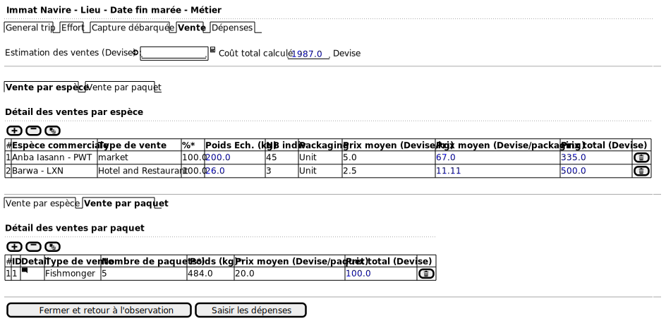     

    <ins>Tablet mode: </ins>
    
    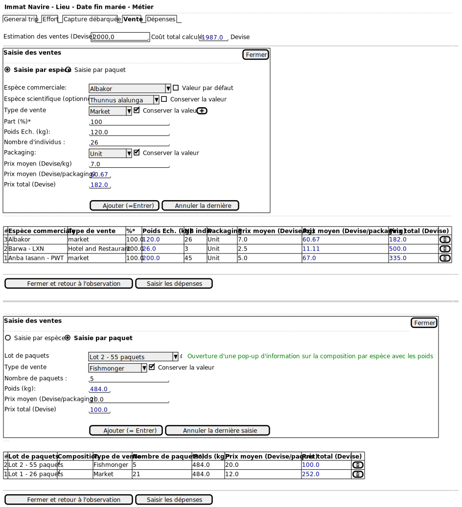   

    If more than one type of sale has to be entered per trip, then it is possible to add more:

    <ins>Tablet mode: </ins>
    
      

### UC Enter the expenditures

Note: optional screen

#### Main scenario

1. He can enter:
    * Estimation of the total expenses for the trip
     The total cost of the trip expenses is calculated automatically by taking the informations related to the detailed expenses:
    * Expenses in fluids to operate:
      For each fluid: Fuel (the type of fuel need to be entered), motor oil, hydraulic oil, please specify:
       (2 items below are necessary for the third one to be calculated automatically)
        * Volume used for the trip (l) (optional)
        * Average price per litre (currency/L) (optional)
        * Total price spent (currency) (optional)
    * Expenditure of other related costs:
        * Expenses of landing (currency)
        * Food (currency)
        * Loss of gear (currency)
        * Other (currrency)
        * Comments (optional)
    * The ice used:
        * Amount of ice
        * Unit (per kg or per bag)
        * Cost of the ice (currency) 
    * Baits:
        * Type of baits (no more than 3 types for the SFA)
        * Number of baits
        * Unit of packing of the baits ( by kg, per unit, per bag or per packet)
        * Cost of the baits

2. The user saves his modifications.

      
           
### UC Enter a weekly report

The observer asks for the creation of a new weekly report

1. He enters:

    * The programme of collection
    * The vessel observed : enter all the vessels observed on the same site at the same date
    * The landing site
    * Date/time of the start of the week (hour is  automatically 00h00)
    * Date/time of the end of the week automatically shows D+6 (the hour is automatically 23h59)
    * The observers (at least one, compulsory)
    * A comment (optional)

    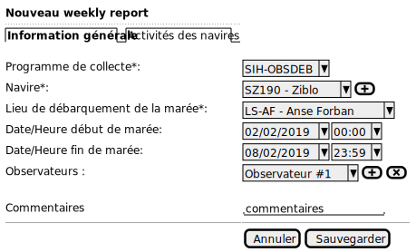

2. Characterisation of the situations inherent to each vessel each day of the week

    The data is entered on a day to day basis: the observer starts each day by selecting the situation for each vessel 
    present on a site and pre-identified. The metiers show up automatically. It is nevertheless possible to add some 
    new ones.
    
    The observer is pratically exhaustive concerning the identifications and the locations on a site of the vessels.
    
    Initials of the situations used on the field form:
    
    * DP- boat departing that day
    * IN- boat in at site
    * LD- boat landed fish that day
    * DL- one day trip (boat departed and landed same day)
    * NA- boat not active
    * OUT- boat out fishing
    * BR- break down
    * NS- boat not seen at site
    * LS- Boat landed fish that day and was sample
    * UR- boat under repair

    <u>Association Metier/Situation</u>:
    
    One same vessel can be observed for different situations during the same day.
    UOne observer may not be able to do observation on a same day for various reason  (illness, empêchement, etc.) ; 
    as a consequence he doesn’t enter any situation.
    
    <ins>Desktop mode: </ins>
    
    
    
    In desktop mode, the entire week shows. The day of the observation shows in bold.
    It is possible to change a previous data on the day of observation. On the other end, it is not possible to 
    anticipate the situations for the days to come after the day of observation.
    
    <ins>Tablet mode: </ins>
    
     
            
    In tablet mode, only the day of observation is shown. Nevertheless the arrow “previous” and the arrow “next” 
    on each side of the observation allow to go back to the previous days before the day of observation to have 
    a look or modify a data. But there isn’t any possibilities to enter ahead in the days to come after the 
    observation day.
        
3. Characterisation of the activity of vessels for each day of the week

    If a vessel doesn’t have any situation, we cannot enter any activity.
    
    The observer isn’t exhaustive in terms of identification of the vessels and the metiers on a given place.
    
    By default, the effective day matches the day of entering the data. It is possible to select the showing 
    by day or by week: click on the calendar day on the top hand right side.
    
    An effective day is activated but a day without any action stays inactive. 
    If the data isn’t entered on the day of the week effective, the stay still stay active, 
    but there isn’t any activity entered.
    
    <u>Research by criterias</u> : the trips of a vessel which has used a metier are associated automatically 
    to the matching activity for a vessel, at the same date. 
    If the trip is not existent, it can then be created at that time
    
    Eye button: When we show the activity reprt, the tool will search all the trips of the week for each 
    vessel --> Eye in bold = activated, if not unactivated

    <ins>Desktop  mode: </ins>
    
    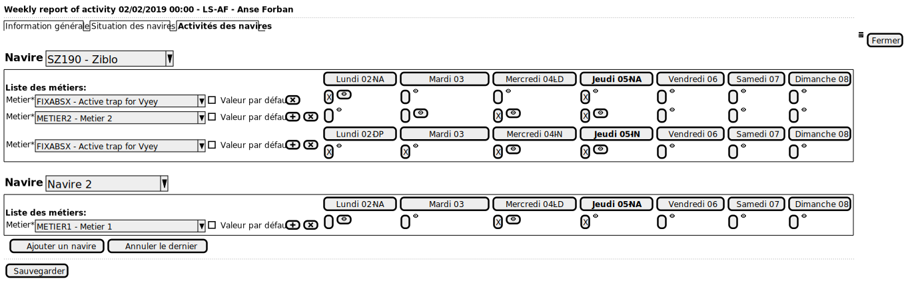 
    
    For a single vessel, as lines are automatically created as in the previous step. The observer indicates 
    in that step the metier(s) observed per vessel and the situation for each day of the activated week.
    
    <ins>Tablet mode: </ins> daily show
    
    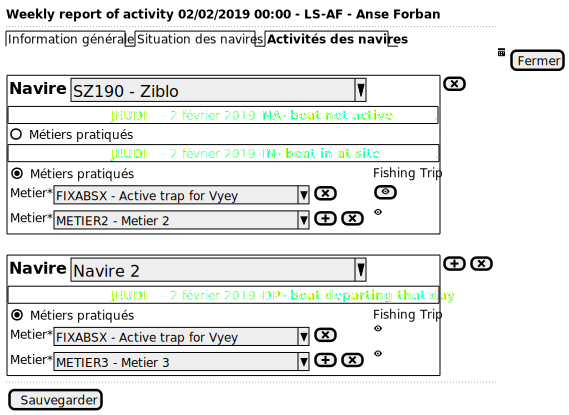

    

