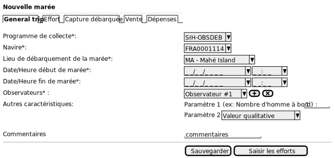
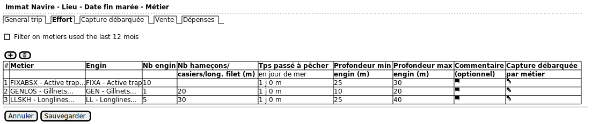
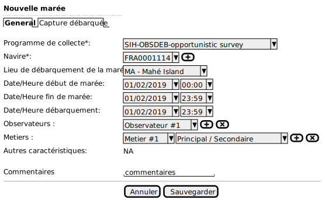
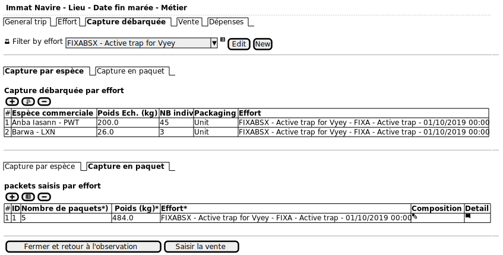
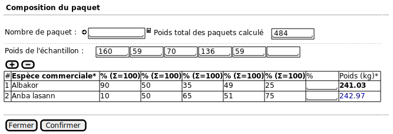
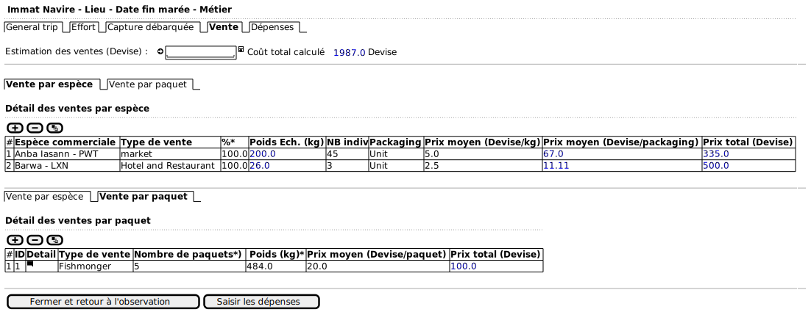

# Cas d'utilisation fonctionnels

## Collecte des données

 - Observations au débarquement (ObdDeb) :
    * [CU Saisir une observation au débarquement](#CU_Saisir_une_observation_au_débarquement)
    * [CU Saisir une marée observée au débarquement](#CU_Saisir_marée_observée_au_débarquement)
    * [CU Saisir des captures débarquées](#CU_Saisir_des_captures_débarquées)
    * [CU Saisir des ventes](#CU_Saisir_des_ventes)
    * [CU Saisir des dépenses](#CU_Saisir_des_dépenses)

### CU Saisir une observation au débarquement

#### Scénario principal

1. L'observateur demande la création d'une nouvelle observation au débarquement : bouton +

2. Il saisit : 

    * Programme de collecte
    * Lieu d'observation = Landing sites (Navigation optionnelle calculée par le logiciel : ile et district sont 2 niveaux de lieux qui servent surtout à faire la recherche du lieu d'observation dans SFA ObsDeb)
    * Date/heure de début de l'observation de tel ou tel navire
    * Date/heure de fin (optionnel/invisible - suivant la configuration du programme)
    * Un ou plusieurs observateurs (au moins un obligatoire)
    * Les autres caractéristiques/paramètres, collectés pour le programme
    * Commentaire (optionnel)

    

   NB: Information technique :
       * Date/heure de saisie (automatique)

    

3. Il peut ensuite ajouter/supprimer des navires observés :

    Lister l'ensemble des navires à ré-appeler par la suite pour chaque marée.
    Pré-documentation des navires basée sur les précédentes observations sur le même lieu.

    
 
    Si saisie d'un nouveau navire :

    
 
### CU Saisir marée observée au débarquement

Objectif :

#### Scénario principal

1. L'observateur demande la création d'une nouvelle marée, rattaché à une observation sur site.

2. Il choisit :
    * Le navire observé (parmi la liste des navires identifiés précédemment)

3. Il saisie :
    * Date/heure de début de la marée (optionnel ; si pas saisie, d'office indique 00h)
    * Date/heure de fin de la marée (optionnel ; si pas saisie, d'office indique 23h59)
    * Date/Heure de début de débarquement (optionnel ; d'office indique la date/heure de la fin de la marée)
    * Les autres caractéristiques/paramètres collectés pour le programme 
    * Un commentaire (optionnel)

    

4. Il peut ensuite saisir l'effort de pêche par métier :
    * Nombre d'engin
    * Paramètre propre à l'engin : Nombre d'hameçons ou longueur de filet ou nombre de casiers
    * Temps passé à pêcher (en jour de mer)
    * Profondeur minimum de l'engin (m)
    * Profondeur maximum de l'engin (m)
    * Un commentaire (optionnel)
    * Il peut ensuite saisir la capture débarquée par métier (cf point 5)

    

5. Accés à la liste des métiers utilisés les 12 derniers mois

    

#### Variantes

##### Variante 1.a - Marée sans observation parente (assez rare pour SFA) --> Autre programme différent d'ObsDeb

L'observateur demande la création d'une nouvelle marée, sans
   rattachement à une observation sur site (ex: collecte opportuniste, sans observation liée à la pêche artisanale)
   --> Si c'est fait, ce sera dans un programme différent avec une liste de paramètre différente (sûrement simplifiée)
   --> Retire tous les filtres présents dans la partie débarquement ObsDeb, cad ouvrir le choix à tous les types d'engin, de métiers, etc.

1. Il saisit : (A REVOIR)

    * Le programme de collecte
    * Le navire observé
    * Le lieu du débarquement
    * Date/heure de début de la marée (optionnel ; si pas saisie, d'office indique 00h) A CONFIRMER
    * Date/heure de fin de la marée (optionnel ; si pas saisie, d'office indique 23h59) A CONFIRMER
    * Les observateurs (au moins un obligatoire)
    * Un commentaire (optionnel)

    

2. L'observateur :
    * choisit le navire observé (parmi la liste des navires identifiés précédemment) 
    * demande la création d'une nouvelle marée

\[Retour au 3]

##### Variante 3.a - Caractéristiques/paramètres de collecte pour SFA ObsDeb

* Autres caractéristiques/paramètres
    * Métiers observés
    * Nombre d'hommes à bord
    * Principale zone de pêche (optionnel car données rarement utilisées car mise sous silence des sites de pêche)
    * Gradient de distance à la côte (optionnel car données rarement utilisées car mise sous silence des sites de pêche)
    * Force du vent
    * Force du courant

### CU Saisir des captures débarquées

Objectif :

#### Scénario principal

1. Il peut ensuite ajouter/supprimer des captures:
    * Pour les captures individuelles :
        * Espèce (référentiel des espèces commerciales avec quelques variantes pour la SFA, mais pas d'arbre hiérarchisé comme dans SIH) 
        * Poids (kg)
        * Nombre d'individus
        * Type de packaging
        * Type de préservation (champs obligatoire)
        
    * Pour les captures en paquets : 
        * Différencier les paquets homogènes (une seule espèce),des paquets hétérogènes (composition de différentes espèces)
          (1 ligne par type de composition de paquets)
        * Echantillonner de 1 à 6 paquets par type de paquet, puis compléter par composition de paquet (tableau de regroupement) :
          (Pas de règle de saisie)
            * Nombre total de paquets comptés par type de composition;
            * Ajouter les espèces qui composent le paquet (1 ligne = 1 espèce);
            * Ajouter le poids des paquets échantillons (1 colonne = 1 paquet échantillon);
            * Ajouter la proportion (%) de présence de chaque espèce (ligne) par paquet (colonne)
            
                * La somme des % = 100 % : OK
                * Si somme des % < 100 % : message erreur
                * Si somme des % > 100 % : message erreur
                
            * Le poids total (kg) de chaque espèce est calculé par composition de paquet

    

    L'utilisateur entre la composition par paquet

    

2. L'utilisateur sauvegarde ses modifications puis peut saisir la partie vente

### CU Saisir des ventes

Note : Ecran optionel
Objectif : 

#### Scénario principal

Les ventes sont automatiquement créées pour chaque capture individuelle et en paquet.

1. Il peut ensuite affecter un type de vente à une capture individuelle ou un paquet 
   Et aussi catégoriser différent type de vente pour une même capture (en ajoutant/supprimant un type de vente)
    
   * Estimation du coût de revient de la vente totale (optionnel si pas de détail)
   * Le coût de revient total de la vente est calculé automatiquement en fonction des informations saisient ci-dessous :
    * Pour les captures individuelles :
       * Type de vente (= Disposition : bouyon, poissonnier, hôtel et restaurant, marché, pêcheries océan, Publique, centre de poisson impétueux,
                                        récolte de la mer, inconnu)
       (2 éléments ci-dessous sont nécessaires pour que le 3em élément se calcule automatiquement)
       * Prix moyen estimé de l'espèce au poids (devise/kg)
       * ou Prix moyen estimé de l'espèce par packaging (devise/packaging)
       * ou Prix total estimé de l'espèce (devise)
    * Pour les captures en paquets :
       * Type de vente (= Disposition : bouyon, poissonnier, hôtel et restaurant, marché, pêcheries océan, Publique, centre de poisson impétueux,
                                        récolte de la mer, inconnu)
       * Prix moyen estimé de l'espèce par paquet (devise/packet)
       * ou Prix total estimé du paquet (devise)

2 L'utilisateur sauvegarde ses modifications puis peut saisir la partie dépenses  

         

### CU Saisir des dépenses

Note : Ecran optionel

#### Scénario principal

1. Il peut saisir:

   * Estimation des dépenses totales pour la marée
   * Le coût total des dépenses de la marée est calculé automatiquement en fonction des informations de dépenses détaillées :
    * Dépenses en fluides de fonctionnement :
      Pour chaque fluide : Carburant (le type de carburant est à préciser), huile de moteur, huile hydraulique, préciser :
       (2 éléments ci-dessous sont nécessaires pour que le 3em élément se calcule automatiquement)
       * Volume utilisé pour la marée (l) (optionnel)
       * Prix moyen par litre (devise/L) (optionnel)
       * Prix total dépensé (devise)  (optionnel)
       
    * Dépenses en frais annexes  :
       * Frais de débarquement (devise)
       * Alimentation  (devise)
       * Perte d'engin (devise)
       * Autre (devise)
       * Commentaire (optionnel)
    * La glace utilisée :
       * Quantité de glace 
       * Unité (au kg ou par sac)
       * Coût de la glace (devise)
    * Appâts :
       * Type d'appâts (pas plus de 3 types maximum pour la SFA) --> représentation en tableau
       * Nombre d'appâts 
       * Unité de conditionnement des appâts (au kg, à l'unité, au sac ou au paquet)
       * Coût des appâts

2. L'utilisateur sauvegarde ses modifications.

   
           
### CU Saisir un calendrier hebdomadaire