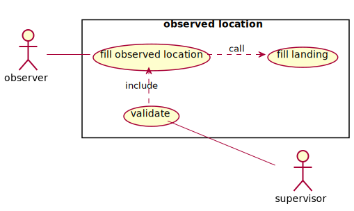

# Use Case

## Data collecting

### Observed Landing

### Fill observed location

1. L'observateur demande la création d'une nouvelle observation.

2. Il saisit :

    * Le programme de collecte;
    * Le lieu d'observation;
    * La date et l'heure de l'observation
    * Les observateurs (au moins un obligatoire)
    * Un commentaire (optionnel)

3. Il peut ensuite ajouter des navires

### Landing

### Fill landing data

1. L'observateur demande la création d'un nouveau débarquement.

2. Il saisit :

    * Le programme de collecte;
    * Le navire observé
    * Le lieu du débarquement;
    * La date et l'heure du débarquement.
    * Les observateurs (au moins un obligatoire)
    * Un commentaire (optionnel)

3. Il peut ensuite saisir la capture débarquée :

