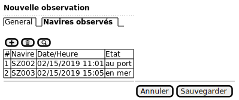

# Use Case

## Data collecting

### Observed Landing

### Fill data on landing

1. L'observateur demande la création d'un nouveau débarquement.

2. Il saisit :

    * Le programme de collecte;
    * Le lieu du débarquement;
    * La date et l'heure du débarquement.
    * Les observateurs
    * Un commentaire (optionnel)

3. Il peut ensuite ajouter des navires

#### Screens

