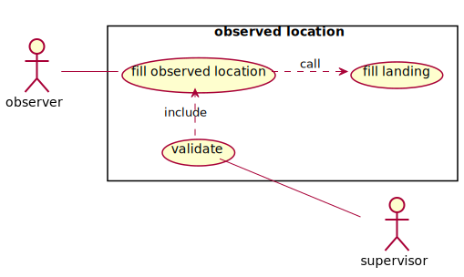
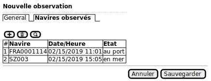
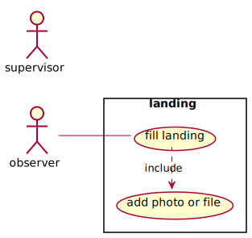
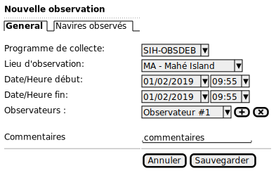
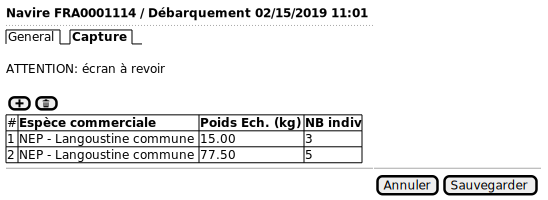

# Use Case

## Data collecting

### Observed Landing

### Fill observed location

1. L'observateur demande la création d'une nouvelle observation.

2. Il saisit :

    * Programme de collecte;
    * Lieu d'observation;
    * Date/heure de début de l'observation
    * Date/heure de fin (optionnel/invisible - suivant la configuration du programme)
    * Un ou plusieurs observateurs (au moins un obligatoire)
    * Les autres caractéristiques/paramètres, collectés pour le programme;
    * Commentaire (optionnel)

3. Il peut ensuite ajouter des navires

### Landing

### Fill landing data

1. L'observateur demande la création d'un nouveau débarquement.

2. Il saisit :

    * Le programme de collecte (invisible si le débarquement est rattaché à une observation);
    * Le navire observé:
    * Le lieu du débarquement (invisible si le débarquement est rattaché à une observation);
    * La date et l'heure du débarquement (invisible si le débarquement est rattaché à une observation).
    * Les observateurs (au moins un obligatoire) (invisible si le débarquement est rattaché à une observation)
    * Les autres caractéristiques/paramètres, collectés pour le programme;
    * Un commentaire (optionnel)

3. Il peut ensuite saisir la capture débarquée :

