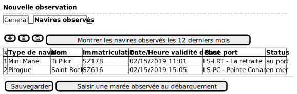

# Functional use cases

Use-cases (UC) define the functional behavior of the SUAMRiS App, for any end-user.

 - [Administration of referentials](#administration_of_referential)
 - [Collection of data](#Collection_of_data)

WARN: Work in progess. See [Use-cases in French](index.md) as latest documentation.

## Administration of referential

(ongoing)

## Collection of data

### UC - Entering a sighting on landing

#### Main Scenario

1. The observer requests the creation of a new observation on landing.

2. He enters :

    * Data collection program;
    * Location of observation;
    * Date/time of observation start;
    * End date/time (optional/invisible - depending on program configuration);
    * One or more observers (at least one mandatory);
    * Other characteristics / parameters, collected for the program;
    * Comment (optional)

3. He can then add/remove observed vessels :

### UC - Entering an observed landing

Goal :

#### Main Scenario

1. The observer requests the creation of a new landing, attached to an observation on site.

2. He enters :
    * The observed vessel:
    * Other characteristics / parameters, collected for the program;
    * A comment (optional)

3. He can then enter the landed catch :

4. The user saves his changes

#### Variants

### Variant 1.a - Landing without parent observation

1. The observer requests the creation of a new landing, without 
   attachment to an on-site observation (eg opportunistic data collection)

2. He enters :

    * The collection program;
    * The observed vessel:
    * he place of landing;
    * The date and time of the landing.
    * Observers (at least one mandatory)
    * Other characteristics / parameters, collected for the program;
    * A comment (optional)

\[Retour au 3]
