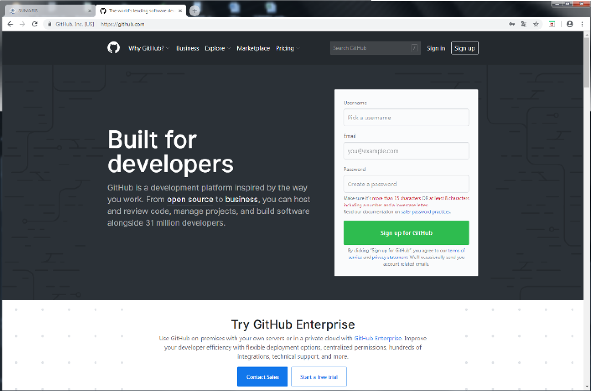

 <u>Title</u>:	 <b>Quick Start user's guide for SUMARiS web entry software</b> 

<u>Author</u>: E-IS	

<u>Date</u>:	October 19, 2019 

<u>Copyright</u>: ”Quick Start user's guide for SUMARiS web entry software” by SUMARiS is licensed under a Creative Commons Attribution-ShareAlike 4.0 International License.

# Bugs, troubleshooting and enhancements

This entry software will evolve. It was already improved but there are probably still some errors.
Thank you for keeping us informed. It is important to communicate these errors to improve the
software. Updates will be available when you load the software into your browser.

It is important to report any discrepancies so that the software can be improved and an updated
version can be released. Click on "About" at the bottom left of the SUMARiS interface:

The application GitHub sets off.  You have to create an account to add comments and  requests. 

In case of a problem, please contact your supervisor.
