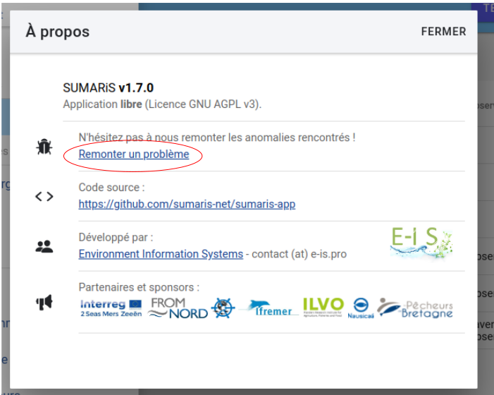

# Bugs, dépannages et améliorations

Ce logiciel de saisie continue d'évoluer. Il a déjà été amélioré mais il reste probablement quelques bugs.  
Merci de nous en tenir informé. Il est important de nous communiquer ces bugs afin de poursuivre l'amélioration du logiciel.  
Les mises à jour seront disponible à l'ouverture du programme dans votre navigateur.

Il est important de rapporter chaque écart pour que le logiciel soit corrigé et qu'une mise à jour soit mise en ligne.  
Cliquez sur le bouton "À propos" disponibles en bas à gauche de l'interface SUMARiS :

L'application GitHub se lance. Vous devez créer un compte pour ajouter des commentaires et/ou des requêtes.

En cas de problème, merci de contacter votre superviseur.
