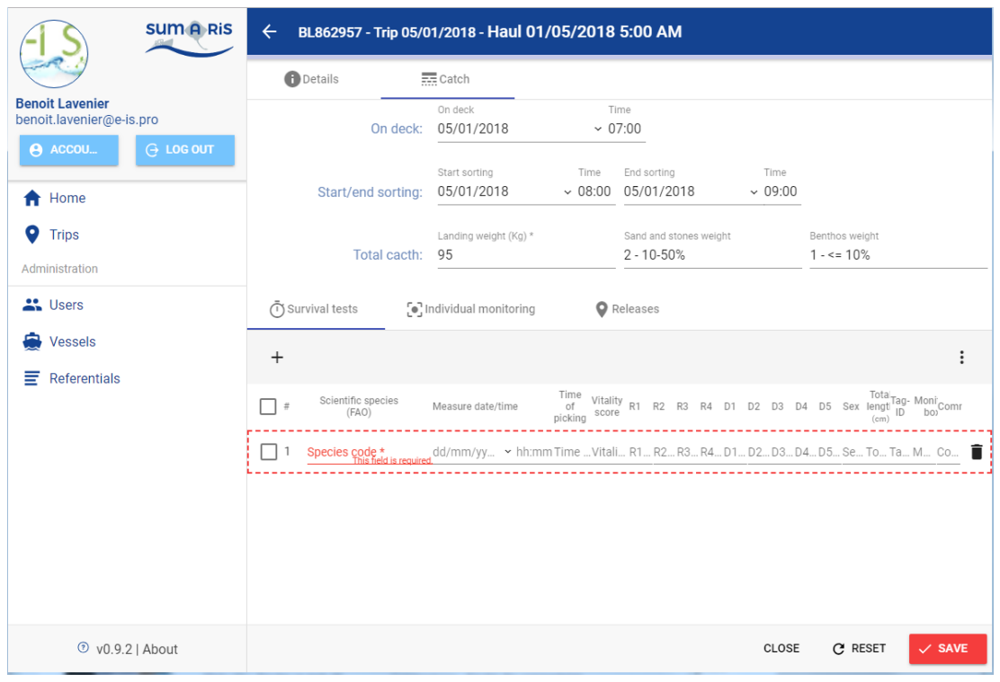
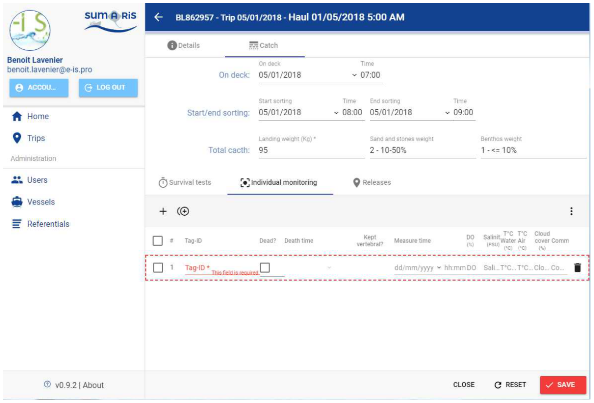
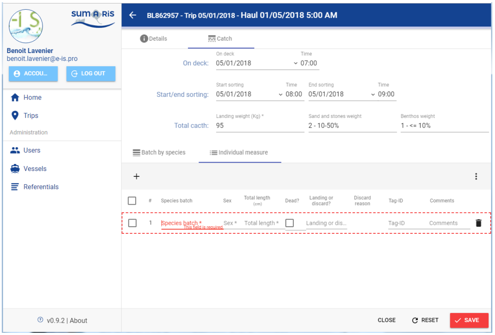

# Quick Start user's guide for SUMARiS web entry software

<u>Title</u>:	 <b>Quick Start user's guide for SUMARiS web entry software</b> 

<u>Author</u>: E-IS	

<u>Date</u>:	October 19, 2019 

<u>Copyright</u>: ”Quick Start user's guide for SUMARiS web entry software” by SUMARiS is licensed under a Creative Commons Attribution-ShareAlike 4.0 International License.

## Entry progress / Screenshots

 - [Home page](#home_page)
 - [Trips screen](#trips_screen)
 - [Gears screen](#gears_screen)
 - [Hauls screen](#hauls_screen)
 - [Catches screen](#catches_screen)
 - [Survival tests screen](#survival_tests_screen)
 - [Individual monitoring screen](#individual_monitoring_screen)
 - [Releases screen](#releases_screen)
 - [Batch by species screen](#batch_by_species_screen)
 - [Individual measure screen](#individual_measure_screen)

## Home page

## Trips screen

## Gears screen

## Hauls screen

## Catches screen

- If sampling = N:

- If sampling = S:

- If sampling = C:

## Survival tests screen

## Individual monitoring screen

## Releases screen

## Batch by species screen

## Individual measure screen

