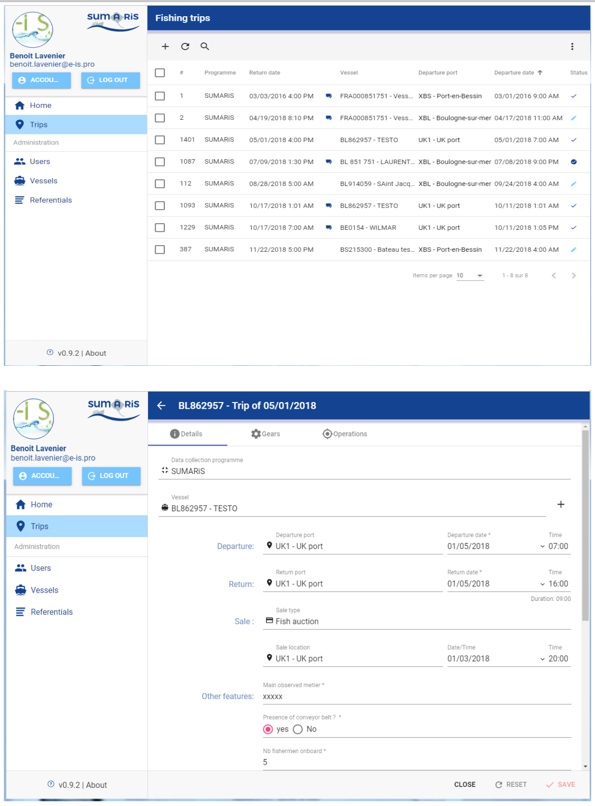
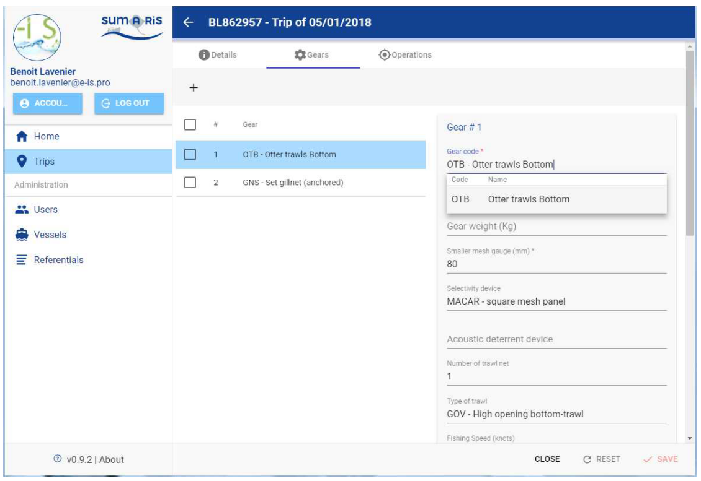
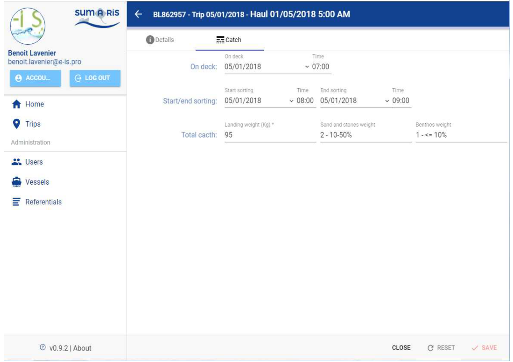
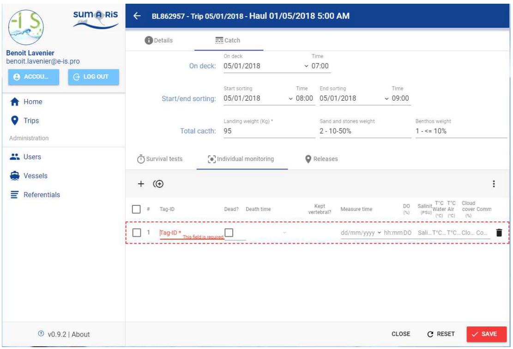
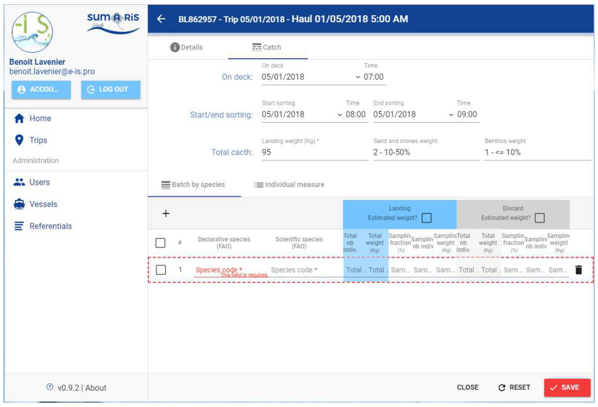

Title:	Quick Start user's guide for SUMARiS web entry software
Author: E-IS	

Date:	October 19, 2019 

Copyright: ”Quick Start user's guide for SUMARiS web entry software” by SUMARiS is licensed under a Creative Commons Attribution-ShareAlike 4.0 International License.

SUMARiS user guide Version V1.3 
attached to SUMARiS Form V8.0
attached to the entry software V0.17.6

# Table of contents

 - [Entry progress / Screenshot]()
    * [Home page]()
    * [Trips screen]()
    * [Gears screen]()
    * [Hauls screen]()
    * [Catches screen]()
    * [Survival tests screen]()
    * [Individual monitoring screen]()
    * [Releases screen]()
    * [Batch by species screen]()
    * [Individual measure screen]()

## Home page

## Trips screen

## Gears screen

## Hauls screen

## Catches screen

- If sampling = N:

- If sampling = S:

- If sampling = C:

## Survival tests screen

## Individual monitoring screen

## Releases screen

## Batch by species screen

## Individual measure screen

