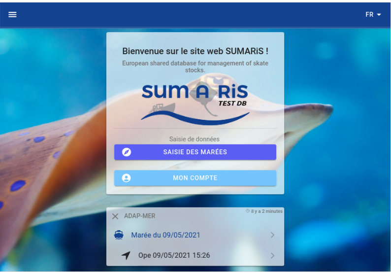
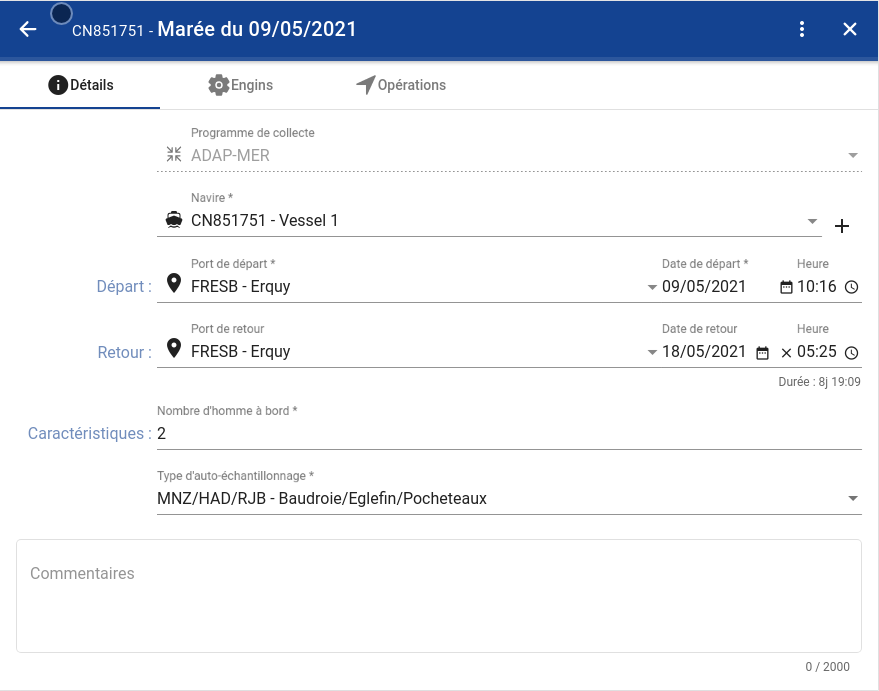
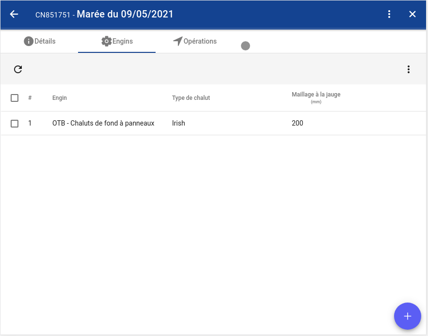
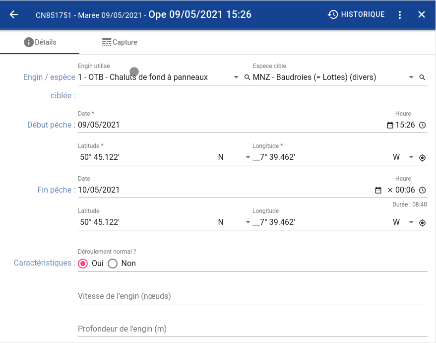
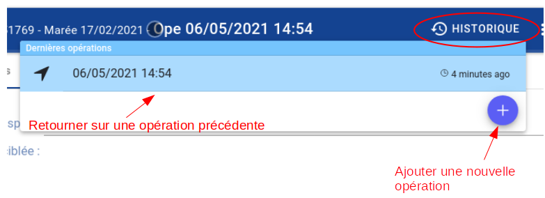
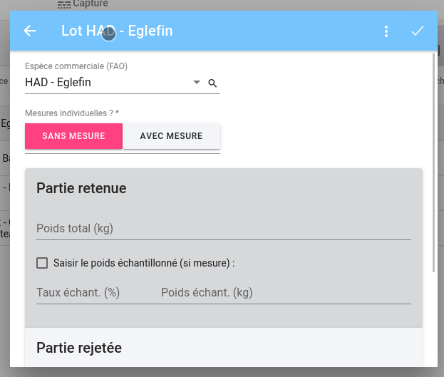
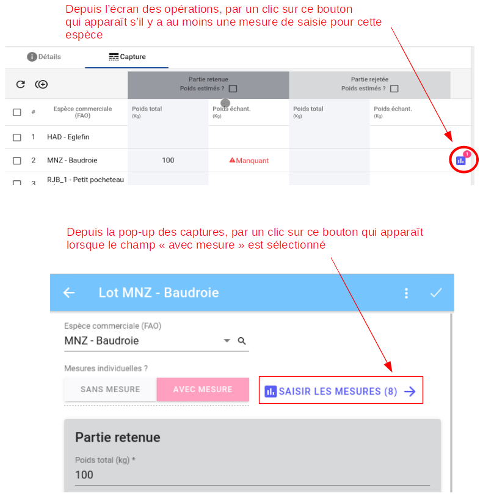
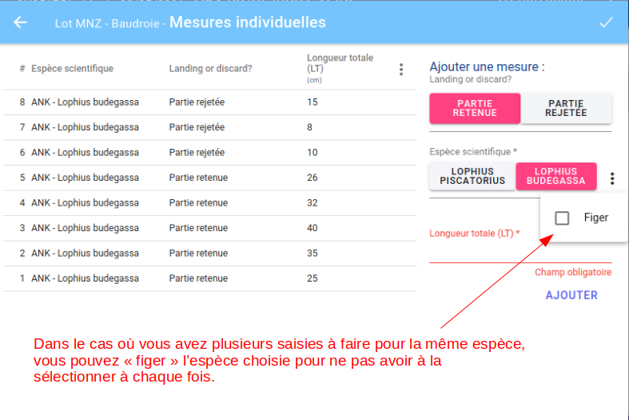

# Progression de la saisie / Captures d'écran

## Page d'accueil

## Écran des marées

## Écran des engins

## Écran des opérations

Depuis cet écran, vous pouvez accéder à l'historique des saisie récente :

## Écran des captures

## Écran des mesures individuelles

Pour accéder à l'écran des mesures individuelles, vous avez deux possibilités :

