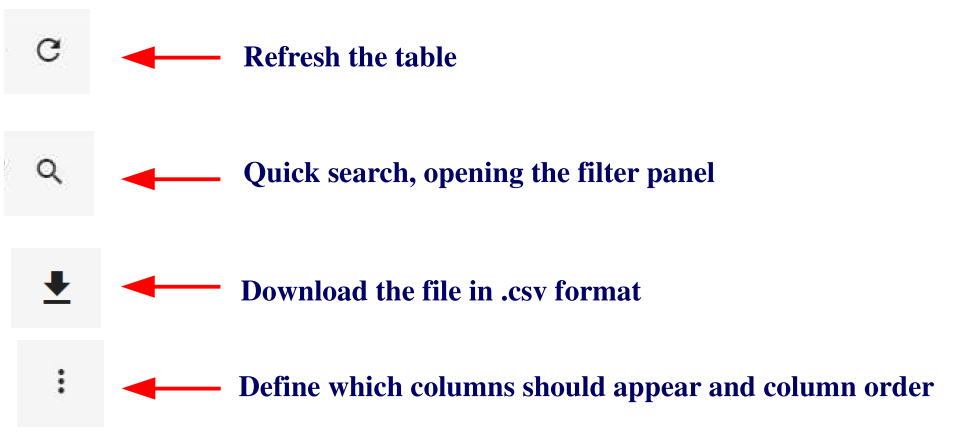
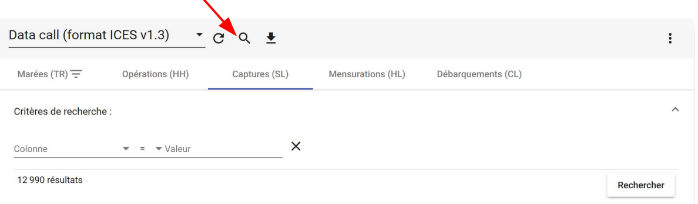
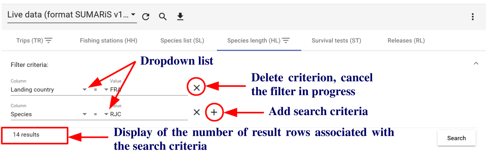

<u>Title</u>:	 <b>Quick Start user's guide for SUMARiS web entry software</b> 

<u>Author</u>: E-IS	

<u>Date</u>:	October 19, 2019 

<u>Copyright</u>: ”Quick Start user's guide for SUMARiS web entry software” by SUMARiS is licensed under a Creative Commons Attribution-ShareAlike 4.0 International License.

# Table of contents

 - [Extractions]()
    * [Extraction module]()
    * [Automatic filters]()
    * [Extraction downloads]()
    * [Extraction values]()
    * [Extraction map]()
    * [EU RGPD standars on personal data]()

## Extraction module

The extraction module is limited to the "supervisor" profiles.
The "Extractions" section contains all the data collected as part of the SUMARiS project. Three types of data can be extracted:
- national data from SUMARiS consurtium member states, in ICES v1.3 format, called "<b>Data call (ICES v1.3 format)</b>" / National data call data,
- At sea observation data from dedicated SUMARiS campaigns, exported in ICES v1.3 data exchange format, called "<b>Live data (ICES v1.3 format)</b>"
- The  survival test data from the SUMARiS dedicated campaigns, in th ecustom format SUMARiS v1.0, called "<b>Live data (SUMARiS v1.0 format)</b>". 

This   module   allows,   in   the   standard   ICES   data   exchange   format,   to   extract   data   of   the   type "Commercial Fisheries Landings statistics" (CL) and different types of records, corresponding to
the tables TR (Trip record), HH (Fishing Station record), SL (Species List record) and HL (Length record). A new record type corresponding to the ST (Survival Tests record) table is also available.

In the module, there are four types actions:

## Automatic filters

By clicking on the <u>search button</u> , the filters panel opens.

In the filters panel, it is possible to add or delete one or more search criteria according to the specified criteria line.

Filters specified on high-level records affect low-level records for the same type of data. Thus, it is not necessary to repeat a filter on the HH table, which would have been previously specified for the
TR table. Also, during several successive queries, remove the previously used filters if necessary for a given recording level.

The automatic filter will allow to use the values  of the fields. The downward pointing triangles corresponding to dropdown lists are displayed near to the field titles - click again on the filter to edit
the selected field.

To redisplay all the records, just cancel all the filters.

It is possible to be more precise in defining the filters. For this, different standard operators are
available:

    <  means less than
    <= means less than or equal to
    >  means superior to
    >= means greater than or equal to
    =  means equal to
    != means different from
    BETWEEN   means between <i>value 1</i>  and <i>value 2</i> 

The link between the criteria present on the first line is automatically of type "and": the records
must satisfies all the selected criteria.

The link between the criteria present on successive lines is automatically of type "or": the records
must satisfies <u>either of</u> the selected criteria.

It is also possible to filter the data from the active cell; in this case, the value used for the filter will
be the same value of this cell. Only records that have the same value for the given field as the active
cell are still displayed.

Finally, it is possible to sort the records in ascending or descending order by clicking on the desired
field in the data table.

More elaborately, it is possible to make a multiple selection of the search criteria for the same or
different information fields. To do so, use the CTRL key on your keyboard and left-click on the
different values of interest. It is also possible to manually specify multiple possible values with a
comma to separate the 2 desired values:

## Extraction downloads

All filtered data can be downloaded. To do this, click on the button          .
To download all extractions, simply delete all specified filters.

The following window opens, allowing to specify the path where to save the file, or to open the
zipped file:

The files will be downloaded in .csv format by type of record (CL, HH, HL, SL, ST, TR) in a
zipped file always named in this way:

Example of saved extraction:

## Extraction values

## Extraction map

## EU RGPD standars on personal data

Anonymisation   and   pseudonymisation   are   two   personal   data
protection techniques assessed under the General Data Protection
Regulation (GDPR) of May 25, 2018. The first provides increased
security and the second provides greater flexibility.

As   part   of   the   extraction   of   SUMARiS   data,   the   identity  of   all
vessels has been pseudonymized, ie it is always possible to identify an individual SHIP through his
personal data. Indeed, the pseudonymisation consists of replacing one attribute with another within
a   record;   here,   the   identity  of   the   ship.  The   aim   of   this   pseudonymisation   is  to   privilege   the
exploitability of data. Their uses therefore remain subject to strict use as defined in the SUMARiS
project.

<b>The data must be reported anonymously and aggregated</b> into an aggregation query system grid
and concise spatial representation. Data must be provided as much as possible for craft groupings at
metier level 6. 
