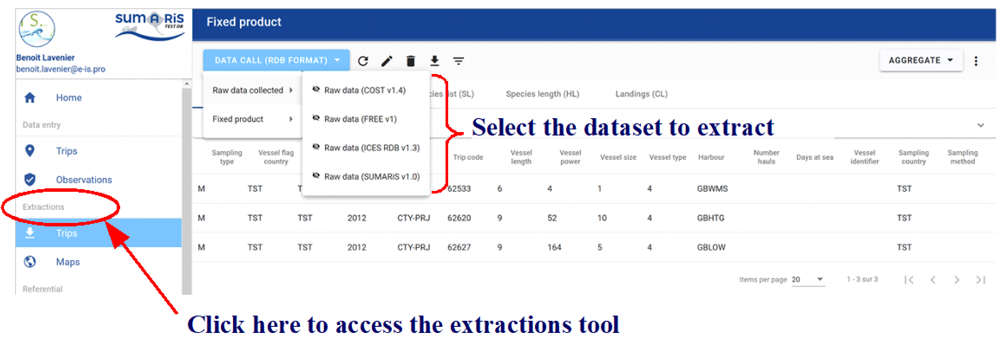
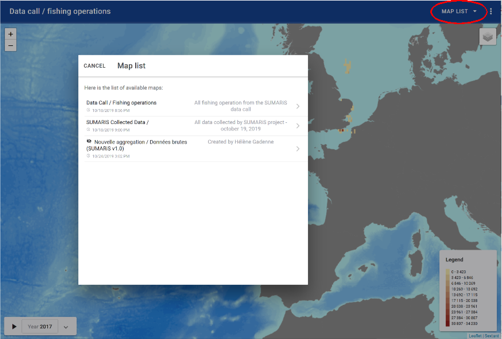

<u>Title</u>:	 <b>Quick Start user's guide for SUMARiS web entry software</b> 

<u>Author</u>: E-IS	

<u>Date</u>:	October 19, 2019 

<u>Copyright</u>: ”Quick Start user's guide for SUMARiS web entry software” by SUMARiS is licensed under a Creative Commons Attribution-ShareAlike 4.0 International License.

# Table of contents

 - [Extractions]()
    * [Trips extraction module]()
    * [Automatic filters]()
    * [Create an aggregation]()
    * [Maps extraction module]()
    * [Extraction downloads]()
    * [EU RGPD standars on personal data]()

## Trips extraction module

The extraction module is limited to the "supervisor" profiles.

The "Extractions" section contains all the data collected as part of the SUMARiS project. Two types of information can be extracted:
- Raw data collected (four formats are available):
    * national data from SUMARiS consurtium member states, in ICES v1.4 format, called "<b>Raw data (ICES v1.4)</b>" / National data call data,
    * the same data in FREE v1 format, called "<b>Raw data (FREE v1)</b>",
    * the same data in RDB v1.3 format, called "<b>Raw data (RDB v1.3)</b>",
    * at sea observation data from dedicated SUMARiS campaigns, exported in ICES v1.4 data exchange format, called "<b>Raw data (SUMARIS v1.0)</b>",with the survival test data , in the custom format SUMARiS v1.0.
- Fixed product:
    * product through national data call, in ICES v1.4 format, called "<b>Data Call / Fishing operations</b>",
    * product through data in RDB v1.3 format, called "<b>Data call (RDB v1.3)</b>",
    * product through SUMARiS collected data, called "<b>SUMARIS Collected Data</b>",
    * product through new aggregation created.
    

This module allows, in the standard ICES data exchange format, to extract data of the type "Commercial Fisheries Landings statistics" (CL) and different types of records, corresponding to the tables TR (Trip record), HH (Fishing Station record), SL (Species List record) and HL (Length record). A new record type corresponding to the ST (Survival Tests record) table is also available, and releases (RL).

In the module, depending information concerned (raw data collected or fixed product), there are six types actions:

## Automatic filters

By clicking on the <u>filter button</u> , the filters panel opens.

In the filters panel, it is possible to add or delete one or more search criteria according to the specified criteria line.

Filters specified on high-level records affect low-level records for the same type of data. Thus, it is not necessary to repeat a filter on the HH table, which would have been previously specified for the
TR table. Also, during several successive queries, remove the previously used filters if necessary for a given recording level.

The automatic filter will allow to use the values  of the fields. The downward pointing triangles corresponding to dropdown lists are displayed near to the field titles - click again on the filter to edit
the selected field.

To redisplay all the records, just cancel all the filters.

It is possible to be more precise in defining the filters. For this, different standard operators are
available:

    <  means less than
    <= means less than or equal to
    >  means superior to
    >= means greater than or equal to
    =  means equal to
    != means different from
    BETWEEN   means between <i>value 1</i>  and <i>value 2</i> 

The link between the criteria present on the first line is automatically of type "and": the records
must satisfies all the selected criteria.

The link between the criteria present on successive lines is automatically of type "or": the records
must satisfies <u>either of</u> the selected criteria.

It is also possible to filter the data from the active cell; in this case, the value used for the filter will
be the same value of this cell. Only records that have the same value for the given field as the active
cell are still displayed.

Finally, it is possible to sort the records in ascending or descending order by clicking on the desired
field in the data table.

More elaborately, it is possible to make a multiple selection of the search criteria for the same or
different information fields. To do so, use the CTRL key on your keyboard and left-click on the
different values of interest. It is also possible to manually specify multiple possible values with a
comma to separate the 2 desired values:

## Create an aggregation

After selecting the dataset to extract, click on the <u>button "aggragte"</u> to create a new aggregation (spatial or not), the edition of extraction windows panel opens.

After selecting the fixed product to extract, click on the <u>Edit button</u> or click on the <u>button "aggregate"</u>, the edition of extraction windows panel opens.

With each new aggregation created, a unique code (identifier) is automatically created. The user must define the name given to the aggregation created, define its visibility status (public, private, obsolete) and say whether it is (yes / no) a spatial aggregation. Then, it is necessary to define the stratification of this aggregation:
- the time scale used (year, month, quarter)
- the spatial scale used (area, statistical rectangle, square)
- what graphical output do you wish to represent (vessel count, trip count, fishing count, station count)
- to characterize the aggregation function used (sum, average)
- on which technique the aggregation function applies (sampling type, landing country, wessel flag country, project, vessel lentgh class, vessel length class, catch registration, national metier, EU metier leve 5, EU metier level 6, gear type, trip code)

Once the aggregation criteria defined, it is necessary to validate to record the aggregation by clicking here: 

The named and saved aggregation can be used later in the mapping tool, to map the dataset according to the defined stratification. 

An aggregation created can be deleted by clicking here:

## Maps extraction module

The extraction module is limited to the "supervisor" profiles.

To use the mapping tool, it is necessary to choice a map in the list.

If the aggregation was not created before and it does not appear in the list, 
or if the criteria defined in an existing map must be modified, then click on 
the "edit" button (see the section 6.3).

Once the map is chosen, it is possible to filter the data according to certain criteria:
- the year
- geometry
- the plotted value

Once these criteria are defined, it is possible to apply them for one or more parameter values. It is then necessary to:
- choose the parameters in the available columns via the extracted dataset
- define the value(s) for this parameter

This module functions as the filter module (see section 6.2).

The legend of the map is automatically updated (to the right of the map), according to the type of data that it is chosen to represent and according to the minimum and maximum values that characterizes the criteria. 

For example, the fishing time in hours below: 

With this tool, the criterion chosen to represent map can also evolve dynamically 
(spatially), as a function of time. To do this, click on the button "play" 
and from year to year (according to the time scale defined) and according to 
available data, the successive maps scroll. 

## Extraction downloads

All filtered data can be downloaded. To do this, click on the button          .
To download all extractions, simply delete all specified filters.

The following window opens, allowing to specify the path where to save the file, or to open the
zipped file: 

The files will be downloaded in .csv format by type of record (CL, HH, HL, SL, ST, TR) in a
zipped file always named in this way:

Example of saved extraction:

## EU RGPD standars on personal data

Anonymisation   and   pseudonymisation   are   two   personal   data
protection techniques assessed under the General Data Protection
Regulation (GDPR) of May 25, 2018. The first provides increased
security and the second provides greater flexibility.

As   part   of   the   extraction   of   SUMARiS   data,   the   identity  of   all
vessels has been pseudonymized, ie it is always possible to identify an individual SHIP through his
personal data. Indeed, the pseudonymisation consists of replacing one attribute with another within
a   record;   here,   the   identity  of   the   ship.  The   aim   of   this   pseudonymisation   is  to   privilege   the
exploitability of data. Their uses therefore remain subject to strict use as defined in the SUMARiS
project.

<b>The data must be reported anonymously and aggregated</b> into an aggregation query system grid
and concise spatial representation. Data must be provided as much as possible for craft groupings at
metier level 6. 
