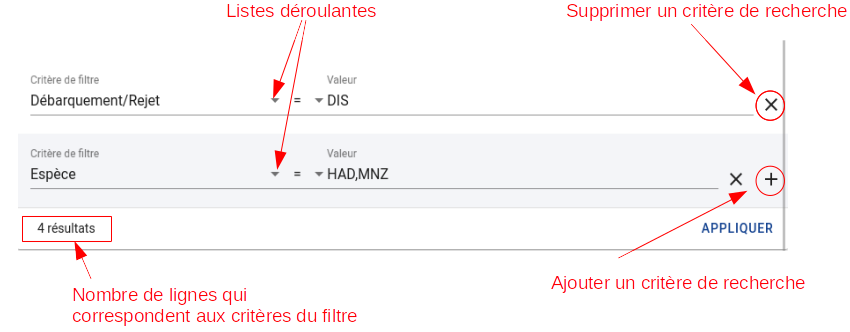
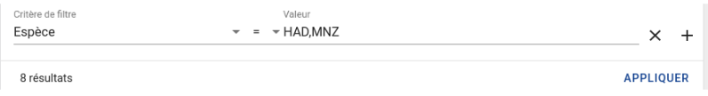
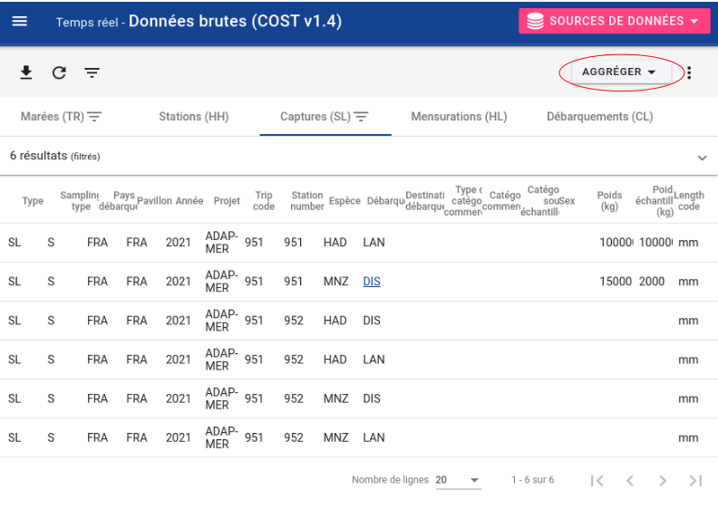
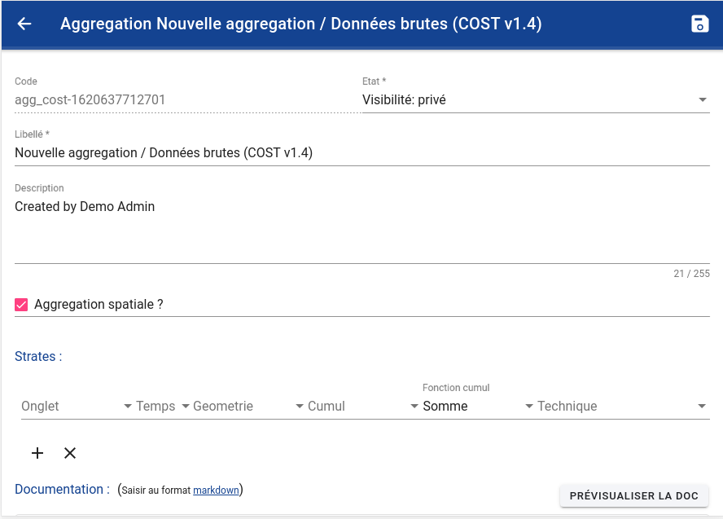
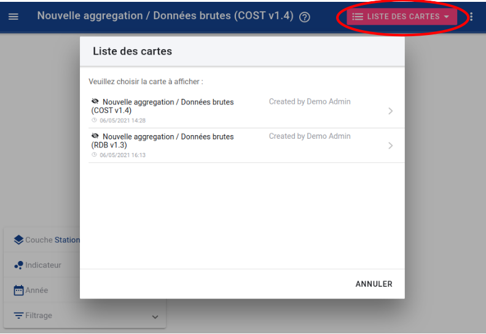
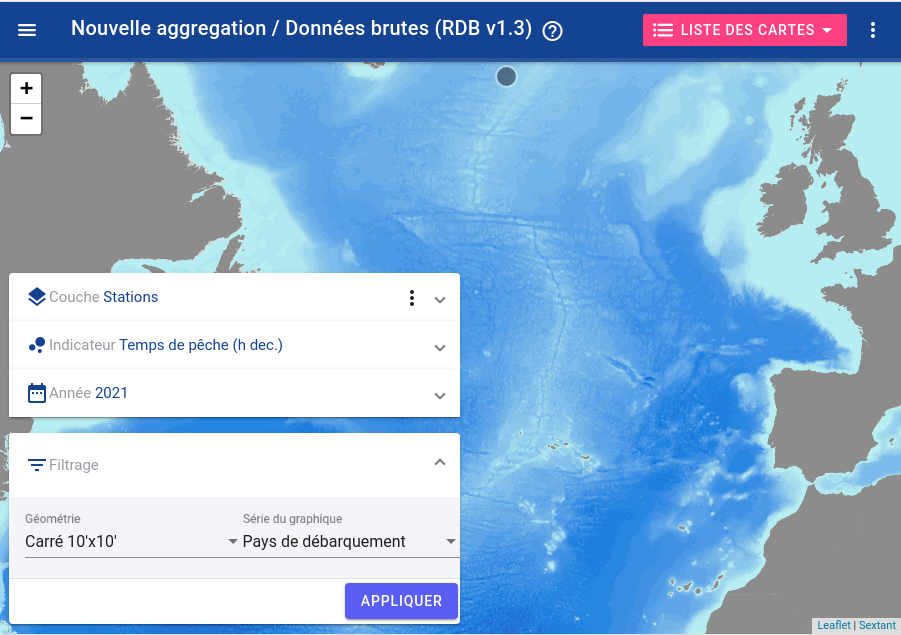
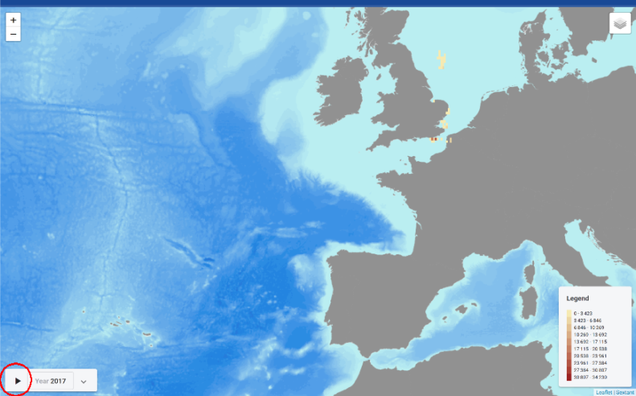
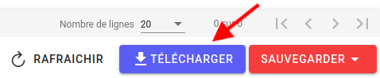
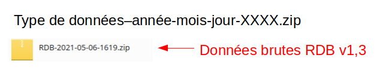
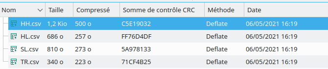

# Extractions

## Module de téléchargement des données

Le module d'extraction n'est accessible que pour :
- les utilisateur ayant le profil d'utilisateur "Superviseur" (ou profil supérieur); 
- Les responsables de programme.

La partie "Extraction" permet d'accéder à toutes les données archivées dans la base de données.
Deux types d'extraction existe :

- L'extraction des données brutes collectées, disponible dans plusieurs formats :
  - **Données brutes (RDB v1.3)** : format "Regional Data Base" du CIEM (ICES);
  - **Données brutes (COST v1.4)** : format utilisé par l'Ifremer et ses partenaires, pour l'échange de données;
  - **Données brutes (FREE v1)** : format utilisé par l'Ifremer et ses partenaires, pour l'échange de données;
  - **Données brutes (FREE2)** : format utilisé par l'Ifremer et ses partenaires, pour l'échange de données;
  - **Données brutes > Générique** : dérivé du format RDB, mais avec de nouvelles colonnes pour chaque champ collecté;
    > Ce format permet d'extraire **tout ce qui a été saisie** dans l'outil SUMARiS, sur un programme de collecte;
    > Le format final dépend donc du programme et de son protocole.
  - "**Données brutes (SUMARiS v1.0)** : format spécifique aux données de tests de survie, telles que collectées dans les campagnes SUMARiS.
- L'extraction des produits :
  - Données issues d'extraction précédentes, dans un des formats précédents, figées à la date de l'extraction;
  - Produits d'agrégation adaptés essentiellement afin d'être affiché dans la fonctionnalité "Cartes".
    

Ce module permet donc, suivant le format choisi, d'extraire les données du type "Débarquement" (CL) 
et différents types d'enregistrements correspondant aux tables TR (Marées), HH (Stations), SL (Captures), HL (Mensurations), 
ST (Tests de survie) and RL (Relâchés). 

## Filtres automatiques
En cliquant sur le **bouton filtrer** , le panneau des filtres s'ouvre.
Dans ce panneau, il est possible d'ajouter ou de supprimer un ou plusieurs critères de recherche.

Les filtres spécifiés aux niveaux supérieurs des données sont également appliqués sur les niveaux inférieurs 
ci-bien qu'il n'est pas nécessaire de remettre les filtres pour la table HH s'ils ont été spécifiés en amont sur la table TR.  
Par contre, lors d'une succession de requête, il peut être nécessaire d'enlever des filtres utilisés sur un niveau précédent. 
 
Pour ré-afficher toutes les lignes, annuler tous les filtres.

Il est possible d'être plus précis pour définir les filtres. Pour cela il existe plusieurs opérateurs standards :

> \< signifie inférieur à

> <= signifie inférieur ou égal à

> \> signifie supérieur à

> \>= signifie supérieur ou égal à

> = signifie égal à

> != signifie différent de

> BETWEEN signifie entre deux valeurs

Le lien entre les critères sur la première ligne est automatiquement de type "et" : 
Les lignes doivent correspondre à tous les critères sélectionnés.

Le lien entre les critères sur les lignes suivantes sont automatiquement de type "ou" : 
Les lignes doivent correspondre à au moins un des critères sélectionnés.

Il est aussi possible de filtrer les données depuis une cellule active. 
Dans ce cas, c'est la valeur de la cellule qui sera utilisée pour filtrer, 
seules les lignes avec la même valeur pour la colonne en question seront affichées. 

Enfin, il est possible de trier les lignes par ordre croissant ou décroissant en cliquant sur l'entête de la colonne désirée dans le tableau de données.

Pour faire une requête plus complexe, vous pouvez sélectionner plusieurs critères de recherche que ce soit pour un ou plusieurs champs.  
Pour ce faire maintenez enfoncée la touche Ctrl de votre clavier et cliquez sur les différentes valeurs que vous voulez sélectionner.  
Il est également possible de renseigner manuellement les différentes valeurs dans le panneau des filtres, en les séparant par une virgule.

## Créer une agrégation 

Après avoir sélectionné les données à extraire, cliquez sur le **bouton agréger** pour créer une nouvelle agrégation (spatiale ou non)

Le panneau d'édition de l'extraction s'ouvre.

Après avoir sélectionné le produit figé à extraire, cliquez sur le **bouton Modifier** ou cliquez sur le **bouton Agréger**
la fenêtre de modification d'une extraction s'ouvre.

Pour chaque nouvelle agrégation créée, un code unique (identifiant) est automatiquement créé. 
L'utilisateur doit définir :

- le nom donné à cette nouvelle agrégation,
- sa visibilité (publique, privé, obsolète),
- si c'est une agrégation spatiale (oui / non),
- la stratification de cette agrégation :
    - l'échelle de temps utilisée (année, mois, trimestre)
    - l'échelle spatiale utilisée (zone, rectangle statistique, carré)
    - quel graphique voulez-vous représenter (nombre de navires, nombre de marées, nombre de poissons, nombre de stations)
    - la fonction d'agrégation utilisée (somme, moyenne)
    - sur quelle technique la fonction de l'agrégation s'applique (type d'échantillonnage, pays de débarquement, pavillon, projet, classe de longueur du navire,
      enregistrement des captures, métier national, métier de l'UE niveau 5, métier de l'UE niveau 6, type d'engin, code de marée)

Une fois les critères de l'agrégation définis, il faut valider son enregistrement en cliquant sur le bouton sauvegarder : 

Le nom et l'agrégation sauvegardée peuvent être utilisé plus tard dans l'outil de cartographie en fonction de la stratification définie.

### Définir les strates

Une strate correspond à une **couche géographique** (au sens SIG), qui va être activable lors de la consultation de la carte.

En général, il est pratique de définir une strate par table de l'extraction. Par exemple : 
 Opérations, Captures, Mensurations individuelle
Pour chaque strate, on peut choisir : 
- une période temporelle de cumul (annuel ou mensuelle),
- un type de géométrie (rectangle statistiques ou carréé 10 min x 10min)
- la variable qui est cumulées (qui apparaitra en couleur dans la géométrie)
- Le type de cumul (somme ou moyenne)
- le champ technique (optionnel) qui va servir pour initialiser le graphique. Cette variable peut être modifier en direct dans l'entête du graphique.

## Module d'extraction des cartes

Le module d'extraction n'est accessible que pour le profil d'utilisateur "Superviseur"

Pour utiliser l'outil de cartographie il faut choisir la carte dans la liste.

Si l'agrégation n'a pas été créée en amont et qu'elle n'apparait pas dans la liste 
ou si les critères définis sur une carte existante doivent être modifiés, cliquez sur le ** bouton Modifier** (voir la section 6.3)

Une fois la carte choisie, il est possible de filtrer les données avec des critères :
  
- l'année,
- la géométrie 
- la valeur tracée

Après avoir défini les critères il est possible de les appliquer pour une ou plusieurs valeurs de paramètres.
Il est alors nécessaire de :

- Choisir les paramètres dans les colonnes disponibles dans les données extraites
- Définir le(s) valeur(s) pour ces paramètres

Ce module fonctionne comme le module des filtres (voir la section 6.2)

La légende de la carte est mise à jour automatiquement (à la droite de la carte) 
en fonction du type de données que vous avez choisi de représenter et des valeurs minimales et maximales des critères.

Par exemple, le temps de pêche en heure ci-dessous :

Avec cet outil, le critère que vous avez choisi de représenter dans la carte peut évoluer dynamiquement (spatialement) en fonction du temps.
Pour ce faire, cliquez sur le bouton "lecture" et d'année en année (en fonction de l'échelle de temps choisie), suivant les données disponible, 
les cartes successives défilent.

## Téléchargement d'extraction

Toutes les données filtrées peuvent être téléchargées. Pour ce faire, cliquez sur le bouton "Télécharger" : 

.

Pour télécharger toutes les extractions effacez simplement les filtres.

Le fichier est téléchargé au format .csv par type d'enregistrement (CL, HH, HL, SL, ST, TR) dans un fichier zip nommé selon le schéma suivant :

Exemple d'extractions enregistrées :

## Standard RGPD de l'UE pour les données personnelles

L'anonymisation et la pseudonymisation sont deux méthodes de protection des données personnelles validées par 
le Règlement Général de Protection des Données (RGPD) du 25 mai 2018. La première permet d'améliorer la sécurité, 
la deuxième autorise une meilleure flexibilité. 

Concernant les extractions des données SUMARiS, l'identité de l'ensemble des navires est pseudonymisée. 
C'est à dire qu'il est toujours possible d'identifier un navire individuel dans ses données personnelles.
En effet la pseudonymisation consiste à remplacer un attribut par un autre dans un enregistrement, ici l'identité du navire.
Le but de la pseudonymisation est de privilégier l'exploitabilité des données.
Leurs utilisations restent donc soumises à une utilisation stricte tel que défini dans le cadre du
projet SUMARiS.

**Les données doivent être rapportées anonymement et agrégées** dans une grille de système de requête d'agrégation et de représentation spatiale concise. Les
données doivent être fournies au maximum pour des regroupements d'engins au niveau de métier 6.

 
