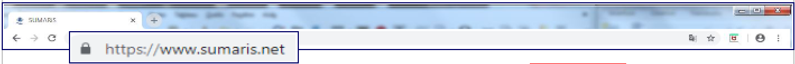
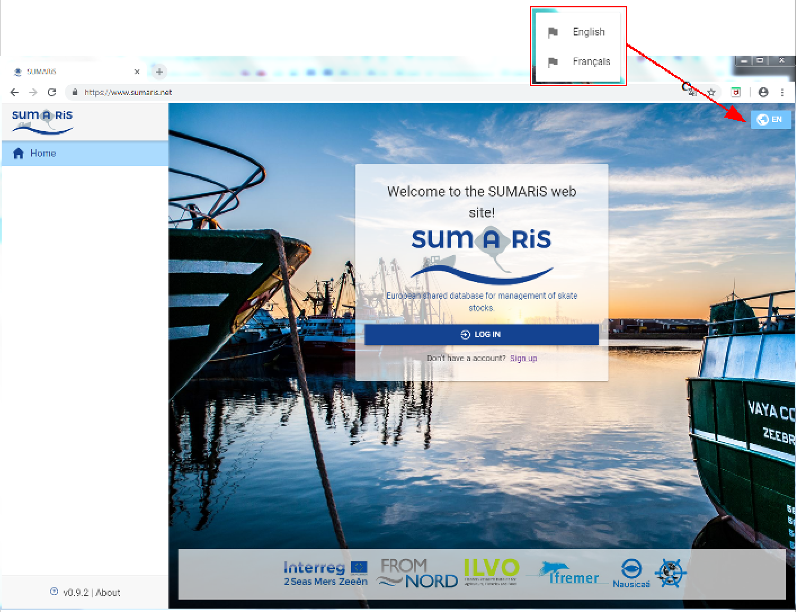
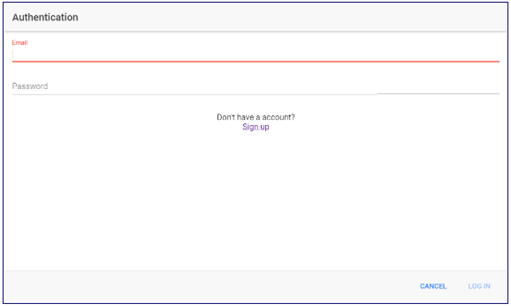

# Quick Start user's guide for SUMARiS web entry software

<u>Title</u>:	 <b>Quick Start user's guide for SUMARiS web entry software</b> 

<u>Author</u>: E-IS	

<u>Date</u>:	October 19, 2019 

<u>Copyright</u>: ”Quick Start user's guide for SUMARiS web entry software” by SUMARiS is licensed under a Creative Commons Attribution-ShareAlike 4.0 International License.

# Preample

SUMARiS is an online entry tool for fisheries data. Developed by E-IS.

This user guide has been delivered based on the database training session that took place in Lille, Tuesday 09 October 2018. During this training, scientists, observers and professional organisations learnt how to manipulate the database. 

This documentation has been reduced to its maximum to help in efficiency for the reader in the discovery of SUMARiS input software.

This guide presents only a small part of the possibilities of the SUMARiS software and does not act as a complete user manual.

- [Minimum configuration](#minimum_configuration)
- [Software objectives](#Software_objectives)
- [Features](#Features)
- [Access to the SUMARiS software](#Access_to_the_SUMARiS_software)

## Minimum configuration

The software works under Microsoft Windows 7/10 operating systems (Family Edition, Professional, tablet-PC Edition) and Linux with Mozilla Firefox, Chromium and Google Chrome  web browsers. These last two browsers are to be favored for a better performance of SUMARiS tools.

An internet connection with a minimum of 2Mbp/s bandwidth in receipt/issue is required.

## Software objectives

SUMARiS is a Web information system for storing, processing and extracting collected data, as well as disseminating results and aggregated outputs. 
There is a " semi-connected" architecture, allowing for off-line use through data storage directly in the browser. 

<u>Good points</u>:
- Allowing the entry of paper forms completed by field observers during the "SUMARiS" campaign through dedicated web software,
- Providing intuitive screens designed to minimize the entry time required,
-  Allowing entry in different languages (EN / FR),
- Providing assistance during the data entry period thanks to a supervision system, in case of anomalies of the software are detected and  unexpected data cannot be computerized.

## Features

SUMARiS manages different types of users. It supports several types of fisheries data:
- Trips observed onboard of fishing vessels (trips, fishing operations, landings, discards and biological sampling, fishing effort)
- Trips dedicated to the survival tests after the catch based on the RAMP method; 
- Trips dedicated to fish tagging (Visual or electronic);
- Scientific Campaigns of research.

## Access to the SUMARiS software

In your internet browser, enter •  <https://www.sumaris.net> and launch the application.
If you were already using a previous version of SUMARiS, the update will automatically run when the application is launched.

On the home page, you can choose your language of view:

At the first start of the software, the authentication is requested by creating a user account, please enter a valid email address, and a secure password (with different types of characters; upper case, lower case, number, special character) and then validate it.

 In this first online version, beware, we do not receive a confirmation email when we create the account. Each authenticated person will first have guest status, allowing them to view, but not to enter data.  The final status of each person must be validated by an administrator and is not automatic for the moment.

If the SUMARiS software is updated, please refresh the page in your browser (usually <i>Ctrl+F5</i> or <i>Ctrl+R</i>) and ensure that is the most recent version (bottom left).
