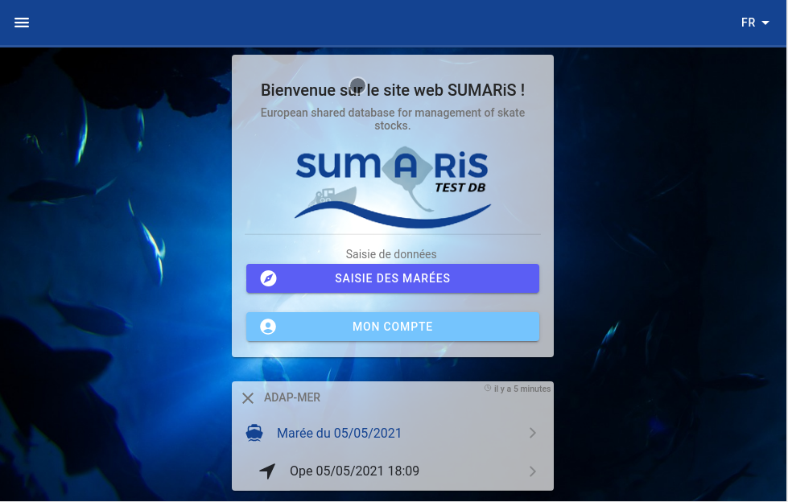
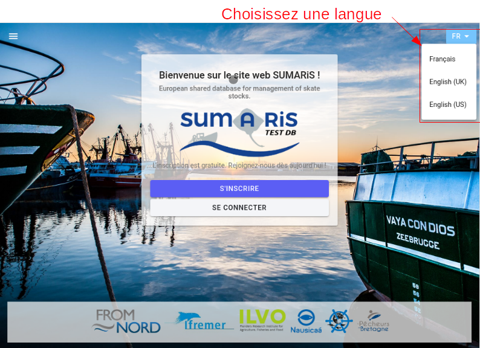
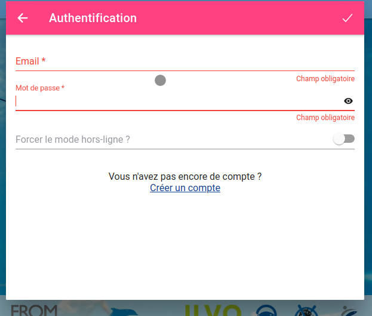

# Préambule

SUMARiS est un outil de saisie en ligne des données halieutiques. Développé par E-IS.

Ce document a été réduit au maximum afin d'aider efficacement le lecteur à décourvrir le logiciel SUMARiS. 

Ce guide ne présente qu'une petite partie des possibilités du logiciel SUMARiS et ne doit pas être considéré comme un manuel complet.

## Configuration minimum

Le logiciel fonctionne sous Microsoft Windows (Toutes versions), linux et tablette Android avec les navigateurs web
Mozilla Firefox, Chromium et Google Chrome.  
Ces deux derniers navigateurs sont à privilégier pour optimiser les performances de SUMARiS.

Une connexion internet avec un débit minimum de 2Mbp/s montant/descendant est nécessaire.

## Objectifs du logiciel

SUMARIS est un système d'information web destiné à la collecte, le traitement et l'extraction de données 
ainsi qu'à la diffusion de résultats et d'agrégations.

L'application a une architecture "semi-connectée" qui permet de collecter et de stocker les données via 
le navigateur lorsque l'application est hors-ligne.

**Avantages** :

 - Permet la saisie des formulaires papiers complétés par les observateurs sur le terrain lors des campagnes de SUMARIS grâce au logiciel web dédié,
 - Dispose d'interfaces intuitives conçues pour minimiser le temps de chargement,
 - Propose une saisie dans différentes langues (EN / FR),
 - Apporte une assistance pendant la phase de saisie grâce au système de supervision capable de détecter les données incorrectes 
   qui ne peuvent pas être enregistrées. 

## Fonctionnalités

SUMARiS gère différents types d'utilisateurs ainsi que différents types de données halieutiques :

- Marées observées à bord de navire de pêche (marées, pêches, débarquements, rejets et échantillonnage biologique, effort de pêche),  
- Marées dédiées aux tests de survie après la pêche, basé sur la méthode RAMP,
- Marée destinée au repérage des poissons (Visuel ou électronique),
- Des campagnes de recherches scientifiques.

## Accéder au logiciel SUMARiS

Dans votre navigateur, saisissez • <https://www.sumaris.net> et lancez l'application.  
Si vous utilisiez une version précédente de SUMARiS, la mise à jour se lancera automatiquement au lancement de l'application.

Sur la page d'accueil, choisissez la langue :

Lors du premier lancement de l'application, il est nécessaire de créer un compte utilisateur pour s'authentifier.  
Merci de saisir une adresse mail valide et un mot de passe sécurisé (avec différents types de caractères, des majuscules,
des minuscules, des nombres et/ou des caractères spéciaux) puis validez.

À la création de votre compte, un email automatique est envoyé pour valider l'adresse email.  
Chaque utilisateur authentifié a au départ un statut d'invité qui lui permet de voir mais pas de saisir de données.
Le statut définitif doit être validé par un administrateur et n'est pas automatisé pour l'instant.

Si le logiciel SUMARiS s'est mis à jour, merci d'actualiser la page dans votre navigateur (en utilisant l'un des raccourcis *Maj+F5* ou *Ctrl+R*) 
et assurez-vous que vous avez la version la plus récente (en bas à gauche de votre écran).
