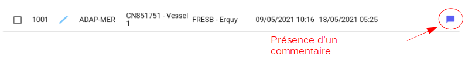

# Contrôle qualité

**Contrôler un échantillon des formulaires saisis est important pour s'assurer de la cohérence des valeurs déclarées** :  

Chacun doit réaliser ce contrôle de son côté puisque c'est la première phase de la validation.

Sélectionnez 10% du total des données entrées puis vérifiez la saisie.
Si vous trouvez une erreur, corrigez-la puis sélectionnez aléatoirement un formulaire supplémentaire à contrôler.
Si aucune fiche n'a d'erreur, continuez la saisie.

**Interprétation des informations qui ne peuvent pas être saisies dans le formulaire** :

Certaines données ne correspondent pas aux recommandations du protocole et demandent une interprétation pour être saisies.

> Par exemple, l'espèce cible répertoriée est une espèce commerciale (sole SOL) 
et pas une espèce des 18 groupes prédéfinis en page 4 du formulaire correspondant aux catégories européennes pour les métiers de niveau 5.  
Le saisisseur considère la sole SOL comme un 'poisson démersal' DEF et fait la correction dans le fiche.

Ces vérifications peuvent être faites avant la saisie afin d'accelerer celle-ci.

**Contrôles des saisies disponible dans l'outil** :

Certains contrôles sont automatiques, d'autres seront ajoutés dans les futures versions.

- Contrôle des dates de début et de fin d'une marée : la fin ne peut pas être plus récente que le départ.
- Contrôle des dates de début et de fin d'une pêche : Idem.
- Contrôle du format des dates et heures : Les heures sont limitées pour être comprises entre 00 et 23h. Les minutes entre 00 et 59.
  Les jours ne peuvent pas dépasser 31 et les mois 12.
- Contrôle des valeurs minimum et maximum des champs spécifiques.
- Contrôle du nombre de décimales autorisées.

**Commentaires** :

Pour s'assurer qu'aucune information n'est perdue, il est important d'ajouter en commentaire tous ce qui ne peut pas être 
saisi, par exemple des détails concernant une espèce ciblée.  
S'il y a un commentaire sur une marée ou une pêche, il est indiqué par une icône sur la ligne correspondante :

