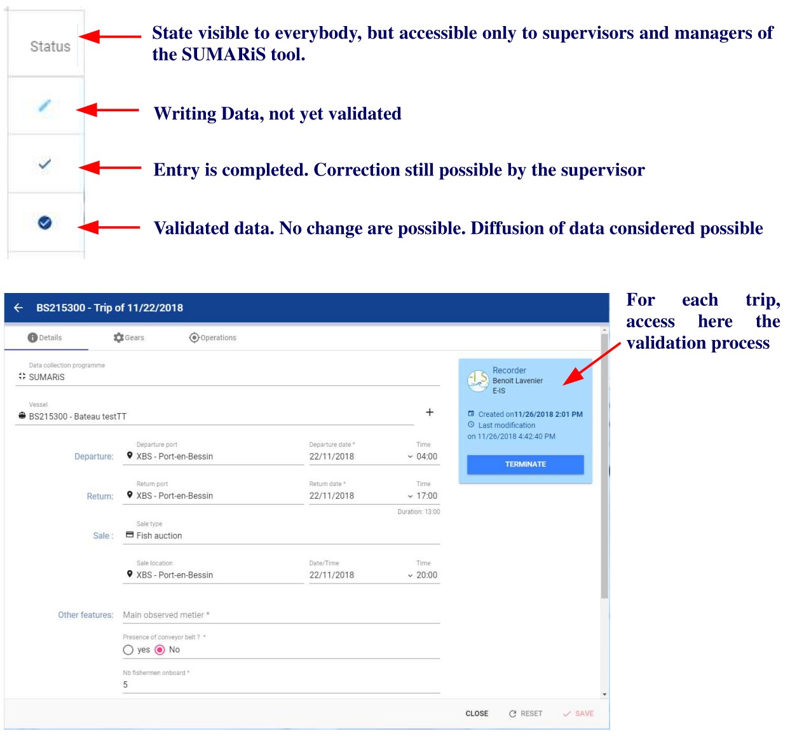
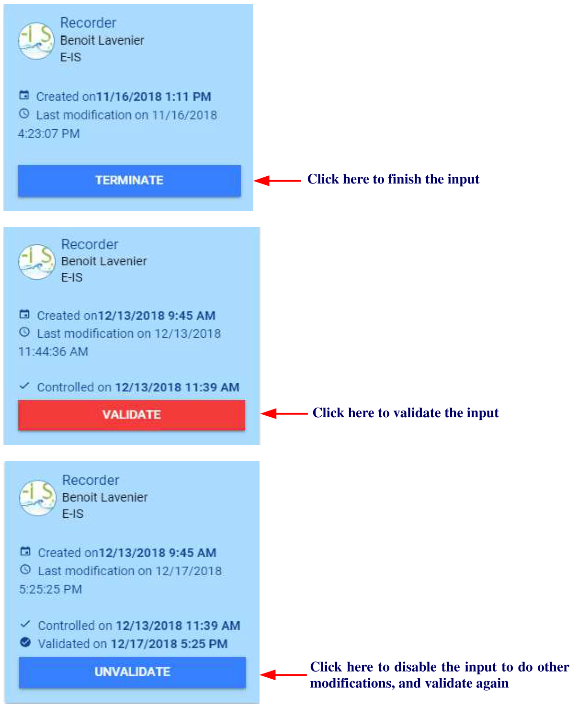

<u>Title</u>:	 <b>Quick Start user's guide for SUMARiS web entry software</b> 

<u>Author</u>: E-IS	

<u>Date</u>:	October 19, 2019 

<u>Copyright</u>: ”Quick Start user's guide for SUMARiS web entry software” by SUMARiS is licensed under a Creative Commons Attribution-ShareAlike 4.0 International License.

# Table of contents

 - [Save, validation and qualification]()
     * [Save]()
     * [Validation and qualification]()

## Save

Be careful, consider saving by clicking on the "Save" button, as the automatic backup is not yet enabled.

By security, data entered and saved in the entry tool are saved twice a day on the server of E-IS. 

## Validation and qualification

Validation is performed by a supervisor.  Each supervisor must have access to all forms completed
by the observer.
 
Only supervisors and administrators can validate the trips data on the dedicated page. A "State"
column indicates the status of each trip; it is possible to determine whether it is a modification (data
not yet validated) or a correction made by the supervisor (=on a validated data).

<b>Validation process</b>:

