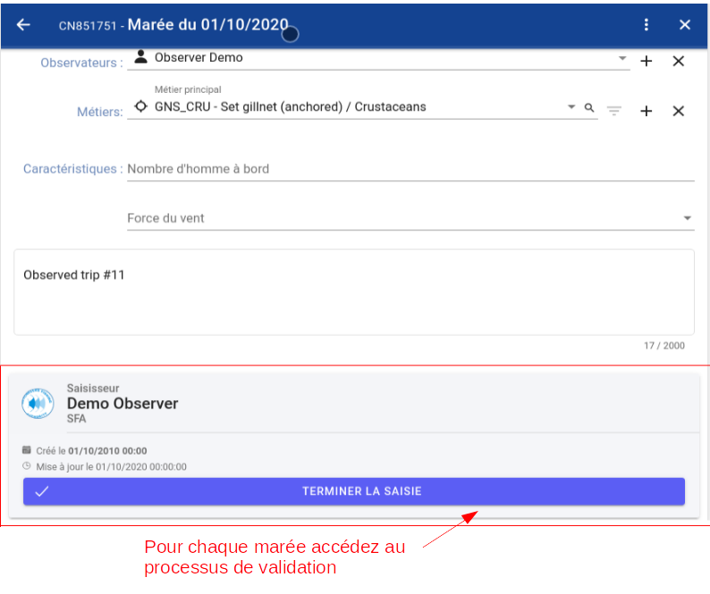
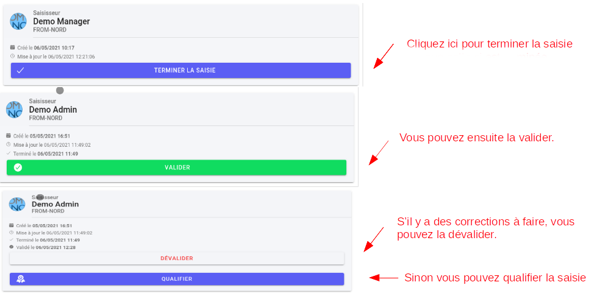

# Sauvegarde, validation et qualification

## Sauvegarde

Attention, n'oubliez pas de cliquer sur le bouton "Sauvegarder" puisque la sauvegarde automatique n'est pas encore disponible.

Par sécurité, les données saisies et enregistrées dans l'outil de saisie sont sauvegardées deux fois par jour sur les serveurs d'E-IS. 

## Validation et qualification

La validation des formulaires doit être réalisée par un superviseur. 
Chaque superviseur a accès à tous les formulaires complétés par les observateurs.

Seuls les superviseurs et les administrateurs peuvent valider et dévalider les données des marées dans une page dédiée.
Une colonne "État" indique le statut de chaque marée.  
Il est possible de savoir s'il s'agit d'une modification (lorsque les données n'ont pas encore été validées) 
ou d'une correction faite par un superviseur (si les données ont été validées).

**Processus de validation** :

