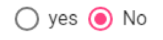

# Screens concepts, various view
    
## Overall design of the entry interface

The main form contains four parts:
-  The left side, the  **side band**, where the user can find all the information for which he/she has
rights (user account, trip information, etc...).
- The high side (in blue), the **primary band**, which indicates at the user the progress of the entry
(which vessel, which sea-trip, which haul).
- The high side (greyed out), the **secondary band**, which allows the user to access different tools
such as adding information, deleting information, searching for information, cancelling changes
(going back), sorting out fields that are visible or not).
- The lower part (white) is the **entry field**.

## Details of lateral headband

## Details of primary headband

This is a reminder area of ongoing entry - the sampled vessel - the start of the trip - the start date
and time of the haul.

## Details of secondary headband

Providing   tools   that   allow   the   user   to   access   buttons   or   tabs   associated   with   entering   new
information.

### The buttons

Each **button** has a set of actions:

### The tabs

Each **tab** shown depends on the information to be collected. Depending on the data collected, the
user will be able to access the different entry sheets by clicking on the corresponding tab. 

- **From a trip**, with **detailed** information, it is possible to enter or access information on **fishing
gears** used during the trips, to operate **fishing operations**.

- **From a fishing operation**, with  **detailed**  information, it is possible to enter or access **catch** 
information. **Note**: the total catch weight of any species is required to record fishing operation.
**Importants**: 
     * When an information is missing, the symbol  appears   in   front   of   the   tab   where informations are required.
     * The missing value in the appropriate tab is highlighted in red.
     * An astérisk * indicates that the field is mandatory and that information is required.

Depending on whether the **fishing operation** is not sampled (sampling = **N**), whether it is sampled
for   capture   (sampling   =  **C**)   or   for   survival   testing   (sampling   =  **S**),   different   sub-tabs   will   be
available in the "**catch**" tab. A new entry area is then accessible along with another secondary band:

- **If sampling = C**:
It is possible to enter or access specific information on the **Batch by species** and to enter **individual measures** information. 
- **If sampling = S**:
It is possible to capture or access specific **survival test** information, enter **individual monitoring** information and  information on **releases** of animal in the sea if necessary..
- **If sampling = N**:
There are no tabs in the catch. Only the total catch weight of any species is required to record the fishing operation. 

## Details of the entry fields

The entry field consists of several types of objects:

 - “Action” buttons: their goal is to close, reset or save the completed entry.
 - Drop-down lists: they allow you to select information from a list, such as vessel registration,
 - The check boxes: when checked, the line is selected. It is possible to select several lines
depending on the desired action.

 - The Yes/No spaces: the active value matchs the space where the pointer is visible.

 - Data groups are associated data, for example, date and time.
 

 - Some entry sheets take up space on the screen, so a scroll area is visible to the right of the
 capture area, to move up or down the screen. The mouse wheel can also be used to unroll the sheet.
 
 - When the number of data available for the same table is important, only a few lines are visible.
  However, it is possible to change the number of data to be displayed, or to move forward and backward in 
  its data visualization using the arrows below:
   

 - Drop-down lists help to avoid errors and limit the entry time. They use data referential. 
 

   To select information from a drop-down list, use the keyboard arrows and enter it.
   

   The information may also be entered but an error will be reported if the data have not been entered correctly.
   
   

   To move from one  entry  field to the next  one, we should use the "tab" key on the
   keyboard. This key has two advantages: following the field entry order and moving the
   cursor in the correct place in the next field.
