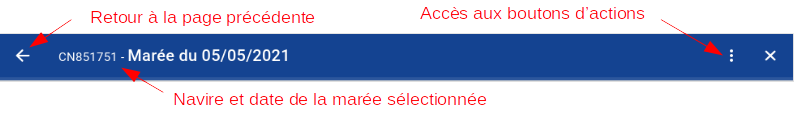

# Conceptions des interfaces

## Design global des interfaces de saisie

Le formulaire principal contient quatre parties :

 - La partie gauche, le **bandeau latéral**, où l'utilisateur a accès à toutes les informations pour lesquelles il/elle a des droits 
(compte utilisateur, information sur les marées, etc.). 
   Sur tablette ce bandeau est caché, il faut faire un glisser depuis la gauche de l'écran vers la droite pour qu'il s'affiche.
 - Le haut (en bleu), le **premier bandeau** dans lequel l'utilisateur peut trouver des informations 
   sur le menu où il se trouve et sur la saisie en cours (quel navire, quelle marée, quelle opération)
 - Le haut (en gris), le **deuxième bandeau**, qui donne accès aux différents outils comme l'ajout, 
   la recherche ou la suppression de données, l'annulation des changements (retour arrière) ou encore le tri des champs visibles ou non.
 - La partie basse (en blanc) est la **zone de saisie**. 

## Détails du bandeau latéral

Le nombre d'élément disponible dans le bandeau latéral dépend des droits de l'utilisateur.

## Détails du premier bandeau

C'est un rappel de la saisie en cours ici le navire et le début de la marée.

## Détails du deuxième bandeau

  

C'est dans ce bandeau que l'utilisateur a accès aux boutons d'actions.

### Les boutons

Il existe plusieurs types de **boutons** que vous rencontrerez lors de la saisie :

### Les onglets

L'affichage de chaque tableau dépend des données à collecter. 
En fonction de celles-ci, l'utilisateur a accès à différents onglets de saisie.   

- À partir d'**une marée** avec des données **détaillées**, 
  il est possible de saisir ou d'accèder à des données sur les engins de pêches utilisés et les opérations.

L'onglet actif est celui qui est souligné.

- À partir d'**une opération** avec des informations **détaillées**, il est possible de saisir ou d'accéder à des donnés de **capture**

**Important** :
- Un astérisque * indique que le champ est obligatoire et donc qu'une valeur doit être remplie.
- Quand une information est manquante :
    - Le champ manquant apparait en rouge dans l'onglet correspondant.
    - Le symbole suivant apparait à côté du nom de l'onglet où la saisie est incomplète :
     

## Détails des champs de saisie

**Les champs de saisie peuvent être de plusieurs types :**

- *Les cases à cocher :* Quand une case est cochée, la ligne est sélectionnée. Il est possible de sélectionner plusieurs lignes en fonction de l'action désirée.

- *Les boutons radios oui/non :* la valeur active est celle dans laquelle un point est visible.

- *Des champs groupés* qui rassemble des données associées. Par exemple la date et l'heure :

- *Les listes déroulantes :* Elles permettent de sélectionner une information dans une liste, par exemple le registre des navires.
 Parce qu'elles utilisent des données de références, elles évitent les erreurs et réduisent le temps de saisie.

Pour sélectionner une valeur dans une liste déroulante, vous pouvez utiliser les flèches du clavier puis valider en appuyant sur entrée.
Les champs peuvent également être remplis manuellement mais une erreur peut être signalée si les données n'ont pas été correctement saisie.

- *Les boutons d'actions :* Leur objectif est de fermer, réinitialiser ou enregistrer la saisie.

Pour passer d'un champ à l'autre, vous pouvez utiliser la touche tabulation du clavier, ce qui présente deux avantages :
saisir les champs dans l'ordre et placer le curseur au bon endroit dans le champ suivant.

Certains onglets de saisie prennent un espace qui dépasse la taille de l'écran,
dans ce cas une barre de défilement apparait à droite de la zone de saisie.

Quand le nombre de champs est très important, seules quelques lignes sont visibles.
Cependant, il est possible de changer le nombre de champs à afficher par page
puis d'utiliser les flèches pour naviguer entre les pages :

