# Manuel d'utilisation de SUMARiS Calendrier d'activité

## Sommaire

- [Prérequis](#prérequis)
- [Paramétrage des colonnes du tableau de consultation des calendriers d'activité](#paramétrage-des-colonnes-du-tableau-de-consultation-des-calendriers-dactivité)
- [Paramétrage des champs et des listes déroulantes](#paramétrage-des-champs-et-des-listes-déroulantes)
- [Epingler un calendrier](#epingler-un-calendrier)
- [Changer de zone de compétence](#changer-de-zone-de-compétence)
- [Sélectionner des cellules, des lignes et des colonnes](#sélectionner-des-cellules-des-lignes-et-des-colonnes)
- [Etendre le contenu d'une cellule](#etendre-le-contenu-dune-cellule)
- [Saisir un mois complet](#saisir-un-mois-complet)
- [Afficher les avertissements](#afficher-les-avertissements)
- [Afficher les erreurs](#afficher-les-erreurs)
- [Replier tout à la sauvegarde](#replier-tout-à-la-sauvegarde)
- [Afficher les raccourcis clavier](#afficher-les-raccourcis-clavier)
- [Générer les formulaires et rapports](#générer-les-formulaires-et-rapports)

## Prérequis

Pour un fonctionnement optimal de SUMARiS Calendrier d'activité, il est préconisé aux utilisateurs :
- D'utiliser Google Chrome
- De désactiver un éventuel traducteur

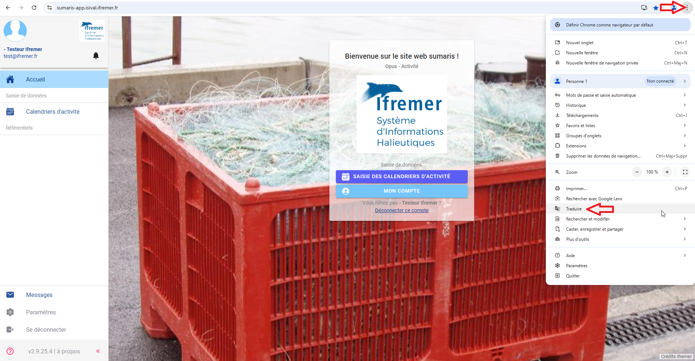
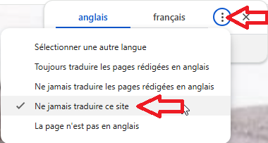

- De se régionaliser :

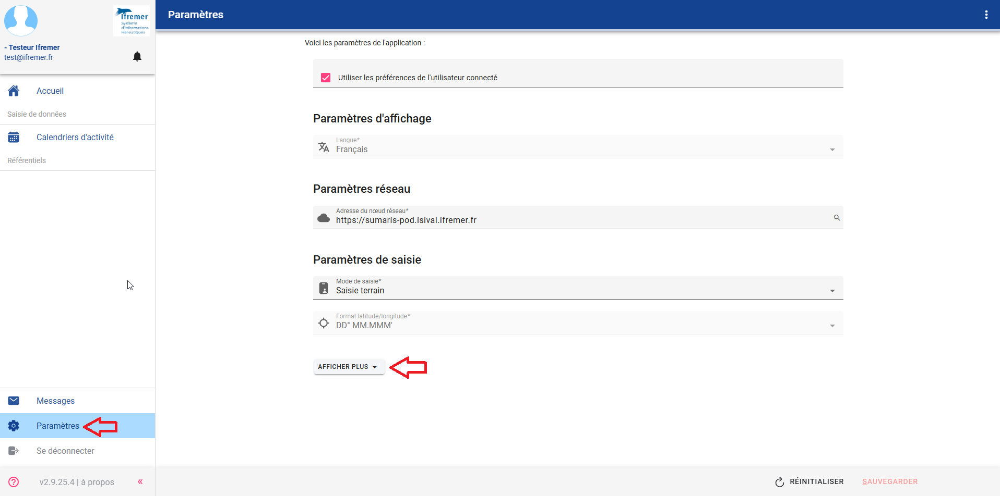
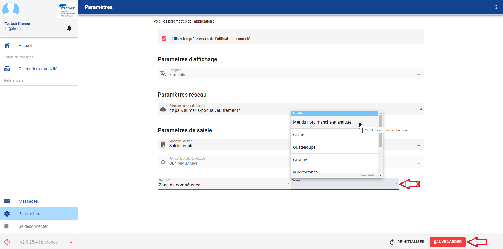

## Paramétrages 

### Paramétrage des colonnes du tableau de consultation des calendriers d'activité

Le paramétrage des colonnes est accessible depuis le tableau de consultation des calendriers d'activité via le menu contextuel et permet de modifier 
l'ordre (via l'icône "=") et la visibilité des colonnes (via le bouton switch).

Ce paramétrage est spécifique à chaque utilisateur.

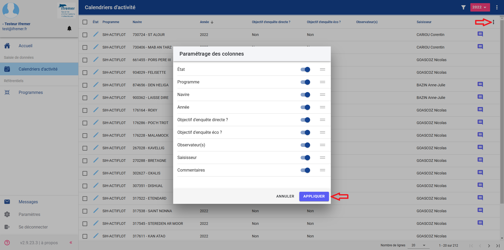

### Paramétrage des champs et des listes déroulantes

Il est possible de personnaliser l'affichage des champs et des listes déroulantes :
- Navire
- Port d'exploitation
- Zone de pêche
- Gradient côte
- Profondeur 
- Zone proche

Pour cela, il faut accéder à l'écran "Paramètres" accessible depuis le menu de gauche puis sélectionner une ou plusieurs options parmis les suivantes, ainsi que la valeur souhaitée :
- Liste déroulante > Navires
- Liste déroulante > Lieux (port, etc.)
- Liste déroulante > Zone de pêche (rectangle, etc.)
- Liste déroulante > Distance à la côte
- Liste déroulante > Profondeur
- Liste déroulante > Zone spécifique

Ce paramétrage est spécifique à chaque utilisateur.

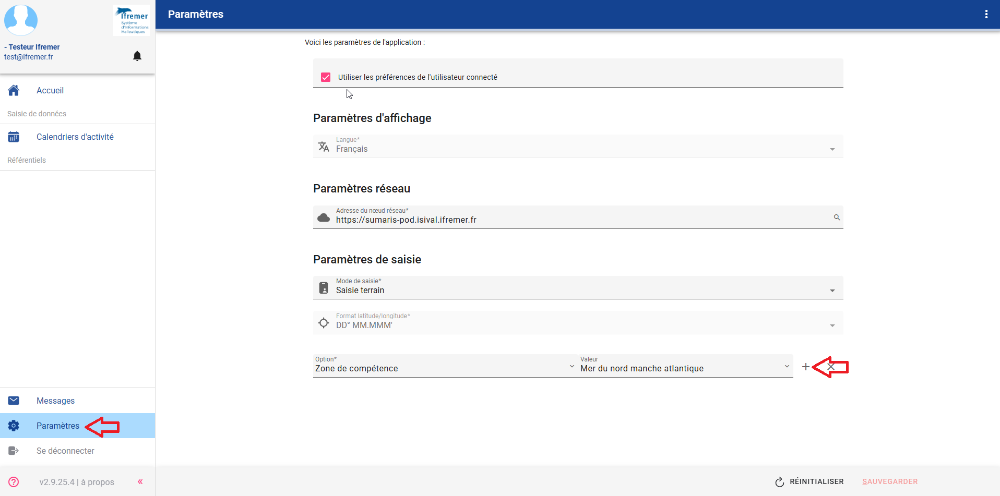
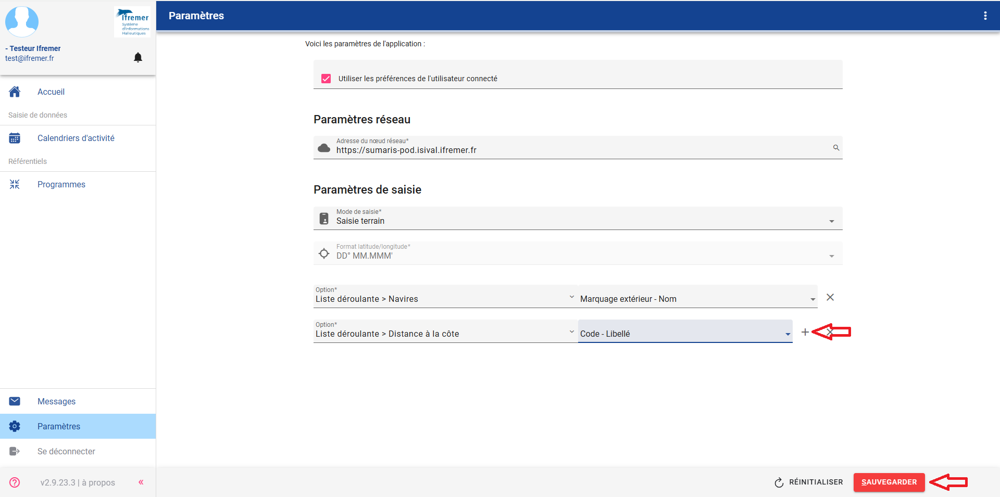

## Fonctionnalités

### Epingler un calendrier

Il est possible d'épingler un calendrier ou l'onglet d'un calendrier afin de le conserver dans le menu de gauche et de pouvoir y accéder rapidement.

Pour cela, il faut consulter le calendrier souhaité puis dans le menu de gauche, cliquer sur l'icône "Epingle" du calendrier ou d'un onglet du calendrier.

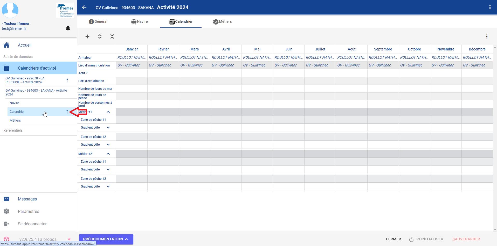

### Changer de zone de compétence

Il est possible de changer de zone de compétence via le menu contextuel.

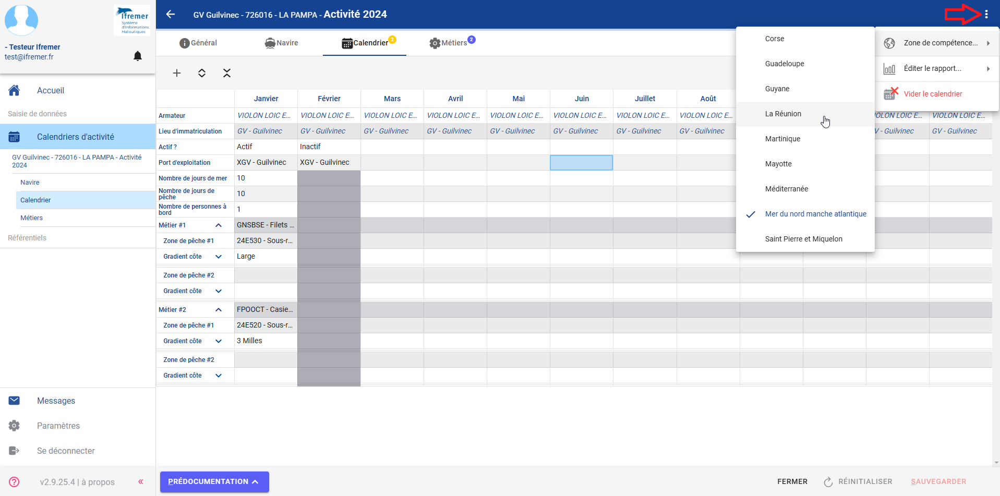

### Sélectionner des cellules, des lignes et des colonnes

Il est possible de sélectionner une ligne ou une colonne en cliquant sur l'en-tête de ligne ou de colonne.

De même il est possible de sélectionner plusieurs cellules, lignes ou colonnes contigues en utilisant la touche **Shift**.

### Etendre le contenu d'une cellule

Il est possible d'étendre le contenu d'une cellule vers la droite ou vers la gauche.

Pour cela, il faut se positionner sur la bordure droite ou gauche de la cellule jusqu'à ce qu'elle s'épaississe puis déplacer la souris.

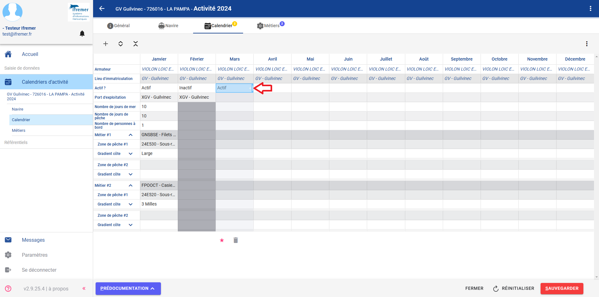

### Saisir un mois complet

Lors de l'édition d'un mois, pour réaliser la saisie d'un mois complet, les touches **Tab** et **Shift + Tab** permettent respectivement de passer à la cellule au-dessous ou au-dessus.
En fin de moi, il est également possible de passer au mois suivant avec la touche **Tab**.

### Afficher les avertissements

Lorsqu'il y a une incohérence entre la saisie et la zone de compétence sélectionnée, les cellules apparaissent avec un fond jaune-orangé.

Ces avertissements ne bloquent pas la sauvegarde du calendrier.

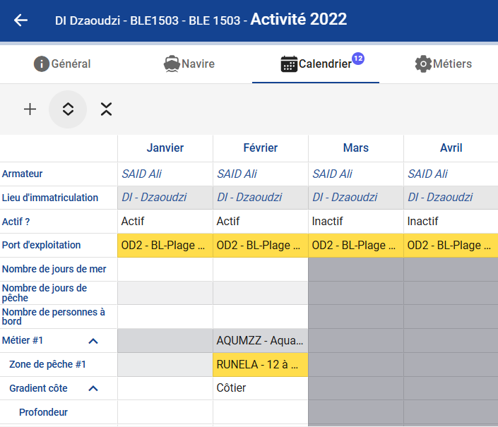

### Afficher les erreurs

Lorsqu'il y a une erreur de saisie, une icône s'affiche au dessus du ou des mois concernés.

Le survol de l'icône permet d'avoir des précisions sur la ou les erreurs rencontrés sur le mois.

A noter : certaines erreurs bloquent la sauvegarde du calendrier, il est donc nécessaire de les corriger avant de pouvoir sauvegarder.

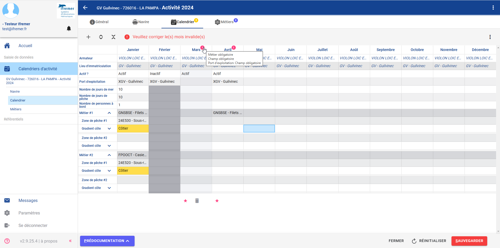

### Déplier/Replier des lignes

Il est possible de déplier/replier les lignes des blocs métiers.

Un premier clic sur les boutons permet de déplier/replier le 1er niveau des blocs métiers.

Un second clic permet de déplier/replier toutes les lignes des bloc métiers.

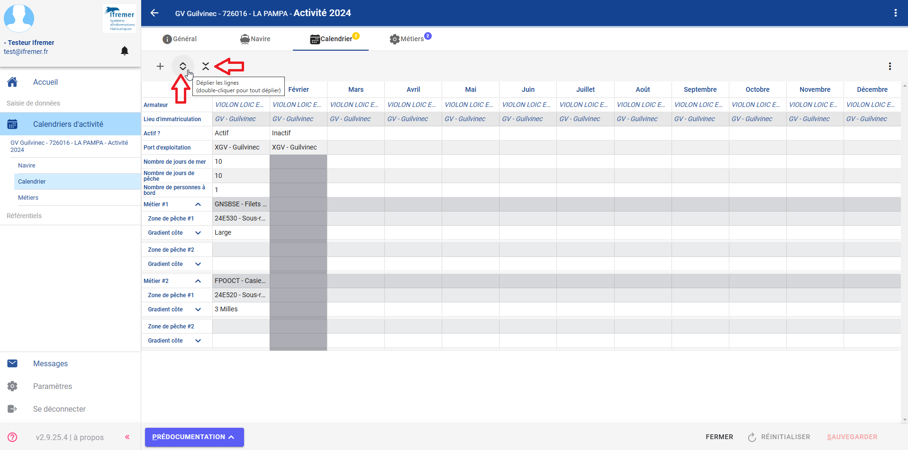

### Replier tout à la sauvegarde

Il est possible de choisir de replier ou non toutes les lignes des blocs métiers lors de la sauvegarde via le menu contextuel.

Par défaut, toutes les lignes des blocs métiers sont repliées à la sauvegarde.

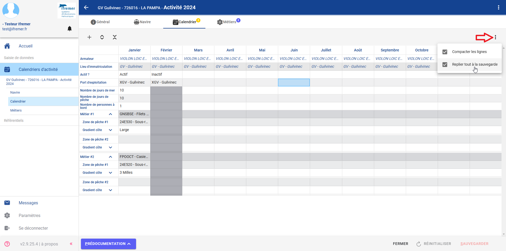

### Afficher les raccourcis clavier

Il est possible d'afficher la liste des raccourcis clavier via la touche "F1".

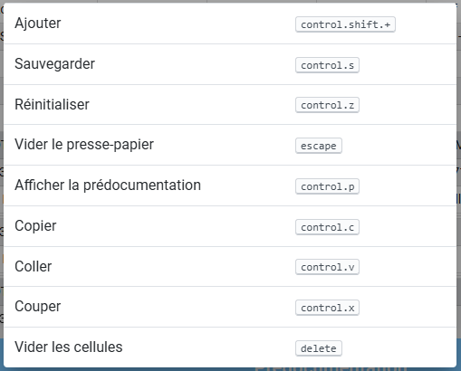

### Générer les formulaires et rapports

Les formulaires et rapports sont accessibles depuis le tableau de consultation des calendriers et depuis chaque calendrier via le menu contextuel.

Sur le tableau de consultation des calendriers, les calendriers sélectionnés ou à défaut l'ensemble des calendriers contenus dans le tableau sera utilisé pour générer les formulaires et rapports.

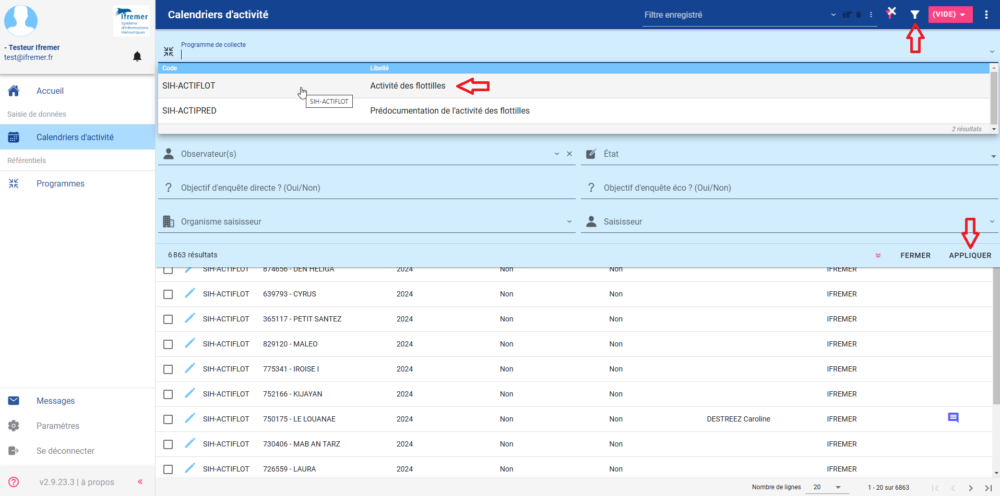

Sur un calendrier, seuls le formulaire vierge et le formulaire avec données sont accessibles.

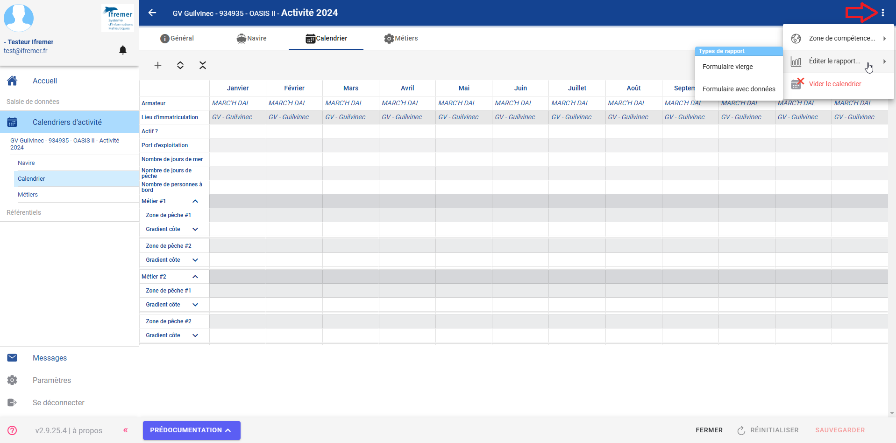

