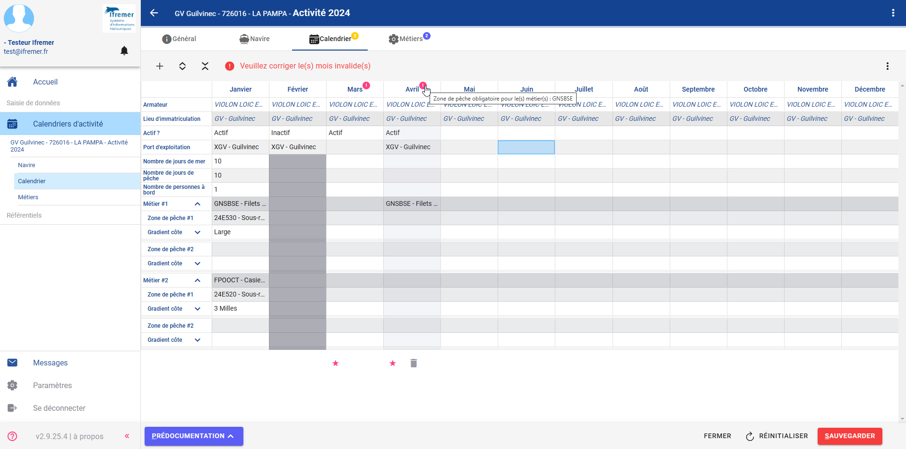

# Manuel d'utilisation de SUMARiS Calendrier d'activité

## Sommaire

- [Prérequis](#prérequis)
- [Paramétrage des colonnes du tableau de consultation des calendriers d'activité](#paramétrage-des-colonnes-du-tableau-de-consultation-des-calendriers-dactivité)
- [Paramétrage des champs et des listes déroulantes](#paramétrage-des-champs-et-des-listes-déroulantes)
- [Epingler un calendrier](#epingler-un-calendrier)
- [Sélectionner des cellules, des lignes et des colonnes](#sélectionner-des-cellules-des-lignes-et-des-colonnes)
- [Etendre le contenu d'une cellule](#etendre-le-contenu-dune-cellule)
- [Afficher les erreurs](#afficher-les-erreurs)
- [Afficher les raccourcis clavier](#afficher-les-raccourcis-clavier)
- [Générer les formulaires et rapports](#générer-les-formulaires-et-rapports)

## Prérequis

Pour un fonctionnement optimal de SUMARiS Calendrier d'activité, il est préconisé aux utilisateurs :
- D'utiliser Google Chrome
- De désactiver un éventuel traducteur

- De se régionaliser (TODO : captures d'écran)
- De compacter les lignes du calendrier de saisie (TODO : activé par défaut ?)

## Paramétrages 

### Paramétrage des colonnes du tableau de consultation des calendriers d'activité

Le paramétrage des colonnes est accessible depuis le tableau de consultation des calendriers d'activité via le menu contextuel et permet de modifier 
l'ordre (via l'icône "=") et la visibilité des colonnes (via le bouton switch).

Ce paramétrage est spécifique à chaque utilisateur.

### Paramétrage des champs et des listes déroulantes

Il est possible de personnaliser l'affichage des champs et des listes déroulantes :
- Navire
- Port d'exploitation
- Zone de pêche
- Gradient côte
- Profondeur 
- Zone proche

Pour cela, il faut accéder à l'écran "Paramètres" accessible depuis le menu de gauche.
Sur l'écran "Paramètres", cliquer sur le bouton "Afficher plus" pour sélectionner une ou plusieurs options parmis les suivantes, ainsi que la valeur souhaitée :
- Liste déroulante > Navires
- Liste déroulante > Lieux (port, etc.)
- Liste déroulante > Zone de pêche (rectangle, etc.)
- Liste déroulante > Distance à la côte
- Liste déroulante > Profondeur
- Liste déroulante > Zone spécifique

Ce paramétrage est spécifique à chaque utilisateur.

## Fonctionnalités

### Epingler un calendrier

Il est possible d'épingler un calendrier ou l'onglet d'un calendrier afin de le conserver dans le menu de gauche et de pouvoir y accéder rapidement.

Pour cela, il faut consulter le calendrier souhaité puis dans le menu de gauche, cliquer sur l'icône "Epingle" du calendrier ou d'un onglet du calendrier.

### Sélectionner des cellules, des lignes et des colonnes

Il est possible de sélectionner une ligne ou une colonne en cliquant sur l'en-tête de ligne ou de colonne.
De même il est possible de sélectionner plusieurs cellules, lignes ou colonnes contigues en utilisant la touche **Shift**.

### Etendre le contenu d'une cellule

Il est possible d'étendre le contenu d'une cellule vers la droite ou vers la gauche.
Pour cela, il faut se positionner sur la bordure droite ou gauche de la cellule jusqu'à ce qu'elle s'épaississe puis déplacer la souris.

### Afficher les erreurs

Lorsqu'il y a une erreur de saisie, une icône s'affiche au dessus du ou des mois concernés.

Le survol de l'icône permet d'avoir des précisions sur la ou les erreurs rencontrés sur le mois.

A noter : certaines erreurs bloquent la sauvegarde du calendrier, il est donc nécessaire de les corriger avant de pouvoir sauvegarder.

### Afficher les raccourcis clavier

Il est possible d'afficher la liste des raccourcis clavier via la touche "F1".

### Générer les formulaires et rapports

Les formulaires et rapports sont accessibles depuis le tableau de consultation des calendriers et depuis chaque calendrier.

Sur le tableau de consultation des calendriers, il est nécessaire d'appliquer un filtre sur le programme de collecte "SIH-ACTIFLOT" 
puis de générer le formulaire vierge, le formulaire avec données et le rapport d'avancement via le menu contextuel .

L'ensemble des calendriers contenus dans le tableau sera utilisé pour générer les formulaires et rapports.

Sur un calendrier, la génération du formulaire vierge et du formulaire avec données est accessible via le menu contextuel.

